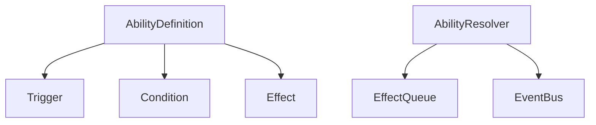

# Ability System

**Version:** 2.0  
**Status:** Active  
**Architectural Update:** This version implements the event-driven ability system with triggers, conditions, and effects.

## 1. Core Architecture

### 1.1 System Components


### 1.2 Data Flow
1. Game event occurs (e.g., unit attacks)
2. EventBus notifies subscribers
3. AbilityResolver processes matching triggers
4. Conditions are validated
5. Effects are queued
6. Effects are resolved in order

## 2. Ability Definition

### 2.1 Structure
```gdscript
class_name AbilityDefinition
extends Resource

@export var id: StringName
@export var display_name: String
@export_multiline var description: String
@export var icon: Texture2D
@export var cooldown: int = 0
@export var trigger: TriggerDefinition
@export var condition: ConditionDefinition
@export var effects: Array[EffectDefinition]
@export var tags: Array[StringName]
```

## 3. Triggers

### 3.1 Trigger Types
| Trigger | When Fired | Context Data |
|---------|------------|--------------|
| `on_battle_start` | Start of battle | `{battle_id: String, turn_count: int}` |
| `on_turn_begin` | Start of unit's turn | `{unit: GachaBallInstance, turn_count: int}` |
| `on_attack` | When attack is made | `{attacker: GachaBallInstance, defender: GachaBallInstance, damage: int}` |
| `on_hit` | When attack connects | Same as `on_attack` |
| `on_kill` | When unit dies | `{killer: GachaBallInstance, victim: GachaBallInstance}` |
| `on_death` | When unit dies | `{victim: GachaBallInstance, killer: GachaBallInstance}` |

### 3.2 Trigger Definition
```gdscript
class_name TriggerDefinition
extends Resource

@export var trigger_type: StringName
@export var source_filter: Dictionary = {
    "tags": [],
    "min_level": 0,
    "max_level": 999
}
@export var target_filter: Dictionary = {
    "tags": [],
    "min_level": 0,
    "max_level": 999
}
```

## 4. Conditions

### 4.1 Condition Types
| Condition | Description | Parameters |
|-----------|-------------|------------|
| `health_below` | Unit HP % < X | `threshold: float` |
| `has_status` | Unit has status effect | `status_id: StringName` |
| `random_chance` | Random chance to proc | `chance: float` |
| `combo_count` | Number of consecutive hits | `min: int, max: int` |

### 4.2 Condition Definition
```gdscript
class_name ConditionDefinition
extends Resource

@export var condition_type: StringName
@export var parameters: Dictionary
@export var invert: bool = false
```

## 5. Effects

### 5.1 Effect Types
| Effect | Description | Parameters |
|--------|-------------|------------|
| `damage` | Deal damage | `amount: int, is_heal: bool` |
| `apply_status` | Apply status effect | `status_id: StringName, duration: int` |
| `modify_stat` | Change stat value | `stat: StringName, amount: float, is_percentage: bool` |
| `summon_unit` | Create new unit | `unit_id: StringName, position: Vector2` |

### 5.2 Effect Definition
```gdscript
class_name EffectDefinition
extends Resource

@export var effect_type: StringName
@export var parameters: Dictionary
@export var target: StringName  # "self", "source", "target", "all_allies", etc.
```

## 6. Stat Modifiers

### 6.1 Modifier Types
1. **Flat**: `final_value = base_value + modifier_value`
2. **Percentage**: `final_value = base_value * (1 + modifier_value/100)`
3. **Multiplicative**: `final_value *= modifier_value`

### 6.2 Modifier Stacking
```gdscript
func calculate_final_stat(base_value: float, modifiers: Array[Modifier]) -> float:
    var flat_sum = 0.0
    var percent_sum = 0.0
    var final_multiplier = 1.0
    
    for mod in modifiers:
        match mod.type:
            Modifier.Type.FLAT:
                flat_sum += mod.value
            Modifier.Type.PERCENT:
                percent_sum += mod.value
            Modifier.Type.MULTIPLICATIVE:
                final_multiplier *= mod.value
                
    return (base_value + flat_sum) * (1 + percent_sum/100) * final_multiplier
```

## 7. Example Ability

### 7.1 Poisoned Blade
```gdscript
var poisoned_blade = AbilityDefinition.new()
poisoned_blade.id = "poisoned_blade"
poisoned_blade.display_name = "Poisoned Blade"
poisoned_blade.description = "Attacks have a 30% chance to poison the target for 3 turns."

# Trigger: On attack
var trigger = TriggerDefinition.new()
trigger.trigger_type = "on_attack"
poisoned_blade.trigger = trigger

# Condition: 30% chance
var condition = ConditionDefinition.new()
condition.condition_type = "random_chance"
condition.parameters = {"chance": 0.3}
poisoned_blade.condition = condition

# Effect: Apply poison
var effect = EffectDefinition.new()
effect.effect_type = "apply_status"
effect.parameters = {
    "status_id": "poison",
    "duration": 3
}
effect.target = "target"
poisoned_blade.effects = [effect]
```

## 8. Implementation Notes

### 8.1 Performance Considerations
- Use object pooling for Effect instances
- Cache ability lookups by trigger type
- Batch process effects when possible

### 8.2 Debugging
```gdscript
# Enable debug logging
AbilitySystem.debug_enabled = true

# Sample debug output:
# [AbilitySystem] Trigger: on_attack (attacker=Hero1, target=Enemy3)
# [AbilitySystem] Checking ability: poisoned_blade
# [AbilitySystem] Condition passed: random_chance(0.3)
# [AbilitySystem] Applying effect: apply_status(poison) to Enemy3
```

## 9. Integration with Other Systems

### 9.1 Event Bus Integration
```gdscript
# Example of how abilities subscribe to game events
EventBus.connect("unit_attacked", _on_unit_attacked)

func _on_unit_attacked(attacker, defender, damage):
    var context = {
        "attacker": attacker,
        "defender": defender,
        "damage": damage
    }
    AbilitySystem.process_trigger("on_attack", context)
```

### 9.2 Status Effects
Status effects are persistent effects that can be applied by abilities. They can modify stats, apply damage over time, or trigger other effects.

```gdscript
# Example status effect definition
var poison_effect = StatusEffectDefinition.new()
poison_effect.id = "poison"
poison_effect.display_name = "Poison"
poison_effect.duration = 3
poison_effect.icon = preload("res://assets/icons/status/poison.png")
poison_effect.on_tick_effect = EffectDefinition.new()
poison_effect.on_tick_effect.effect_type = "damage"
poison_effect.on_tick_effect.parameters = {"amount": 5, "is_heal": false}
poison_effect.on_tick_effect.target = "self"
```

## 9.5 Simulation-aware Effects & Animator Integration (2025-08-11)

- Two-stage pipeline: (1) simulate effects to mutate data and collect `CombatEvent`s, (2) replay events via `scripts/BattleAnimator.gd` with pacing.
- Effects must respect `context.is_simulation` to suppress direct UI signals during simulation.
- Use silent setters (e.g., `set_current_hp_silent`) in simulation to avoid reactive UI side-effects.

Rules
- Do emit gameplay triggers during simulation (e.g., `on_hurt`, `on_kill`) so abilities can enqueue follow-up effects.
- Do not emit combat UI signals during simulation (`battle_log_event`, `unit_stats_changed`, `battle_inventory_changed`). The animator emits them after simulation per event.
- Return values: `BasicAttackEffect.execute(...)` returns dealt damage (int). `BattleManager` currently uses this to create `LOG_MESSAGE` and `DAMAGE` `CombatEvent`s. Other effects may return nothing; only known return types are transformed into events.

Example
```gdscript
func execute(source_uuid: String, targets: Array[String], bm: Node, ctx: Dictionary):
	var is_sim := ctx.get("is_simulation", false)
	var src = bm.get_instance_by_uuid(source_uuid)
	var tgt = bm.get_instance_by_uuid(targets[0])
	var dmg := _calc(src)
	var new_hp := max(0, tgt.current_hp - dmg)
	if is_sim and tgt.has_method("set_current_hp_silent"):
		tgt.set_current_hp_silent(new_hp)
	else:
		tgt.set_current_hp(new_hp)

	bm.trigger_on_hurt(tgt.ball_uuid, dmg, src.ball_uuid)
	if new_hp <= 0 and tgt.current_hp > 0:
		bm.trigger_on_kill(src.ball_uuid, tgt.ball_uuid)

	if not is_sim:
		SignalBus.battle_log_event.emit("%s deals %d dmg to %s" % [
			tr(src.get_definition().display_name_key), dmg, tr(tgt.get_definition().display_name_key)
		])
		SignalBus.unit_stats_changed.emit(tgt.ball_uuid)
		SignalBus.battle_inventory_changed.emit()

	return dmg
```

## 10. Best Practices

### 10.1 Ability Design
- Keep individual effects simple and focused
- Combine multiple effects for complex abilities
- Use conditions to create situational abilities
- Test edge cases thoroughly

### 10.2 Performance
- Avoid expensive operations in frequently triggered abilities
- Use object pooling for temporary effects
- Cache frequently accessed data
- Profile performance with many active abilities

### 10.3 Debugging
- Add descriptive debug names to all abilities and effects
- Log ability activations and effect applications
- Visualize active effects on units
- Add debug commands to trigger specific abilities