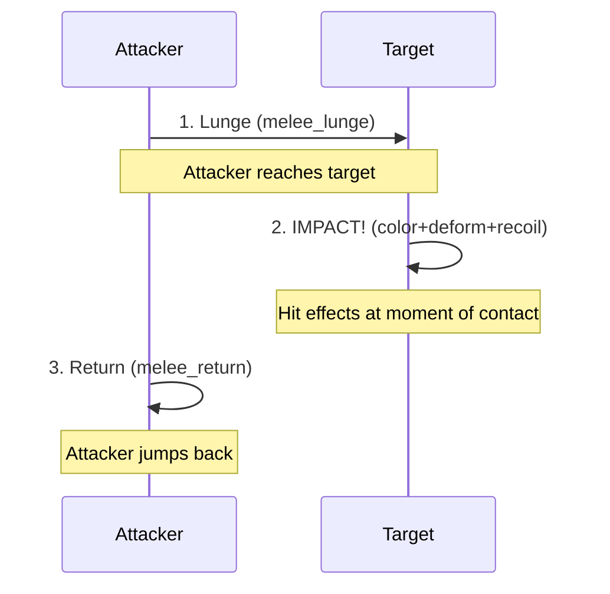
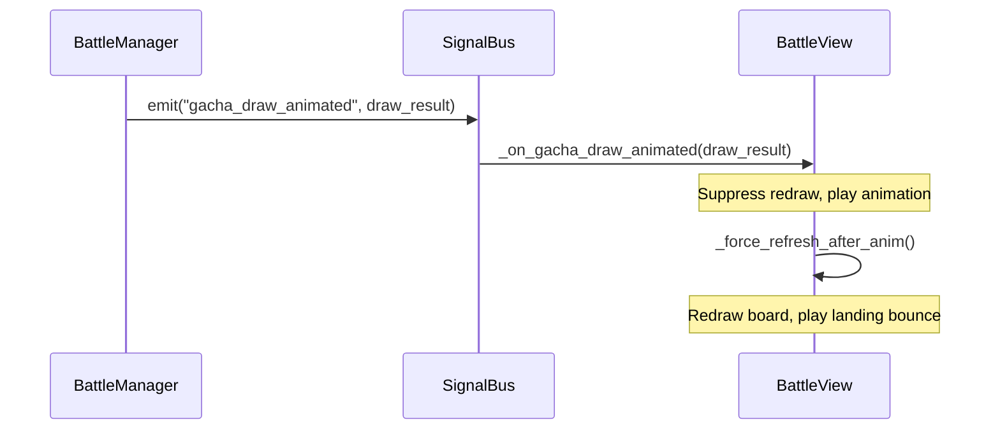

# Animation Implementation Guide

## Purpose
This document explains how to implement visual feedback in Flashcard Heroes (The **Presentation Phase**). It details how the "Dumb Player" architecture works, how to add new visual events, and how to create satisfying combat animations.

> [!IMPORTANT]
> **The Golden Rule of Animation:**
> The Animator is **STATELESS**. It must NEVER query the game state (e.g., `unit.current_hp`). It only visualizes exactly what is defined in the `CombatEvent`.

---

## 1. The Presentation Pipeline

The visual system follows a strict one-way data flow:

```mermaid
graph TD
    BM[BattleManager (Simulation)] -->|Generates| LOG[TurnLog (Queue of CombatEvents)]
    LOG -->|Fed to| BA[BattleAnimator]
    BA -->|Parses| CE[CombatEvent]
    BA -->|Triggers| VIEW[GachaBallView / UI]
    VIEW -->|Plays| TWEEN[Tweens & Particles]
```

### 1.1 The CombatEvent
The `CombatEvent` is the atomic unit of communication. It contains:
- **Type**: What happened (`DAMAGE`, `HEAL`, `BUFF`, etc.)
- **Payload**: Pure data needed to visualize it (`amount`, `target_uuids`, `visual_context`)

### 1.2 BattleAnimator
The conductor. It:
1.  Pops the next event from the queue.
2.  Decides *how* to play it (parallel or sequential).
3.  Calls specific functions on visual nodes (`GachaBallView`).
4.  Waits for completion before processing the next event.

### 1.3 Animation Registry
The system uses a **registry pattern** for animations via `AnimationRegistry.gd`. Each animation is a class extending `BattleAnimation` with an `execute()` method.

**Registered Animations:**
| Animation ID | Class | Purpose |
|--------------|-------|---------|
| `projectile` | `ProjectileAnimation` | Stat projectile flight |
| `damage` | `DamageAnimation` | Damage with melee lunge/bump |
| `heal` | `HealAnimation` | Heal floating number + flash |
| `buff` | `BuffAnimation` | Stat buff with projectile |
| `item_activation` | `ItemActivationAnimation` | Item trigger visuals |
| `death` | `DeathAnimation` | Unit death fade |
| `summon` | `SummonAnimation` | Unit spawn fade-in |
| `guardian_intercept` | `GuardianInterceptAnimation` | Guardian Sentinel leap |
| `lethal_save` | `LethalSaveAnimation` | Aegis Charm save |

**Adding a New Animation:**
1. Create `scripts/animations/MyAnimation.gd` extending `BattleAnimation`
2. Implement `execute(animator, targets, payload)`
3. Register in `AnimationRegistry.load_standard_animations()`

---

## 2. Standard Visual Events

Existing event types supported by `BattleAnimator`:

| Event Type | Visual Behavior | Payload Requirements |
|------------|-----------------|----------------------|
| `DAMAGE` | Shake, flash white, float number, HP bar drop | `amount`, `stat="hp"`, `targets_old_hp`, `targets_new_hp` |
| `HEAL` | Green flash, float number, HP bar rise | `amount`, `stat="hp"`, `targets_old_hp`, `targets_new_hp` |
| `BUFF` | Icon popup, stat change text | `stat`, `amount` |
| `DEATH` | Fade out, remove from scene | `target_uuids` |
| `SUMMON` | Fade in new unit unit | `new_unit_uuid`, `snapshot` |
| `LETHAL_SAVE` | Turn gold, float up, return to 1 HP | `saved_uuid` |
| `GUARDIAN_INTERCEPT` | Leap in front of ally, take damage | `guardian_uuid`, `protected_uuid` |
| `LOG_MESSAGE` | Floating text above unit | `text` |

---

## 3. How to Add a New Animation

### Preferred Approach: Animation Registry

Create a dedicated animation class for complex animations:

**Step 1:** Create `scripts/animations/PortalTeleportAnimation.gd`:
```gdscript
class_name PortalTeleportAnimation
extends BattleAnimation

func execute(animator: Node, targets: Array[String], payload: Dictionary) -> void:
    await animator.get_tree().process_frame  # Ensure coroutine
    
    var teleporter_uuid = String(payload.get("teleporter_uuid", ""))
    var view = animator._visual_registry.get(teleporter_uuid)
    if not is_instance_valid(view): return
    
    # Scale down (disappear) -> Wait -> Scale up (reappear)
    var tween = animator.get_tree().create_tween()
    tween.tween_property(view, "scale", Vector2.ZERO, 0.3)
    await tween.finished
```

**Step 2:** Register in `AnimationRegistry.gd`:
```gdscript
var portal_anim = load("res://scripts/animations/PortalTeleportAnimation.gd")
register("portal_teleport", portal_anim.new())
```

**Step 3:** Use in `BattleAnimator._animate_events()`:
```gdscript
CombatEvent.Type.PORTAL_TELEPORT:
    var anim = AnimationRegistry.get_animation("portal_teleport")
    if anim:
        await anim.execute(self, event.target_uuids, event.visual_payload)
```

### Alternative: Inline Handler (Simple Cases)

For simple animations, handle directly in BattleAnimator:
    if not is_instance_valid(view): return
    
    # Example: Scale down (disappear) -> Wait -> Scale up (reappear)
    var tween = create_tween()
    tween.tween_property(view, "scale", Vector2.ZERO, 0.3)
    tween.tween_callback(func(): _play_sfx("portal_woosh"))
    
    await tween.finished
    
    # Only strictly visual updates here! 
    # Actual logical position updates happened frames ago in simulation.
```

---

## 4. Composable Animation Effects

The animation system uses **three independent effect channels** that run in parallel. This allows fine-grained control over visual feedback.

### 4.1 The Three Channels

| Channel | Signal | Purpose | Controller |
|---------|--------|---------|------------|
| **Color Flash** | `unit_color_flash` | Shader-based tint that fades | `_on_unit_color_flash()` |
| **Deformation** | `unit_deform` | Squish/stretch on sprite scale | `_on_unit_deform()` |
| **Movement** | `unit_move` | Position animation (hop, recoil) | `_on_unit_move()` |

Each channel has its own tween that runs independently. You can combine any effects freely!

> [!IMPORTANT]
> **Sprite vs Icon Container:** Scale animations target the `UnitSprite` child (in Battle mode) or `icon_rect` directly (Inventory mode), NOT the `icon_rect` container when a UnitSprite child exists. This prevents diagonal movement caused by scaling a container with positioned children. Use `_get_sprite()` helper to get the correct node.

### 4.2 Signal Signatures

```gdscript
# Color flash with fade duration
SignalBus.emit_signal("unit_color_flash", unit_uuid, color, duration)

# Deformation type
SignalBus.emit_signal("unit_deform", unit_uuid, &"DEFORM_TYPE")

# Movement with direction (for directional moves like recoil)
SignalBus.emit_signal("unit_move", unit_uuid, &"MOVE_TYPE", direction)
```

### 4.3 Available Effect Types

**Deformation Types:**
| Type | Description | Use Case |
|------|-------------|----------|
| `SQUISH_BOUNCE` | Narrow & tall → elastic return | Landing, receiving buff |
| `STRETCH_BOUNCE` | Wide & short → elastic return | Impact, jump peak |
| `HIT_IMPACT` | Stretch → elastic return | Taking damage |
| `HOP_DEFORM` | Squish→Stretch→Squish→Return | Full hop cycle (heal/buff) |
| `LANDING_BOUNCE` | Squish→Stretch→Squish→Settle | Inventory action feedback (swap/equip/drop) |

**Movement Types:**
| Type | Description | Direction |
|------|-------------|-----------|
| `HOP` | Jump up and land back | `Vector2.ZERO` (ignored) |
| `RECOIL` | Knockback and return | Direction to recoil (team-based) |
| `BUMP` | Quick forward/back bump | Direction of attack |

### 4.4 Composing Effects (Examples)

**Damage Hit:**
```gdscript
# All emit at once - run in parallel
SignalBus.emit_signal("unit_color_flash", uuid, Color.WHITE, 0.25)
SignalBus.emit_signal("unit_deform", uuid, &"HIT_IMPACT")
SignalBus.emit_signal("unit_move", uuid, &"RECOIL", Vector2.LEFT)
await animator.wait_for_animation_completion("move", uuid)
```

**Heal/Buff:**
```gdscript
SignalBus.emit_signal("unit_color_flash", uuid, Color(0.6, 0.8, 1.0), 0.25)
SignalBus.emit_signal("unit_deform", uuid, &"HOP_DEFORM")
SignalBus.emit_signal("unit_move", uuid, &"HOP", Vector2.ZERO)
await animator.wait_for_animation_completion("move", uuid)
```

**Armor Buff (no movement):**
```gdscript
SignalBus.emit_signal("unit_color_flash", uuid, Color(0.7, 0.7, 0.8), 0.25)
SignalBus.emit_signal("unit_deform", uuid, &"SQUISH_BOUNCE")
# No movement - just wait for deform
await animator.get_tree().create_timer(0.24).timeout
```

### 4.5 Timing Constants

All timing values are in [AnimationConstants.gd](file:///Users/danhh/Desktop/Flashcard%20Heroes/scripts/animations/AnimationConstants.gd):

| Constant | Current Value | Purpose |
|----------|---------------|---------|
| `FLASH_HOP_HEIGHT` | 30.0 | Hop height in pixels |
| `HURT_RECOIL_DISTANCE` | 35.0 | Recoil knockback distance |
| `FLASH_HOP_UP_DURATION` | 0.12s | Time to reach hop peak |
| `FLASH_HOP_DOWN_DURATION` | 0.18s | Time to land from hop |
| `FLASH_RECOIL_DURATION` | 0.08s | Time to recoil back |
| `FLASH_RETURN_DURATION` | 0.2s | Time to return from recoil |
| `FLASH_FADE_DURATION` | 0.25s | Color flash fade time |
| `DEFORM_DURATION` | 0.08s | Single deform step time |
| `SQUISH_SCALE` | (0.85, 1.15) | Narrow & tall deformation |
| `STRETCH_SCALE` | (1.15, 0.85) | Wide & short deformation |

### 4.6 Team-Based Recoil Direction

Recoil direction is determined by sprite orientation:
- **Player units** (not flipped) → recoil **LEFT** (away from enemies)
- **Enemy units** (flipped) → recoil **RIGHT** (away from players)

```gdscript
var recoil_direction = Vector2.LEFT  # Default for player
if target_view.icon_rect.flip_h:
    recoil_direction = Vector2.RIGHT  # Enemy recoils opposite
```

### 4.7 Melee Attack Flow

The melee attack uses this sequence for impactful hits:



---

## 5. GachaBallView API

The `GachaBallView` controls the individual unit's visuals. These are the **Puppet API** methods called by `BattleAnimator`:

- **`set_visual_state(snapshot)`**: Instantly updates icon, stats, and frame from a data snapshot.
- **`animate_stat_change(target_val, delta, type)`**: Animates HP or PWR change.
- **`animate_burn_change(target_stacks)`**: Animates burn stack changes.
- **`animate_armor_change(target_stacks)`**: Animates armor stack changes.
- **`animate_leap_to(target_center)`**: Guardian Sentinel leap animation.
- **`animate_leap_return()`**: Guardian Sentinel return animation.

> [!NOTE]
> Low-level animations (flash, bump, death fade, melee lunge) are handled by the `UnitAnimationController` child node, not `GachaBallView` directly. `BattleAnimator` triggers these via signals. See **Section 4: Composable Animation Effects** for the independent color/deform/move channels.

---

## 6. Best Practices

### A. Async Await is King
The animator depends on `await` to maintain timing.
- **Correct**: `await view.animate_bump(...)`
- **Wrong**: `view.animate_bump(...)` (Running without await desyncs the event queue)

### B. Parallel vs Sequential
- **Sequential**: `await` each step. Used for main action chains (Attack -> Damage -> Death).
- **Parallel**: Create tweens/animations but don't `await` them individually, or use `Parallel` command if implemented.
- **Grouped**: For AOE, loop through all targets and start animations, then `await get_tree().create_timer(duration).timeout` to wait for all.

### C. No Logic in Animation
**NEVER** calculate damage, roll dice, or check conditions in `BattleAnimator`.
- If the unit died, the event says `DEATH`.
- If the unit survived with 1 HP, the event says `LETHAL_SAVE`.
- The animation just draws what it's told.

### D. Idempotency (The Snapshot)
At the start of every turn playback, `BattleAnimator` receives a **Full Board Snapshot**. It resets every unit's position and visual state to match the *start* of the turn.
This strictly prevents "visual drift" where animations might leave a unit slightly offset forever.

---

## 8. Gacha Draw Animation

When a player draws from a gacha machine, a gachaball "jumps" from the machine to its destination slot with a satisfying arc animation.

### 8.1 Signal Flow



**Key Signal:** `gacha_draw_animated(draw_result)`
- Emitted **before** `battle_inventory_changed` to set suppression flag
- Contains destination slot info, item UUID, and source tier

### 8.2 Animation Phases

| Phase | Duration | Description |
|-------|----------|-------------|
| **Launch** | 0.45s | Ball shoots from machine with Bezier arc |
| **Refresh** | 1 frame | Slot content appears after ball lands |
| **Bounce** | 0.38s | Rubber-ball squish/stretch/settle on slot |

### 8.3 Arc Trajectory (Bezier Curve)

```gdscript
# Quadratic Bezier: P = (1-t)²·P0 + 2·(1-t)·t·P1 + t²·P2
var control_point := Vector2(
    (start.x + end.x) / 2.0,  # Centered
    min(start.y, end.y) - 400  # 400px above
)
var eased_t = pow(t, 0.55)  # Fast start, snappy landing
```

- **Start**: Center of the gacha machine knob
- **End**: Center of destination slot (with 96px Y offset for visual centering)
- **Control Point**: Horizontally centered, 400px above

### 8.4 Landing Bounce

After the ball lands and the slot refreshes, a rubber-ball bounce plays on the `icon_rect`:

| Phase | Scale | Duration | Easing |
|-------|-------|----------|--------|
| **Squish** | (1.2, 0.8) | 0.08s | EASE_OUT |
| **Stretch** | (0.9, 1.15) | 0.12s | EASE_OUT |
| **Small squish** | (1.05, 0.95) | 0.08s | EASE_IN_OUT |
| **Settle** | (1.0, 1.0) | 0.1s | ELASTIC |

### 8.5 Machine Bounce Animation

The gacha machine bounces when:
- **Tokens arrive** (tossed from token counter)
- **Gachaball pops out** (at start of draw animation)
- **Gachaball returns** (from Shop/Reward purchase)

**Function:** `trigger_machine_bounce(tier: int)` in [Main.gd](file:///Users/danhh/Desktop/Flashcard%20Heroes/scripts/Main.gd)

```gdscript
# Machine bounce effect (squash then stretch back)
var reaction_tween = create_tween()
reaction_tween.set_parallel(true)
reaction_tween.tween_property(machine, "scale", Vector2(1.03, 0.97), 0.04)
reaction_tween.tween_property(machine, "scale", Vector2(0.98, 1.02), 0.06).set_delay(0.04)
reaction_tween.tween_property(machine, "scale", Vector2(1.0, 1.0), 0.08).set_delay(0.10).set_trans(Tween.TRANS_ELASTIC)
```

### 8.6 Shop/Reward Gachaball Return Animation

When purchasing from Shop or confirming a Reward, the selected gachaball animates from its slot to the corresponding tier's gacha machine.

**Direction:** Slot → Machine (inverse of draw animation)

**Animation Parameters:** (now identical to draw animation)
| Parameter | Value |
|-----------|-------|
| Duration | `0.45s` |
| Arc height | `400px` above highest point |
| Position easing | `pow(t, 0.55)` - fast start, snappy landing |
| Scale | `0.3 → 1.0` (grows during flight) |
| Scale easing | `1.0 - pow(1.0 - t, 2)` - fast initial growth, settling |
| Start offset | `+96px Y` to match ball visual center in 192px slot |

**Tier Mapping:**
- Tier 1 items → GachaMachine1
- Tier 2 items → GachaMachine2
- Tier 3 items → GachaMachine3
- Trinkets → GachaMachine3 (no tier, uses highest)

**Implementation Files:**
- [Shop.gd](file:///Users/danhh/Desktop/Flashcard%20Heroes/scripts/Shop.gd): `_animate_gachaball_to_machine()`
- [Reward.gd](file:///Users/danhh/Desktop/Flashcard%20Heroes/scripts/Reward.gd): `_animate_gachaball_to_machine()`

### 8.7 Trinket Reward Animation (Boss Fight)

When claiming a trinket reward from a boss fight, the trinket animates to the player's trinket bar in the TopArea.

**Direction:** Reward slot → PlayerTrinketBar slot

**Key Behavior:**
- Signal is **delayed** until animation completes (prevents early slot visibility)
- Target slot is captured **before** signal emission to ensure correct targeting

**Animation Parameters:** (same as battle draw)
| Parameter | Value |
|-----------|-------|
| Duration | `0.45s` |
| Arc height | `400px` above highest point |
| Position easing | `pow(t, 0.55)` - fast start, snappy landing |
| Scale | `0.3 → 1.0` (grows during flight) |
| Scale easing | `1.0 - pow(1.0 - t, 2)` - fast initial growth, settling |
| Ball size | `128x128px` (matches trinket bar slot) |

**Implementation:** [Reward.gd](file:///Users/danhh/Desktop/Flashcard%20Heroes/scripts/Reward.gd): `_animate_gachaball_to_trinket_bar()`

### 8.8 Implementation Files

- **[BattleManager.gd](file:///Users/danhh/Desktop/Flashcard%20Heroes/scripts/BattleManager.gd)**: Emits `gacha_draw_animated` in `bm_draw_gacha_instance()`
- **[BattleView.gd](file:///Users/danhh/Desktop/Flashcard%20Heroes/scripts/BattleView.gd)**: `_on_gacha_draw_animated()` and `_force_refresh_after_anim()`
- **[Main.gd](file:///Users/danhh/Desktop/Flashcard%20Heroes/scripts/Main.gd)**: `trigger_machine_bounce()` for machine bounce effects
- **[SignalBus.gd](file:///Users/danhh/Desktop/Flashcard%20Heroes/scripts/SignalBus.gd)**: `gacha_draw_animated` signal definition

---

## 9. Common Pitfalls

- **"Ghost Animations"**: Playing an animation on a UUID that was removed in a previous event.
    - *Fix*: Always check `is_instance_valid(view)` before animating.
    - *Fix*: Ensure `DEATH` events are processed *after* damage/reaction animations (this is handled by Event Ordering in `BattleManager`).
- **Desync**: The UI shows HP 50, but the logic thinks HP 40.
    - *Fix*: Ensure `DAMAGE` events include `new_hp` in payload, and `GachaBallView` uses that value directly.
- **Missing Sfx**:
    - *Fix*: Call `AudioManager` inside the `tween_callback` to sync sound with visual impact.


---

## 10. Drag & Drop Interaction Animations

These animations provide feedback during the interactive drag phase (User Input), unlike the playback-driven combat animations.

### 10.1 Drag Deformation
- **Script**: `GachaBallView.gd`
- **Behavior**:
    - **Pick up**: Scale up slightly, follow mouse.
    - **Drag**: "Rubber band" deformation based on mouse velocity (`_process` loop).
    - **Drop**: Reset to normal scale.

### 10.2 Landing Bounce (Drop Feedback)
- **Function**: `_play_landing_bounce()` in `GachaBallView`.
- **Trigger**:
    - **Successful Move**: Triggered by `_on_inventory_action_completed` when the item lands in its new slot.
    - **Failed/Cancelled Drop**: Triggered by `_notification(NOTIFICATION_DRAG_END)` when the drag is released on an invalid target OR rejected by inventory logic.
- **Implementation**:
    - **Battle Mode (has AnimationController)**: Delegates to `UnitAnimationController` via `unit_deform` signal with `LANDING_BOUNCE` type. Uses the sprite animation system with bottom-center pivot.
    - **Inventory/Shop Mode (no controller)**: Uses inline tween on `icon_rect` with center pivot.
- **Logic Failure Handling**:
    - `GachaBallView` listens to `SignalBus.drag_ended(was_handled)`.
    - If `was_handled` is false (InventoryManager rejected the move), `_logical_drag_success` is set to false.
    - `_notification` checks both Godot's mechanical success (hit a control?) AND `_logical_drag_success`.
    - **Rule**: If either fails, the item bounces back to its original slot.
- **Clean Start Rule**: `_reset_drag_deformation()` (scale 1.0) must occur **before** `_play_landing_bounce()` starts, otherwise the reset will clobber the animation tween.
