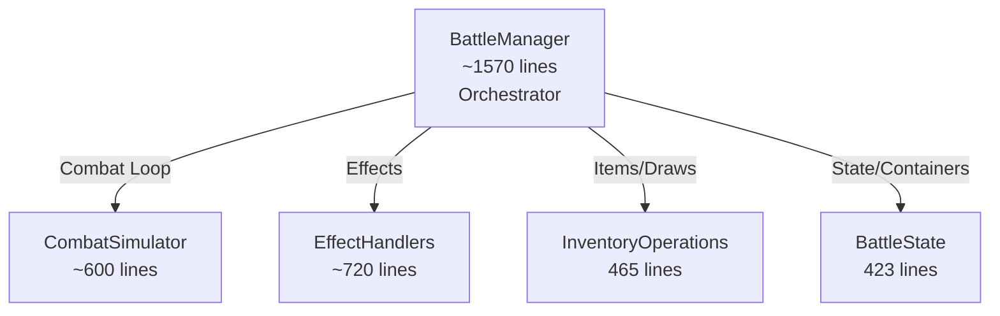

# Combat System Architecture

The Combat System is built on a **Strict State-Event Decoupling** architecture. This ensures that the complex, instantaneous logic of the simulation is completely separated from the temporal, visual presentation of the battle.

## Core Philosophy: "Simulate First, Present Later"

The system is divided into two distinct, non-overlapping phases:

1.  **Simulation Phase (The Black Box):** The entire turn is calculated instantly. The result is a **TurnLog**—an ordered queue of `CombatEvent`s that describes *exactly* what happened, step-by-step.
2.  **Presentation Phase (The Dumb Player):** The UI receives the `TurnLog` and plays it back sequentially. The UI is **stateless** regarding the simulation; it only knows what the current event tells it.

> [!IMPORTANT]
> **The Golden Rule of Decoupling:**
> During the Presentation Phase, the UI must **NEVER** query the live `GachaBallInstance` or `BattleManager` for current state (e.g., `unit.current_hp`). The live data is already at the "End of Turn" state. The UI must *only* use the data provided in the `CombatEvent` to update itself.
>
> **See [AbilityImplementationGuide.md](AbilityImplementationGuide.md) and [AnimationImplementationGuide.md](AnimationImplementationGuide.md) for strict implementation rules.**

---

## 1. The Simulation Phase (`BattleManager`)

The `BattleManager` acts as the authoritative simulation engine. It operates on the **Logical Model** (the `GachaBallInstance` data and `DataContainer` structures).

### Architecture Overview

The BattleManager delegates to specialized helper classes:



| Helper File | Responsibility |
|-------------|----------------|
| Constants | Centralized tags, prioritization constants, and enumerations |
| CombatSimulator | Combat loop, actor queue, reaction processing, EffectResult handling (damage, summons, cascade) |
| EffectHandlers | Damage application, burn processing, summon creation, cascade damage handling |
| InventoryOperations | **Exclusive** handler for ALL inventory mutations (move, swap, equip, remove, discard) |
| BattleState | Instance storage, container management |
| DeathProcessor | Death cleanup logic (delegates inventory moves to InventoryOperations) |
| TurnAbilities | Turn start/end triggers |
| TargetResolver | Target resolution |
| BattleHelpers | Utility functions |
| BattleSetup | Battle initialization |
| EffectResult | Unified return type for all effects. Contains fields for damage (`damage_request`), summons (`summon_request`, `summon_units_request`), cascade AOE (`cascade_request`), and direct events |
| TestModeHelpers | Test mode unit/item/trinket registration |

### Responsibilities
1.  **Snapshotting:** Captures the state of the board *before* any logic runs. This snapshot is sent to the Animator to reset the UI before playback.
2.  **Execution:** Runs the turn logic (Attacks, Abilities, Deaths, Summons) instantly.
3.  **Recording:** Generates a `CombatEvent` for *every* significant state change.
4.  **No Side Effects:** The simulation **must not** manipulate the SceneTree, play sounds, or spawn visual nodes directly. It only mutates data and records events.
5.  **Unified Stat Modification:** All stat changes (HP, PWR, Status Effects) must go through `BattleManager.apply_stat_delta()`.
    *   **Rule:** Effects must **NEVER** set properties (e.g., `current_hp`) directly.
    *   **Purpose:** This function updates the data model *and* returns the absolute value required for the `CombatEvent` visual payload, ensuring the snapshot is accurate.

### The Event Queue (TurnLog)
The output of the simulation is a linear queue of `CombatEvent` objects. This queue represents the **Causal History** of the turn.

**Causality Principle:**
Events must be ordered by cause and effect. A cause must *always* precede its effect in the queue.

*   **Correct:** `DAMAGE` -> `DEATH` -> `SUMMON` -> `BUFF`
*   **Incorrect:** `DEATH` -> `BUFF` -> `SUMMON` (Violates causality; the buff source might be the summoned unit)

> [!IMPORTANT]
> **Fidelity Rule:** Every `CombatEvent` in the TurnLog **MUST** be processed by `BattleAnimator`. The animator may not skip, filter, or drop events. Each event has a unique `event_id` for verification. Look for `[SIM]` and `[ANIM]` prefixes in logs to trace simulation-presentation fidelity.

### Handling Complex Logic (Priority-Based Reaction Resolution)

The system uses a **Priority-Based Reaction System** to resolve complex interactions. Reactions are not instantaneous; they are collected, sorted by priority, and filtered by validity (e.g., lethality checks) before execution.

**1. The Priority Hierarchy (Execution Order)**
Every effect and reaction has a priority value (defined in AbilityDefinition). Higher priority resolves first.

> [!IMPORTANT]
> **Single Source of Truth:** All priority constants are defined in `scripts/Constants.gd` (and `AbilityPriorities.gd` is deprecated/removed).

| Priority | Constant | Description | Examples |
|----------|----------|-------------|----------|
| 300 | `PRIORITY_GUARDIAN_INTERCEPT` | Damage interception | Guardian Sentinel |
| 210 | `PRIORITY_TRINKET_SUMMON` | Resurrection from trinkets | Soul Echo |
| 205 | `PRIORITY_UNIT_SUMMON` | Unit on-death summon | Sakura Spirit |
| 200 | `PRIORITY_ITEM_SUMMON` | Item on-death summon | Last Wish |
| 100 | `PRIORITY_RESILIENT_AURA` | On-hurt buffs/heals | Resilient Aura |
| 50 | `PRIORITY_COUNTER_ATTACK` | Retaliation damage | Retaliate |
| 10 | `PRIORITY_DEFENSIVE_STANCE` | Attack modifiers | Shockwave |
| 0 | `PRIORITY_STANDARD` | Default abilities | Most abilities |
| -50 | `PRIORITY_BOSS_SUMMON` | End-of-turn spawns | Boss waves |
| -100 | `PRIORITY_EXTRA_ACTION` | Grant extra turns | Bloodlust Edge |


> [!IMPORTANT]
> **Summon Priority Rule:** Trinket summons (priority 210) execute before item summons (priority 200), which both execute before counter-attacks (priority 50).
> This ensures that Soul Echo resurrects the original unit type before item-based summons spawn a different unit.

**2. The Discovery Order (Tie-Breaker)**
When multiple abilities trigger at the same time (and have the same priority), `AbilityResolver` discovers them in a deterministic order:
1.  **Units**: The unit itself (e.g., `on_hurt` source).
2.  **Equipped Items**: Sorted by slot index (0 to N).
3.  **Trinkets**: Player trinkets then Enemy trinkets.

**3. The Resolution Flow (Step-by-Step)**
When an action (like an Attack) occurs, the system follows this strict sequence:

1.  **Base Action:** The action executes fully.
    *   *Example:* AOE Attack deals 10 damage to Unit A and Unit B.
2.  **Lethality Check:** The system checks for deaths *immediately* after the action.
    *   *Example:* Unit A (0 HP) -> Dead. Unit B (0 HP) -> Dead.
3.  **Trigger Collection:** All applicable triggers (`on_hurt`, `on_kill`, `on_death`) are collected into a pending list.
    *  > [!IMPORTANT]
       > **Trigger Timing Rule:** Both `on_hurt` and `on_kill` are fired **AFTER** `apply_stat_delta()` modifies HP. This ensures:
       > - Condition checks (e.g., `DAMAGE_WAS_NON_LETHAL`) see post-damage HP values
       > - `on_kill` is triggered immediately when damage causes HP ≤ 0, not by snapshot comparison
       > - Kills of summoned units (created mid-turn) are handled correctly
4.  **Validity Filtering:**
    *   **Dead Units:** Triggers from dead units are **discarded** unless the ability has `execute_on_lethal = true` (e.g., Vengeful Counter, Retaliation).
5.  **Priority Sorting:** The pending list is sorted by Priority (Descending). Ties are broken by the discovery order (FIFO).
6.  **Execution:** The sorted triggers are executed one by one.

**Scenario: The AOE Chain (Corrected)**
*   **Setup:** AOE Attack targets Unit A (1 HP) and Unit B (1 HP). Unit A has "On Death: Heal Ally".
*   **Execution:**
    1.  **Action:** Damage A (10), Damage B (10).
    2.  **Check:** A is Dead. B is Dead.
    3.  **Triggers:**
        *   A: `OnDeath` (Heal Ally).
        *   B: `OnHurt` (Self Heal) - *Discarded* (B is dead).
    4.  **Resolution:** A's `Heal Ally` targets B.
    5.  **Result:** B is *already dead*. The heal targets a corpse (or is invalid).
    *   *Outcome:* Both die. The priority system correctly prevented the "zombie heal".

**Event Generation:**
Events are generated sequentially as they happen. The `TurnLog` reflects the final, causal reality: `AOE_DAMAGE` -> `DEATH (A)` -> `DEATH (B)` -> `HEAL (Invalid/Corpse)`.


---

## 1.5 Snapshot Architecture: The "Rewind" Mechanism

### The Problem
During simulation, the game state mutates instantly. By the time presentation starts, units have already been damaged, killed, and removed. If views query live data (e.g., `unit.current_hp`), they see the "end of turn" state, not the step-by-step progression.

### The Solution: Value-Based Snapshots
Before simulation runs, `BattleManager` captures a **snapshot** of the entire board state. This snapshot contains **pure values only**—no object references.

```gdscript
# ✅ CORRECT: Value-based snapshot
{
    "unit_abc123": {
        "uuid": "unit_abc123",
        "hp": 10,
        "pwr": 5,
        "poison_stacks": 0,
        "def_id": &"unit_t1_a",
        "icon": <Texture>,
        "tier": 1,
        "category": &"UNIT",
        "display_name_key": "unit_t1_a.name"
    }
}

# ❌ WRONG: Object references
{
    "unit_abc123": {
        "instance": <GachaBallInstance>,  # This becomes stale!
        "location": <LocationIdentifier>   # This queries simulation!
    }
}
```

### Why No Object References?
If the snapshot contains `GachaBallInstance` references, when the presentation layer accesses `instance.current_hp`, it reads the **mutated** value from the simulation, not the snapshot value. This breaks the VCR model.

### Presentation Isolation
During the presentation phase:
- `BattleAnimator` populates `GachaBallView` nodes using snapshot values
- Views store these values in `_visual_*` fields (e.g., `_visual_hp`)
- Views **NEVER** call `get_instance()` or query `BattleManager`
- All updates come from `CombatEvent` payloads

> [!IMPORTANT]
> **Zero-Tolerance Rule**: During COMBAT phase, presentation code must make **ZERO** queries to simulation data. Any `get_instance()` call is a violation.

---

## 1.6 Phase-Based UI Blocking

The game uses **phase-based blocking** to prevent UI updates from interfering with animations.

### Animation Phases
These phases represent active animation playback:
- `COMBAT`: Main turn animations
- `START_OF_TURN`: Turn-start ability animations
- `END_OF_TURN`: Poison/status effect animations

### Interaction Phase
- `MANAGEMENT`: Player can interact with UI

### Blocking Mechanisms
**BattleView**:
```gdscript
func _redraw_board() -> void:
    var current_phase = battle_manager.get_current_phase()
    if current_phase == Phases.COMBAT or \
       current_phase == Phases.START_OF_TURN or \
       current_phase == Phases.END_OF_TURN:
        return  # Block rebuild during animations
```

**Why?** If `_redraw_board()` runs during COMBAT, it destroys and recreates `SlotView` nodes, invalidating the `BattleAnimator`'s `_visual_registry`. This breaks all animations mid-playback.

### Event Ordering and Deferred Deaths

**Causality Rule**: Events must appear in causal order.
- ✅ Correct: `DAMAGE → on_hurt HEAL/BUFF → DEATH → on_death SUMMON`
- ❌ Wrong: `DAMAGE → SUMMON → HEAL/BUFF → DEATH` (Violates causality)

**Death Processing (Simulation-Internal):**
When a unit reaches 0 HP, the simulation processes death in this order:

1. Unit HP reaches 0
2. **Pending `on_hurt` reactions drained** (ensures damage-triggered effects resolve first)
3. `on_death` triggers fire (dying unit's item abilities)
4. **DEATH event generated** (for TurnLog - correct visual ordering)
5. `on_ally_death` triggers fire (allies' abilities like resurrection)
6. Reactions processed (generate SUMMON events, etc.)
7. Game state cleanup (unit removed from containers - deferred for reactions)

> [!IMPORTANT]
> **Causality Rule for Death Processing:**
> Pending `on_hurt` reactions (e.g., resilient_aura buffs) MUST be drained BEFORE `on_death` triggers fire. This ensures the dying unit's reactive abilities generate their events while the unit is still "alive" in the event sequence. See `_check_for_deaths_with_counter_delay()` in BattleManager.gd.

> [!IMPORTANT]
> **Event Generation vs. Cleanup Separation:**
> The DEATH event is generated immediately (step 4) to ensure correct TurnLog ordering.
> Game state cleanup is deferred (step 7) so reactions can reference the dying unit.
> This separation is invisible to presentation - it only sees events in the correct order.

### Unified Death Registry (`_dead_this_turn`)

The system uses a **turn-scoped death registry** to prevent duplicate death processing across phases:

```gdscript
var _dead_this_turn: Dictionary = {}  # {uuid: {team, died_in_phase, def_id}}
```

**Key Functions:**
- `_register_death(unit, phase)` → Returns `true` if new death, `false` if already dead
- `is_dead_this_turn(uuid)` → Check if unit has died this turn
- `get_death_info(uuid)` → Get death metadata (team, phase, def_id)

**Lifecycle:**
1. Registry is **cleared** at the start of each combat turn (`_populate_actor_queue`)
2. All death detection paths call `_register_death()` before creating DEATH events
3. `_finalize_deaths()` only cleans up units that are registered dead
4. Registry persists across phases (COMBAT → END_OF_TURN → START_OF_TURN)

**Why This Matters:**
Without unified tracking, a unit could:
- Die from damage in COMBAT phase (DEATH event #1)
- Not be cleaned up before END_OF_TURN
- Die again from burn damage (DEATH event #2 - **duplicate!**)
- Trigger `on_ally_death` twice → **excessive buff stacking**

### Target Liveness Validation

When resolving ability targets, the system validates that targets are still valid using **TWO checks**:

1. **HP Check:** `target.current_hp > 0`
2. **Location Check:** Target must be in an active battle container

**Why Both Checks?**
When a unit dies, `reset_battle_stats_silent()` restores their HP to full **before** moving them to discard. If only HP is checked, dead units could pass validation and receive "ghost attacks."

**Valid Battle Containers:**
- `PLAYER_LINEUP`, `ENEMY_LINEUP`
- `PLAYER_BENCH`, `ENEMY_BENCH`

**Invalid Containers (target rejected):**
- `BATTLE_DISCARD_PILE`
- `""` (removed/invalid)

The validation occurs in:
- `BattleManager._resolve_single_effect_request()` at the target filtering stage
- `TargetResolver.resolve_target()` for context-based target resolution

### Mid-Turn Summon Participation

When a unit is summoned to an **empty slot** mid-turn, it may participate in combat during the turn it's summoned:

### Queue Insertion Logic (`CombatSimulator.insert_summoned_unit`):
- Player units act right-to-left (slot 4→3→2→1→0)
- Enemy units act left-to-right (slot 0→1→2→3→4)
- Summoned unit is inserted at the correct queue position based on its slot
- If the slot's "turn" has already passed (all higher-priority same-team slots acted), the unit is **not** added

**Why This Matters:**
- Soul Echo trinket resurrects units to empty slots on ally death
- Without queue insertion, resurrected units would miss the current turn entirely
- This mirrors the "on-death summon" behavior where a new unit replaces a dying unit in the queue

### Summon Slot Conflict Resolution
When multiple summon effects trigger simultaneously (e.g., Trinket + Item) and target the same slot, the system enforces a "Golden Rule": **Physics over Logic**.
- **Detection**: Before finalizing a summon, `EffectHandlers` checks if the target slot is effectively occupied by a *living* unit (and not the one being overwritten/replaced).
- **Resolution**: 
  1. If occupied, search for the next available empty slot in the lineup.
  2. If lineup full, target the `BATTLE_DISCARD_PILE`.
  3. If discard full, cancel the summon to prevent overwriting existing units.

### Effect Data Flow (No Instance Queries)

Effects receive ALL data via the `context` parameter:

```gdscript
# Context for on_death trigger
{
    "source_uuid": "unit_abc",
    "source_location": <LocationIdentifier>,  # Snapshot at trigger time
    "source_def_id": &"unit_t1_a",
    "equipped_items": [{ /* snapshot */ }]
}

# Context for on_ally_death trigger
{
    "source_uuid": "ally_xyz",             # The living ally
    "fainting_ally_uuid": "unit_abc",      # The dying unit
    "fainting_ally_location": <LocationIdentifier>,
    "fainting_ally_slot": 2,
    "fainting_ally_team": "PLAYER"
}
```

> [!CAUTION]
> **Zero-Instance-Query Rule:**
> Effects must NEVER call `get_instance()`, `get_location_for_uuid()`, or `get_instances_in_container()`.
> All needed data must come from `context` or `parameters`.
> This ensures effects work correctly regardless of cleanup timing.

### Armor Damage Mitigation

Armor is a **status effect** that absorbs incoming damage before HP is affected.

**Simulation Logic (`EffectHandlers.handle_damage_effect`):**
1. Incoming damage is calculated
2. Armor stacks are checked via `get_status_effect_amount(&"armor")`
3. Armor absorbs damage: `armor_consumed = min(armor_stacks, damage)`
4. Remaining damage goes to HP: `hp_damage = damage - armor_consumed`
5. Armor data is embedded in the DAMAGE event's `visual_payload`:
   - `targets_old_armor`: Armor before attack
   - `targets_new_armor`: Armor after absorption
   - `armor_consumed`: Amount of armor used

**Visual Presentation (`DamageAnimation._apply_damage_effects`):**
1. **Armor popup FIRST** (grey, 0.5s before HP popup)
   - Grey floating number shows armor consumed
   - Armor label counts down via `apply_armor_delta()`
2. **HP popup SECOND** (red)
   - Red floating number shows HP damage
   - HP label counts down via `apply_hp_delta()`
3. If armor reaches 0, the armor icon fades out

> [!IMPORTANT]
> Armor and HP effects are part of a **single DAMAGE event**. Armor data is embedded in the payload, not split into separate events. This ensures correct visual timing (armor → HP).

---

## 2. The Presentation Phase (`BattleAnimator`)


The `BattleAnimator` is a dumb playback engine. It does not know rules; it only knows how to visualize events.

### Responsibilities
1.  **Visual Registry (Puppet System):**
    *   **Initialization:** At the start of a sequence, the Animator scans the scene tree to map UUIDs to `GachaBallView` nodes.
    *   **Mechanism:** Uses `LocationIdentifier` objects from the snapshot to resolve the correct `Control` node in the scene.
    *   **Storage:** Populates `_visual_registry` (Dictionary: UUID -> GachaBallView).
    *   **Puppet Mode:** Views operate in "Puppet Mode" (strictly decoupled from live data) and are controlled strictly by the Animator. They are populated using `VisualDataAdapter` and updated via `CombatEvent` payloads.
2.  **State Restoration:** Uses the **State Snapshot** to reset all Unit Views to their "Start of Turn" values before playback begins.
3.  **Sequential Playback:** Iterates through the `TurnLog` one event at a time.
4.  **Visual State Management:**
    *   **Updates:** Resolves the target View via `_visual_registry` and updates it using the `visual_payload`.
    *   **Mutations:** Resolves visual nodes via the Registry to perform container swaps (Summons/Deaths).
5.  **Blocking:** Waits for animations (e.g., projectile travel, death fade) to complete before processing the next event.

### Visual Queueing (Presentation Priority)
The Animator maintains a **Visual Queue** of actions. Unlike the simulation, this queue is strictly **FIFO** based on the `TurnLog`.
*   **Event:** `DAMAGE (Target: A, Amount: 10)`
*   **Visual Action:**
    1.  Play "Hurt" animation on View A.
    2.  Spawn "Floating Text -10".
    3.  Tween HP Bar from Current -> Current - 10.
    4.  Wait for Tween.

**Visual Priority vs. Event Priority:**
*   **Event Priority** (Simulation) determines *what* happens and *in what order* logically (e.g., Heals happen before Damage if priority is higher).
*   **Visual Priority** (Presentation) is purely about **Z-Index** and **Screen Space**.
    *   Floating Text > Unit Sprites > Background.
    *   The `BattleAnimator` does **not** reorder events. It plays the VCR tape exactly as recorded.

---

## 3. Data Structures

### `CombatEvent`
The atomic unit of the TurnLog.
```gdscript
class_name CombatEvent
enum Type { DAMAGE, HEAL, DEATH, SUMMON, BUFF, ... }

var type: Type
var source_uuid: String
var target_uuids: Array[String]
var visual_payload: Dictionary 
# Source of Truth for Views. Common keys:
# - amount: int (The delta applied)
# - stat: String ("hp", "pwr", "poison_stacks")
# - targets_new_hp: Array[int] (Absolute HP values for each target)
# - targets_new_poison: Array[int] (Absolute stack counts)
# - skip_bump: bool (If true, suppresses hit reaction)
var resultant_state: Dictionary 
```

### `StateSnapshot`
Captured at the start of the turn.
```gdscript
{
    "unit_uuid": {
        "hp": 100,
        "pwr": 10,
        "container": "PlayerLineup",
        "index": 0,
        "status_effects": { "poison": 2 }
    }
}
```

---

## 4. Implementation Guidelines

### For Simulation Logic (Effects)
*   **DO:** Mutate `GachaBallInstance` properties (HP, PWR).
*   **DO:** Create `CombatEvent`s with all necessary data for the UI to visualize the change.
*   **DO NOT:** Call `get_node()` to find UI elements.
*   **DO NOT:** Emit signals that the UI listens to (except for debugging).
*   **DO NOT:** Mutate `DataContainer`s in a way that breaks the "Start of Turn" snapshot assumption, unless you explicitly handle it in the event metadata (like Summons).

### For Presentation Logic (Views)
*   **DO:** Listen to signals from `BattleAnimator`.
*   **DO:** Read data from the `CombatEvent` payload.
*   **DO NOT:** Read `BattleManager.get_instance(uuid).current_hp`. (This value is from the future!)
*   **DO NOT:** Start animations on your own. Wait for the Animator.

### No Defensive Code Policy

> [!CAUTION]
> **CRITICAL**: Defensive code is **NOT ALLOWED** in this codebase. If a condition "should never happen," use `assert()` to fail fast. Do not silently handle, skip, or log-and-continue.

**What is Defensive Code?**  
Code that checks for and handles "impossible" conditions—states that should never occur under correct program logic.

**Why It's Prohibited**:
1. **Masks Bugs**: Hides the root cause instead of exposing it
2. **Silent Failures**: Program continues in invalid state
3. **False Confidence**: Tests pass but bugs remain hidden
4. **Technical Debt**: Accumulates workarounds instead of fixes

**Examples**:
```gdscript
# ❌ DEFENSIVE CODE - NOT ALLOWED
func apply_damage(unit: GachaBallInstance, amount: int) -> void:
    if not is_instance_valid(unit):
        return  # Silent failure - bug is hidden!
    if amount < 0:
        amount = 0  # Silently "fixing" bad input
    unit.current_hp -= amount

# ✅ CORRECT - FAIL FAST
func apply_damage(unit: GachaBallInstance, amount: int) -> void:
    assert(is_instance_valid(unit), "Unit must be valid")
    assert(amount >= 0, "Damage amount must be non-negative")
    unit.current_hp -= amount
```

**When to Use Defensive Code**: NEVER in game logic. The only exception is user input validation at system boundaries (e.g., validating file paths from config files).

---

## 5. Example Flow: The "Summoning" Turn

1.  **Start:** Unit A (10 HP) holds "Summon Item".
2.  **Simulation:**
    *   Enemy attacks Unit A for 10 damage.
    *   Unit A HP -> 0.
    *   **Event:** `DAMAGE (Target: A, Amount: 10, NewHP: 0)`.
    *   Death Check: Unit A is dead.
    *   **Event:** `DEATH (Target: A)`.
    *   Trigger `on_death`: Summon Item activates.
    *   **Event:** `SUMMON (Source: A, NewUnit: B, Slot: 0)`.
    *   Trigger `on_ally_death`: Unit C gets +5 PWR.
    *   **Event:** `BUFF (Target: C, Amount: 5)`.
3.  **Presentation:**
    *   **Reset:** UI sets Unit A to 10 HP. Unit B is hidden/not created yet.
    *   **Play DAMAGE:** Unit A takes 10 damage (Visual HP -> 0).
    *   **Play DEATH:** Unit A plays death animation and fades out.
    *   **Play SUMMON:** Unit A's view is removed. Unit B's view is created in Slot 0 and fades in.
    *   **Play BUFF:** Unit C plays buff animation.