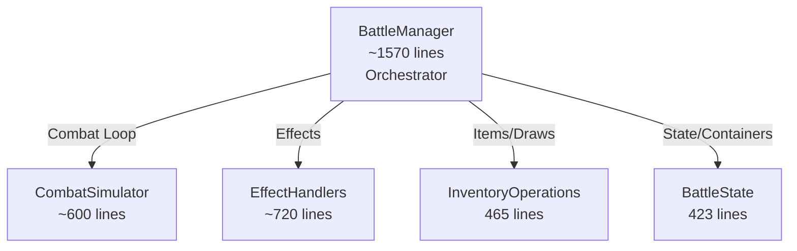

# Combat System Architecture

The Combat System is built on a **Strict State-Event Decoupling** architecture. This ensures that the complex, instantaneous logic of the simulation is completely separated from the temporal, visual presentation of the battle.

## Core Philosophy: "Simulate First, Present Later"

The system is divided into two distinct, non-overlapping phases:

1.  **Simulation Phase (The Black Box):** The entire turn is calculated instantly. The result is a **TurnLog**—an ordered queue of `CombatEvent`s that describes *exactly* what happened, step-by-step.
2.  **Presentation Phase (The Dumb Player):** The UI receives the `TurnLog` and plays it back sequentially. The UI is **stateless** regarding the simulation; it only knows what the current event tells it.

> [!IMPORTANT]
> **The Golden Rule of Decoupling:**
> During the Presentation Phase, the UI must **NEVER** query the live `GachaBallInstance` or `BattleManager` for current state (e.g., `unit.current_hp`). The live data is already at the "End of Turn" state. The UI must *only* use the data provided in the `CombatEvent` to update itself.
>
> **See [AbilityImplementationGuide.md](AbilityImplementationGuide.md) and [AnimationImplementationGuide.md](AnimationImplementationGuide.md) for strict implementation rules.**

---

## 1. The Simulation Phase (`BattleManager`)

The `BattleManager` acts as the authoritative simulation engine. It operates on the **Logical Model** (the `GachaBallInstance` data and `DataContainer` structures).

### Architecture Overview

The BattleManager delegates to specialized helper classes:



| Helper File | Responsibility |
|-------------|----------------|
| Constants | Centralized tags, prioritization constants, and enumerations |
| CombatSimulator | Combat loop, actor queue, reaction processing, EffectResult handling (damage, summons, cascade) |
| EffectHandlers | Damage application, burn processing, summon creation, cascade damage handling |
| InventoryOperations | **Exclusive** handler for ALL inventory mutations (move, swap, equip, remove, discard) |
| BattleState | Instance storage, container management |
| DeathProcessor | Death cleanup logic (delegates inventory moves to InventoryOperations) |
| TurnAbilities | Turn start/end triggers |
| TargetResolver | Target resolution |
| BattleHelpers | Utility functions |
| BattleSetup | Battle initialization |
| EffectResult | Unified return type for all effects. Contains fields for damage (`damage_request`), summons (`summon_request`, `summon_units_request`), cascade AOE (`cascade_request`), and direct events |
| TestModeHelpers | Test mode unit/item/trinket registration |

### Responsibilities
1.  **Snapshotting:** Captures the state of the board *before* any logic runs. This snapshot is sent to the Animator to reset the UI before playback.
2.  **Execution:** Runs the turn logic (Attacks, Abilities, Deaths, Summons) instantly.
3.  **Recording:** Generates a `CombatEvent` for *every* significant state change.
4.  **No Side Effects:** The simulation **must not** manipulate the SceneTree, play sounds, or spawn visual nodes directly. It only mutates data and records events.
5.  **Unified Stat Modification:** All stat changes (HP, PWR, Status Effects) must go through `BattleManager.apply_stat_delta()`.
    *   **Rule:** Effects must **NEVER** set properties (e.g., `current_hp`) directly.
    *   **Purpose:** This function updates the data model *and* returns the absolute value required for the `CombatEvent` visual payload, ensuring the snapshot is accurate.

### Gold Coin VFX & Layering
Currency animations follow strict directionality and layering rules:
- **Gain (Combat)**: Gold flies from the **killed unit** (source) to the HUD icon. Logic uses `killed_uuid` in the combat event context to identify the origin.
- **Spend (Shop/Market)**: Gold flies from the **HUD icon** to the action point (Remove/Transform/Buy).
- **Layering**: All currency, floating damage numbers, and gachaball animations are parented to the `GlobalVFXLayer` (CanvasLayer 150) to ensure they render above all HUD and inventory containers.
- **Floating Text**: Damage and heal numbers are spawned exactly at the target's center. To prevent "clustering," text uses a slight random X-offset (±15px) and a consistent upward drift.

### 0-Damage Visual Feedback
To ensure consistent game feel, units with 0 PWR (like Dust Minions) still trigger visual feedback when they attack.
- **Rule**: `EffectHandlers.handle_damage_effect` always includes hit targets in the `damaged_uuids` list of an `EffectResult`.
- **Impact**: The `BattleAnimator` receives a `DAMAGE` event for every hit, even if 0 HP is lost, allowing it to trigger "bump" and "impact VFX" animations for every basic attack.

### The Event Queue (TurnLog)
The output of the simulation is a linear queue of `CombatEvent` objects. This queue represents the **Causal History** of the turn.

**Causality Principle:**
Events must be ordered by cause and effect. A cause must *always* precede its effect in the queue.

*   **Correct:** `DAMAGE` -> `DEATH` -> `SUMMON` -> `BUFF`
*   **Incorrect:** `DEATH` -> `BUFF` -> `SUMMON` (Violates causality; the buff source might be the summoned unit)

### Step-by-Step Playback
In Step Mode, the Presentation Phase pauses between each `CombatEvent`. The player can click **"Next Step"** to advance exactly one event at a time. Each step captures a single logical transition (e.g., one instance of damage, one buff application), allowing players to debug and study complex priority-based chains.

> [!IMPORTANT]
> **Fidelity Rule:** Every `CombatEvent` in the TurnLog **MUST** be processed by `BattleAnimator`. The animator may not skip, filter, or drop events. Each event has a unique `event_id` for verification. Look for `[SIM]` and `[ANIM]` prefixes in logs to trace simulation-presentation fidelity.

### Handling Complex Logic (Priority-Based Reaction Resolution)

The system uses a **Priority-Based Reaction System** to resolve complex interactions. Reactions are not instantaneous; they are collected, sorted by priority, and filtered by validity (e.g., lethality checks) before execution.

**1. The Priority Hierarchy (Execution Order)**
Every effect and reaction has a priority value (defined in `AbilityDefinition`). The `CombatSimulator` sorts the pending reaction queue by priority (descending) before resolution.

**Priority Bands (Guidelines):**
- **300+**: Interceptors (Must resolve before damage is finalized).
- **200-299**: High-priority Reactions (Resurrections, Summons, Death damage).
- **100-199**: Standard Reactions (Buffs, Heals, Auras).
- **1-99**: Modifiers (Counter-attacks, Defensive triggers).
- **0**: Default (Standard abilities).
- **< 0**: Delayed (Extra actions, Boss reinforcements).

| Priority | Constant | Usage | Examples |
|----------|----------|-------|----------|
| 300 | `PRIORITY_GUARDIAN_INTERCEPT` | Damage interception | Guardian Sentinel |
| 220 | `PRIORITY_DOPPLEGANGER` | Post-death duplication | Doppleganger |
| 210 | `PRIORITY_SOUL_ECHO` | High-priority Resurrection | Soul Echo |
| 205 | `PRIORITY_UNIT_SUMMON` | Unit on-death summon | Sakura Spirit |
| 200 | `PRIORITY_ITEM_SUMMON` | Item on-death summon | Last Wish |
| 100 | `PRIORITY_BUFF_HEAL` | Standard Buffs/Heals | Resilient Aura |
| 50 | `PRIORITY_COUNTER_ATTACK` | Retaliation damage | Retaliate |
| 10 | `PRIORITY_MODIFY_ATTACK` | Attack modifiers | Shockwave |
| 0 | `PRIORITY_STANDARD` | Default abilities | Most abilities |
| -50 | `PRIORITY_BOSS_REINFORCEMENT`| End-of-turn spawns | Boss waves |
| -100 | `PRIORITY_EXTRA_ACTION` | Grant extra turns | Bloodlust Edge |


> [!IMPORTANT]
> **Summon Priority Rule:** Trinket summons (priority 210) execute before item summons (priority 200), which both execute before counter-attacks (priority 50).
> This ensures that Soul Echo resurrects the original unit type before item-based summons spawn a different unit.

**2. The Discovery Order (Tie-Breaker)**
When multiple abilities trigger at the same time (and have the same priority), `AbilityResolver` discovers them in a deterministic order:
1.  **Units**: The unit itself (e.g., `on_hurt` source).
2.  **Equipped Items**: Sorted by slot index (0 to N).
3.  **Trinkets**: Player trinkets then Enemy trinkets.

**3. The Resolution Flow (Step-by-Step)**
When an action (like an Attack) occurs, the system follows this strict sequence:

1.  **Base Action:** The action executes fully.
    *   *Example:* AOE Attack deals 10 damage to Unit A and Unit B.
2.  **Lethality Check:** The system checks for deaths *immediately* after the action.
    *   *Example:* Unit A (0 HP) -> Dead. Unit B (0 HP) -> Dead.
3.  **Trigger Collection:** All applicable triggers (`on_hurt`, `on_kill`, `on_death`) are collected into a pending list.
    *  > [!IMPORTANT]
       > **Trigger Timing Rule:** Both `on_hurt` and `on_kill` are fired **AFTER** `apply_stat_delta()` modifies HP. This ensures:
       > - Condition checks (e.g., `DAMAGE_WAS_NON_LETHAL`) see post-damage HP values
       > - `on_kill` is triggered immediately when damage causes HP ≤ 0, not by snapshot comparison
       > - Kills of summoned units (created mid-turn) are handled correctly
4.  **Validity Filtering:**
    *   **Dead Units:** Triggers from dead units are **discarded** unless the ability has `execute_on_lethal = true` (e.g., Vengeful Counter, Retaliation).
5.  **Priority Sorting:** The pending list is sorted by Priority (Descending). Ties are broken by the discovery order (FIFO).
6.  **Execution:** The sorted triggers are executed one by one.

**Scenario: The AOE Chain (Corrected)**
*   **Setup:** AOE Attack targets Unit A (1 HP) and Unit B (1 HP). Unit A has "On Death: Heal Ally".
*   **Execution:**
    1.  **Action:** Damage A (10), Damage B (10).
    2.  **Check:** A is Dead. B is Dead.
    3.  **Triggers:**
        *   A: `OnDeath` (Heal Ally).
        *   B: `OnHurt` (Self Heal) - *Discarded* (B is dead).
    4.  **Resolution:** A's `Heal Ally` targets B.
    5.  **Result:** B is *already dead*. The heal targets a corpse (or is invalid).
    *   *Outcome:* Both die. The priority system correctly prevented the "zombie heal".

**Event Generation:**
Events are generated sequentially as they happen. The `TurnLog` reflects the final, causal reality: `AOE_DAMAGE` -> `DEATH (A)` -> `DEATH (B)` -> `HEAL (Invalid/Corpse)`.


---

## 1.5 Snapshot Architecture: The "Rewind" Mechanism

### The Problem
During simulation, the game state mutates instantly. By the time presentation starts, units have already been damaged, killed, and removed. If views query live data (e.g., `unit.current_hp`), they see the "end of turn" state, not the step-by-step progression.

### The Solution: Value-Based Snapshots
Before simulation runs, `BattleManager` captures a **snapshot** of the entire board state. This snapshot contains **pure values only**—no object references.

```gdscript
# ✅ CORRECT: Value-based snapshot
{
    "unit_abc123": {
        "uuid": "unit_abc123",
        "hp": 10,
        "pwr": 5,
        "poison_stacks": 0,
        "def_id": &"unit_t1_a",
        "icon": <Texture>,
        "tier": 1,
        "category": &"UNIT",
        "display_name_key": "unit_t1_a.name"
    }
}

# ❌ WRONG: Object references
{
    "unit_abc123": {
        "instance": <GachaBallInstance>,  # This becomes stale!
        "location": <LocationIdentifier>   # This queries simulation!
    }
}
```

### Why No Object References?
If the snapshot contains `GachaBallInstance` references, when the presentation layer accesses `instance.current_hp`, it reads the **mutated** value from the simulation, not the snapshot value. This breaks the VCR model.

### Presentation Isolation
During the presentation phase:
- `BattleAnimator` populates `GachaBallView` nodes using snapshot values
- Views store these values in `_visual_*` fields (e.g., `_visual_hp`)
- Views **NEVER** call `get_instance()` or query `BattleManager`
- All updates come from `CombatEvent` payloads

> [!IMPORTANT]
> **Zero-Tolerance Rule**: During COMBAT phase, presentation code must make **ZERO** queries to simulation data. Any `get_instance()` call is a violation.

---

## 1.6 Phase-Based UI Blocking

The game uses **phase-based blocking** to prevent UI updates from interfering with animations.

### Animation Phases
These phases represent active animation playback:
- `COMBAT`: Main turn animations
- `START_OF_TURN`: Turn-start ability animations
- `END_OF_TURN`: Poison/status effect animations

### Interaction Phase
- `MANAGEMENT`: Player can interact with UI

### Blocking Mechanisms
**BattleView**:
```gdscript
func _redraw_board() -> void:
    var current_phase = battle_manager.get_current_phase()
    if current_phase == Phases.COMBAT or \
       current_phase == Phases.START_OF_TURN or \
       current_phase == Phases.END_OF_TURN:
        return  # Block rebuild during animations
```

**Why?** If `_redraw_board()` runs during COMBAT, it destroys and recreates `SlotView` nodes, invalidating the `BattleAnimator`'s `_visual_registry`. This breaks all animations mid-playback.

### Event Ordering and Deferred Deaths

**Causality Rule**: Events must appear in causal order.
- ✅ Correct: `DAMAGE → on_hurt HEAL/BUFF → DEATH → on_death SUMMON`
- ❌ Wrong: `DAMAGE → SUMMON → HEAL/BUFF → DEATH` (Violates causality)

**Death Processing (Simulation-Internal):**
When a unit reaches 0 HP, the simulation processes death in this order:

1. Unit HP reaches 0
2. **Pending `on_hurt` reactions drained** (ensures damage-triggered effects resolve first)
3. `on_death` triggers fire (dying unit's item abilities)
4. **DEATH event generated** (for TurnLog - correct visual ordering)
5. `on_ally_death` triggers fire (allies' abilities like resurrection)
6. Reactions processed (generate SUMMON events, etc.)
7. Game state cleanup (unit removed from containers - deferred for reactions)

> [!IMPORTANT]
> **Causality Rule for Death Processing (FIXED)**:
> Pending `on_hurt` reactions (e.g., resilient_aura buffs) MUST be drained BEFORE `on_death` triggers fire. This ensures the dying unit's reactive abilities generate events before it is logically removed. See `_check_for_deaths_with_counter_delay()` in `BattleManager.gd`.

> [!IMPORTANT]
> **Event Generation vs. Cleanup Separation:**
> The DEATH event is generated immediately (step 4) to ensure correct TurnLog ordering.
> Game state cleanup is deferred (step 7) so reactions can reference the dying unit.
> This separation is invisible to presentation - it only sees events in the correct order.

### Unified Death Registry (`_dead_this_turn`)

The system uses a **turn-scoped death registry** to prevent duplicate death processing across phases:

```gdscript
var _dead_this_turn: Dictionary = {}  # {uuid: {team, died_in_phase, def_id}}
```

**Key Functions:**
- `_register_death(unit, phase)` → Returns `true` if new death, `false` if already dead
- `is_dead_this_turn(uuid)` → Check if unit has died this turn
- `get_death_info(uuid)` → Get death metadata (team, phase, def_id)

**Lifecycle:**
1. Registry is **cleared** at the start of each combat turn (`_populate_actor_queue`)
2. All death detection paths call `_register_death()` before creating DEATH events
3. `_finalize_deaths()` only cleans up units that are registered dead
4. Registry persists across phases (COMBAT → END_OF_TURN → START_OF_TURN)

**Why This Matters:**
Without unified tracking, a unit could:
- Die from damage in COMBAT phase (DEATH event #1)
- Not be cleaned up before END_OF_TURN
- Die again from burn damage (DEATH event #2 - **duplicate!**)
- Trigger `on_ally_death` twice → **excessive buff stacking**

### Target Liveness Validation

When resolving ability targets, the system validates that targets are still valid using **TWO checks**:

1. **HP Check:** `target.current_hp > 0`
2. **Location Check:** Target must be in an active battle container

**Why Both Checks?**
When a unit dies, `reset_battle_stats_silent()` restores their HP to full **before** moving them to discard. If only HP is checked, dead units could pass validation and receive "ghost attacks."

**Valid Battle Containers:**
- `PLAYER_LINEUP`, `ENEMY_LINEUP`
- `PLAYER_BENCH`, `ENEMY_BENCH`

**Invalid Containers (target rejected):**
- `BATTLE_DISCARD_PILE`
- `""` (removed/invalid)

The validation occurs in:
- `BattleManager._resolve_single_effect_request()` at the target filtering stage
- `TargetResolver.resolve_target()` for context-based target resolution (ensuring triggers and effects accurately evaluate target liveness and correct location).

### Mid-Turn Summon Participation

When a unit is summoned to an **empty slot** mid-turn, it may participate in combat during the turn it's summoned:

---

## 1.7 Trait & Status Mechanics

### Phase-Based Trait Locking
To ensure consistency during combat (preventing "mid-battle effectiveness drops"), the Trait System uses a **Snapshot Locking** mechanism:
1.  **Combat Start**: The system takes a snapshot of all active team traits (based on unit composition).
2.  **During Combat**: All trait logic (e.g., Fire Damage Bonus) uses this **Locked Snapshot**.
    *   *Result:* If a Fire unit dies, the team's Fire Soul count *remains unchanged* for the rest of that battle.
3.  **Start/End of Turn**: The system reverts to **Live Calculation**.
    *   *Result:* Start-of-turn effects (e.g., Earth Armor, Fire 9 Burn) use the *current* surviving units. Deaths and mid-battle summons affect these phases.

### Status Effect: Burn
*   **Application**: Burn is applied whenever a source triggers it (via Trinket or Fire Trait). It applies **even if the attack deals 0 damage** (e.g., fully blocked by Armor).
*   **Damage (True Damage)**: Burn DOT occurs at the end of the turn.
    *   It bypasses **Armor** entirely.
    *   It reduces **HP** directly (`current_hp -= stacks`).
    *   It does **not** consume Armor stacks.

### Status Effect: Armor
*   **Mitigation**: Armor absorbs damage before it touches HP.
*   **Logic**: `armor_consumed = min(armor_stacks, damage)`. Remaining damage hits HP.

### Unified Turn-Start Sequence

To ensure correct interaction between Unit Abilities (like Mimic) and Team Traits (like Earth Armor), `START_OF_TURN` effects are processed via the **Reaction Queue**.

1.  **Unit Abilities (Priority > 100)**: Trigger first.
    *   *Example:* Mimic Transformation (Priority 500). The unit transforms *before* traits calculate.
2.  **Trait Effects (Priority 100)**: Trigger second.
    *   `BattleManager` queues a special `_trait_start_effects` reaction with **Priority 100**.
    *   This ensures that Trait logic (e.g., counting active Earth units) sees the board state *after* Mimics have transformed.
3.  **Trinkets/Other (Priority < 100)**: Trigger last.

This unified queue ensures that state mutations (Transformations) happen *before* state-dependent calculations (Buffs), preventing "missed buffs" on transformed units.
    *   *Result:* +3 Armor (Trait) and +3 Armor (Trinket) result in a smooth +6 Armor visualization and correct final state.

> [!NOTE]
> **First-Turn Suppression:**
> To ensure a stable opening state and allow players to establish their lineup, `on_turn_start` ability and trait triggers are completely suppressed during the very first turn of a battle. They resume normal functionality starting at the beginning of the second turn.

---

## 1.8 Death & Reaction Priority

When a unit dies, triggers are processed in strict phases to ensuring correct priority sorting. All reactions generated by these phases are collected into a single batch and THEN sorted by priority.

### Death Processing Phases
1.  **Phase 1 (`on_death`)**:
    *   Triggers first (e.g., Unit Summons, Item Summons like "Summon Scroll").
    *   Typical Priority: 200 (Items), 205 (Unit Summons).
2.  **Phase 2 (`on_ally_death`)**:
    *   Triggers second (e.g., Trinkets like "Soul Echo", Class Passives).
    *   Typical Priority: 210 (Trinkets).
3.  **Phase 3 (Drain & Execute)**:
    *   **CRITICAL**: The system waits for BOTH phases to finish queuing before executing ANY reaction.
    *   The combined queue is sorted by Priority (Highest First).
    *   **Result**: High-priority Trinket effects (210) from Phase 2 will correctly execute *before* lower-priority Item/Unit effects (200/205) from Phase 1.

### Priority Reference
| Source Type | Trigger | Priority | Example |
|---|---|---|---|
| **Trinket** | `on_ally_death` | **210** | **Soul Echo** (Resurrect), Vengeance (+PWR) |
| **Unit** | `on_death` | **205** | **Soul Summon** (Summon Ghost) |
| **Item** | `on_death` | **200** | **Summon Scroll** (Summon T1) |

This ensures that a resurrection trinket (210) always takes precedence over a self-summon ability (205), preventing "ghosts" from blocking resurrections.

### Summoning Rules & Board Geometry
To ensure consistent behavior, all summoning effects (Trinkets, Items, Units, Reinforcements) follow a unified set of rules.

#### 1. Board Geometry
The battlefield is mirrored, meeting in the center.
- **Player Team (Left Side):**
  - **Slot 0:** Backmost (Left). Acts LAST.
  - **Slot 4:** Frontmost (Right). Acts FIRST.
  - **Action Order:** 4 → 3 → 2 → 1 → 0. (Front-to-Back)
- **Enemy Team (Right Side):**
  - **Slot 0:** Frontmost (Left). Acts FIRST.
  - **Slot 4:** Backmost (Right). Acts LAST.
  - **Action Order:** 0 → 1 → 2 → 3 → 4. (Front-to-Back)

> [!NOTE]
> "First Available Slot" always refers to the **Backmost** empty slot (safest position).
> - **Player Search:** 0 → 4 (Back → Front)
> - **Enemy Search:** 4 → 0 (Back → Front)

#### 2. Slot Priority Logic
When a unit is summoned, the system determines its target slot in this strict order:
1.  **Holder's Slot:** If the summon source is replacing a unit (e.g., resurrection, on-death summon), it **must** take that unit's slot.
    *   **Collision Check:** If the slot is occupied by a *different* LIVING unit, it is considered blocked. (Dead units or the summoner itself do not block).
2.  **Backmost Available Slot:** If the primary slot is blocked (or if there is no specific holder, like Boss Reinforcements), search for the first empty slot starting from the **Back** of the formation.
    *   Player: Search Index 0 → 4.
    *   Enemy: Search Index 4 → 0.
3.  **Discard Pile:** (Player Only) If lineup is full, summon to the Discard Pile.
4.  **Cancel:** If all options fail, the summon is cancelled.

#### 4. Summon Location Context
Summoning effects often require specific context from the trigger source (e.g., "Summon where the unit died"):
- **`fainting_ally_location`**: Provided during `on_ally_death`.
- **`death_location`**: Provided during `on_death`.
- **Preference**: Effects like **Soul Echo** MUST prioritize the `fainting_ally_location` snapshot to ensure the resurrected unit takes the exact same slot it occupied before death.

#### 3. Mid-Turn Action Rule
Summoned units may act in the *same turn* they are summoned, but ONLY if valid within the turn order.
- **Rule:** "One Action Per Slot Per Turn".
- **Condition:** A summoned unit joins the action queue **only if** its slot index is "ahead" of the current battle cursor.
    - If a unit summons a replacement into its *own* slot (replacing the currently acting unit), the new unit **does not act** this turn.
    - If a unit summons into a slot that has *already acted*, the new unit **does not act**.
    - If a unit summons into a pending slot (one that hasn't acted yet), the new unit **will act**.
- **Detection**: Before finalizing a summon, `EffectHandlers` checks if the target slot is effectively occupied by a *living* unit (and not the one being overwritten/replaced).
- **Resolution**: 
  1. If occupied, search for the **First Empty Slot** in the lineup.
     - **Player Team**: Searches **Back-to-Front** (Index N → 0). This prioritizes slots that act earlier in the turn sequence.
     - **Enemy Team**: Searches **Back-to-Front** (Index N → 0).
  2. If lineup full, target the `BATTLE_DISCARD_PILE` (Player only).

#### 5. Field-Only Trigger Rule (Ambush/Blessing)
To ensure that reactive abilities (like **Ambush Predator** or **Summon Blessing**) behave logically, their triggers are filtered by location.
- **Rule**: `on_enemy_summon` and `on_ally_summon` triggers ONLY fire if the unit is summoned to a **Lineup** (battlefield) container.
- **Purpose**: This prevents units in the bench or discard pile from being "ambushed" or "blessed" before they have actually entered the field of play.
- **Implementation**: Handled globally in `battle/TurnAbilities.gd`.

#### 6. Inventory-Targeted Summons (Dust Elite)
Reserved for specific "Minion Summons" that bypass the standard battlefield economy:
- **Direct Entry**: Units are spawned directly into a `BattleInventoryT*` tray.
- **Logic**: Targets the first available slot in the physics drawer corresponding to the unit's tier.

### Mid-Turn Summon Actions
Summoned units may act in the *same turn* they are summoned, but ONLY if valid within the turn order.
- **Rule**: "One Action Per Slot Per Turn".
- **Condition**: A summoned unit joins the action queue **only if** its slot index is "ahead" of the current battle cursor.
    - If a unit summons a replacement into its *own* slot (replacing the currently acting unit), the new unit **does not act** this turn.
    - If a unit summons into a slot that has *already acted*, the new unit **does not act**.
    - If a unit summons into a pending slot, the new unit **will act**.

### Effect Data Flow (No Instance Queries)

Effects receive ALL data via the `context` parameter:

```gdscript
# Context for on_death trigger
{
    "source_uuid": "unit_abc",
    "source_location": <LocationIdentifier>,  # Snapshot at trigger time
    "source_def_id": &"unit_t1_a",
    "equipped_items": [{ /* snapshot */ }]
}

# Context for on_ally_death trigger
{
    "source_uuid": "ally_xyz",             # The living ally
    "fainting_ally_uuid": "unit_abc",      # The dying unit
    "fainting_ally_location": <LocationIdentifier>,
    "fainting_ally_slot": 2,
    "fainting_ally_team": "PLAYER"
}
```

> [!CAUTION]
> **Zero-Instance-Query Rule:**
> Effects must NEVER call `get_instance()`, `get_location_for_uuid()`, or `get_instances_in_container()`.
> All needed data must come from `context` or `parameters`.
> This ensures effects work correctly regardless of cleanup timing.

### Armor Damage Mitigation

Armor is a **status effect** that absorbs incoming damage before HP is affected.

**Simulation Logic (`EffectHandlers.handle_damage_effect`):**
1. Incoming damage is calculated
2. Armor stacks are checked via `get_status_effect_amount(&"armor")`
3. Armor absorbs damage: `armor_consumed = min(armor_stacks, damage)`
4. Remaining damage goes to HP: `hp_damage = damage - armor_consumed`
5. Armor data is embedded in the DAMAGE event's `visual_payload`:
   - `targets_old_armor`: Armor before attack
   - `targets_new_armor`: Armor after absorption
   - `armor_consumed`: Amount of armor used

**Visual Presentation (`DamageAnimation._apply_damage_effects`):**
1. **Armor popup FIRST** (grey, 0.5s before HP popup)
   - Grey floating number shows armor consumed
   - Armor label counts down via `apply_armor_delta()`
2. **HP popup SECOND** (red)
   - Red floating number shows HP damage
   - HP label counts down via `apply_hp_delta()`
3. If armor reaches 0, the armor icon fades out

> [!IMPORTANT]
> Armor and HP effects are part of a **single DAMAGE event**. Armor data is embedded in the payload, not split into separate events. This ensures correct visual timing (armor → HP).

---

## 2. The Presentation Phase (`BattleAnimator`)


The `BattleAnimator` is a dumb playback engine. It does not know rules; it only knows how to visualize events.

### Playback Speed & Scale

To maintain mechanical decoupling, the game utilizes a **Global Speed Factor** (`AnimationConstants.speed_factor`) rather than modifying the engine's time scale.

- **Animation Duration Scaling**: All animation durations must be wrapped in `AnimationConstants.scaled(duration)`. This ensures that `1x`, `2x`, and `4x` playback speeds affect all visual transitions (lunges, flashes, projectiles) uniformly.
- **VFX Independence**: Non-combat UI animations (shop refreshes, inventory opening) should **not** be scaled, preserving general menu responsiveness.
- **Persistence**: The playback speed is run-persistent; it does not reset between battles, allowing players to find their preferred pacing and keep it.

### Responsibilities
1.  **Visual Registry (Puppet System):**
    *   **Initialization:** At the start of a sequence, the Animator scans the scene tree to map UUIDs to `GachaBallView` nodes.
    *   **Mechanism:** Uses `LocationIdentifier` objects from the snapshot to resolve the correct `Control` node in the scene.
    *   **Storage:** Populates `_visual_registry` (Dictionary: UUID -> GachaBallView).
    *   **Puppet Mode:** Views operate in "Puppet Mode" (strictly decoupled from live data) and are controlled strictly by the Animator. They are populated using `VisualDataAdapter` and updated via `CombatEvent` payloads.
2.  **State Restoration:** Uses the **State Snapshot** to reset all Unit Views to their "Start of Turn" values before playback begins.
3.  **Sequential Playback:** Iterates through the `TurnLog` one event at a time.
4.  **Visual State Management:**
    *   **Updates:** Resolves the target View via `_visual_registry` and updates it using the `visual_payload`.
    *   **Mutations:** Resolves visual nodes via the Registry to perform container swaps (Summons/Deaths).
5.  **Blocking:** Waits for animations (e.g., projectile travel, death fade) to complete before processing the next event.

### Visual Queueing (Presentation Priority)
The Animator maintains a **Visual Queue** of actions. Unlike the simulation, this queue is strictly **FIFO** based on the `TurnLog`.
*   **Event:** `DAMAGE (Target: A, Amount: 10)`
*   **Visual Action:**
    1.  Play "Hurt" animation on View A.
    2.  Spawn "Floating Text -10".
    3.  Tween HP Bar from Current -> Current - 10.
    4.  Wait for Tween.

**Visual Priority vs. Event Priority:**
*   **Event Priority** (Simulation) determines *what* happens and *in what order* logically (e.g., Heals happen before Damage if priority is higher).
*   **Visual Priority** (Presentation) is purely about **Z-Index** and **Screen Space**.
    *   Floating Text > Unit Sprites > Background.
    *   The `BattleAnimator` does **not** reorder events. It plays the VCR tape exactly as recorded.

---

## 3. Data Structures

### `CombatEvent`
The atomic unit of the TurnLog.
```gdscript
class_name CombatEvent
enum Type { DAMAGE, HEAL, DEATH, SUMMON, BUFF, ... }

var type: Type
var source_uuid: String
var target_uuids: Array[String]

# Ability/Trigger Context - enables descriptive logging
var ability_id: StringName = &"" 
var trigger_type: StringName = &"" 
var ability_holder_uuid: String = "" 

# Concurrent Animation Trackers
# Array of dictionaries: { "source_uuid": str, "def_id": StringName }
# Used by BattleAnimator to play VFX on the UI trinket icons concurrently with the event.
var trinket_activations: Array[Dictionary] = []

var visual_payload: Dictionary 
# Source of Truth for Views. Common keys:
# - amount: int (The delta applied)
# - stat: String ("hp", "pwr", "poison_stacks")
# - targets_new_hp: Array[int] (Absolute HP values for each target)
# - targets_new_poison: Array[int] (Absolute stack counts)
# - skip_bump: bool (If true, suppresses hit reaction)
var resultant_state: Dictionary 
```

### `StateSnapshot`
Captured at the start of the turn.
```gdscript
{
    "unit_uuid": {
        "hp": 100,
        "pwr": 10,
        "container": "PlayerLineup",
        "index": 0,
        "status_effects": { "poison": 2 }
    }
}
```

---

## 4. Implementation Guidelines

### For Simulation Logic (Effects)
*   **DO:** Mutate `GachaBallInstance` properties (HP, PWR).
*   **DO:** Create `CombatEvent`s with all necessary data for the UI to visualize the change.
*   **DO NOT:** Call `get_node()` to find UI elements.
*   **DO NOT:** Emit signals that the UI listens to (except for debugging).
*   **DO NOT:** Mutate `DataContainer`s in a way that breaks the "Start of Turn" snapshot assumption, unless you explicitly handle it in the event metadata (like Summons).

### For Presentation Logic (Views)
*   **DO:** Listen to signals from `BattleAnimator`.
*   **DO:** Read data from the `CombatEvent` payload.
*   **DO NOT:** Read `BattleManager.get_instance(uuid).current_hp`. (This value is from the future!)
*   **DO NOT:** Start animations on your own. Wait for the Animator.

### No Defensive Code Policy

> [!CAUTION]
> **CRITICAL**: Defensive code is **NOT ALLOWED** in this codebase. If a condition "should never happen," use `assert()` to fail fast. Do not silently handle, skip, or log-and-continue.

**What is Defensive Code?**  
Code that checks for and handles "impossible" conditions—states that should never occur under correct program logic.

**Why It's Prohibited**:
1. **Masks Bugs**: Hides the root cause instead of exposing it
2. **Silent Failures**: Program continues in invalid state
3. **False Confidence**: Tests pass but bugs remain hidden
4. **Technical Debt**: Accumulates workarounds instead of fixes

**Examples**:
```gdscript
# ❌ DEFENSIVE CODE - NOT ALLOWED
func apply_damage(unit: GachaBallInstance, amount: int) -> void:
    if not is_instance_valid(unit):
        return  # Silent failure - bug is hidden!
    if amount < 0:
        amount = 0  # Silently "fixing" bad input
    unit.current_hp -= amount

# ✅ CORRECT - FAIL FAST
func apply_damage(unit: GachaBallInstance, amount: int) -> void:
    assert(is_instance_valid(unit), "Unit must be valid")
    assert(amount >= 0, "Damage amount must be non-negative")
    unit.current_hp -= amount
```

**When to Use Defensive Code**: NEVER in game logic. The only exception is user input validation at system boundaries (e.g., validating file paths from config files).

---

## 5. Example Flow: The "Summoning" Turn

1.  **Start:** Unit A (10 HP) holds "Summon Item".
2.  **Simulation:**
    *   Enemy attacks Unit A for 10 damage.
    *   Unit A HP -> 0.
    *   **Event:** `DAMAGE (Target: A, Amount: 10, NewHP: 0)`.
    *   Death Check: Unit A is dead.
    *   **Event:** `DEATH (Target: A)`.
    *   Trigger `on_death`: Summon Item activates.
    *   **Event:** `SUMMON (Source: A, NewUnit: B, Slot: 0)`.
    *   Trigger `on_ally_death`: Unit C gets +5 PWR.
    *   **Event:** `BUFF (Target: C, Amount: 5)`.
3.  **Presentation:**
    *   **Reset:** UI sets Unit A to 10 HP. Unit B is hidden/not created yet.
    *   **Play DAMAGE:** Unit A takes 10 damage (Visual HP -> 0).
    *   **Play DEATH:** Unit A plays death animation and fades out.
    *   **Play SUMMON:** Unit A's view is removed. Unit B's view is created in Slot 0 and fades in.
    *   **Play BUFF:** Unit C plays buff animation.
---

## 6. Real-Time Physics Penalties
Separate from the turn-based simulation, the **Inventory Drawer** and **Discard Pile** operate on a real-time physics clock.

- **Overflow Penalty**: If a ball maintains continuous contact with the **Spring Lid** for 5 seconds, it emits a penalty signal.
- **Data Mutation**: This signal triggers an **immediate** atomic move of the instance to the **Battle Discard Pile**. See [InventoryManager.md](InventoryManager.md) for details.
- **Interaction Boundaries**: To prevent accidental window closure, hover inspections originating outside the active inventory window are blocked while the drawer is open (Rule S8).
