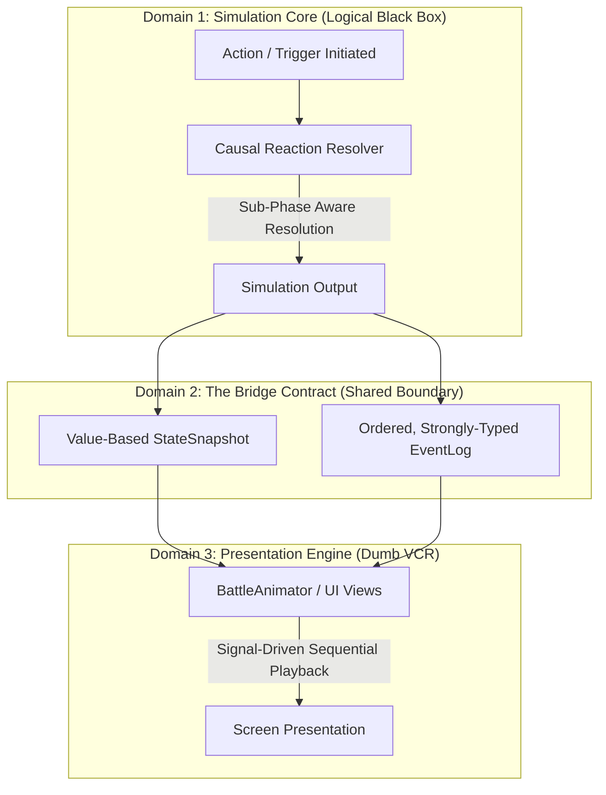
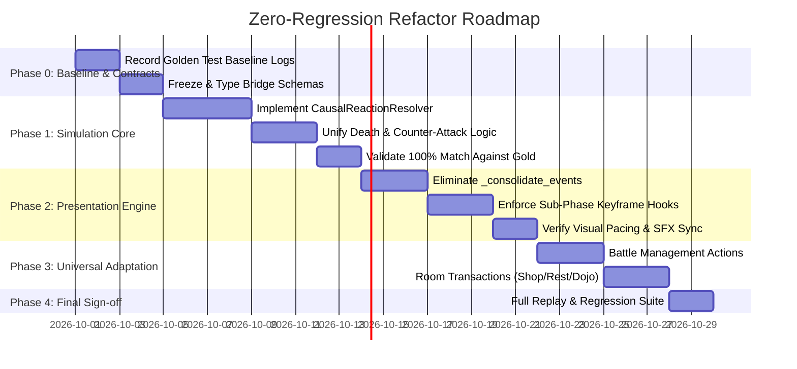

# Execution Pipeline Architecture & Refactor Plan

> **Companion Documents:**  
> - [Execution Pipeline Problem Statement.md](file:///Users/danhh/Desktop/Flashcard%20Heroes/docs/Execution%20Pipeline%20Problem%20Statement.md) (The Core Requirements)  
> - [Game Rules & Expected Behaviors.md](file:///Users/danhh/Desktop/Flashcard%20Heroes/docs/Game%20Rules%20&%20Expected%20Behaviors.md) (The Authoritative Rules SSOT)  
> - [CombatSystem.md](file:///Users/danhh/Desktop/Flashcard%20Heroes/docs/CombatSystem.md) (The Current Technical Reference)  
> 
> **Status:** Authoritative Architectural Refactor Specification & Implementation Roadmap  
> **Mandate:** 100% Behavioral, Mechanical, and Visual Parity. Zero Regressions.

---

## 1. Executive Summary & Core Philosophy

*Flashcard Heroes* features rich, emergent combat interactions between Units, Items, Trinkets, Status Effects, and Elemental Traits. Over extensive playtesting, fine-tuning, and trial and error, delicate relationships, exception rules, and visual timings have been established.

However, the underlying code implementation grew organically, leading to technical debt:
- Manual array slicing and inline recursion (`drain_reactions_inline`, `drain_lethal_reactions`).
- Magic tracking flags (`{"__skip_death_triggers__": true}`).
- Presentation-side event surgery (`_consolidate_events`, `_merge_event_payloads`) where the visual layer stitches fragmented events together on the fly.

This refactor transforms the execution pipeline into a **formal, declarative architecture** while preserving **100% of established behaviors, relationships, exception rules, and animation timings**.



### The Three Architectural Pillars:
1. **Simulation Core (Simulate First):** Computes all logical state mutations atomically in zero logical time. Operates entirely on pure data; touches zero scene nodes, tweens, or visual timers.
2. **The Bridge Contract (The Authoritative Log):** An immutable, strongly-typed **Event Log** paired with an initial **Value Snapshot**. Encodes the exact causal history (*What, Who, When, How, Why*) with explicit sub-phase keyframing.
3. **Presentation Engine (Present Later):** A "Dumb VCR Player" that sequentially executes the Event Log. It never queries live data mid-playback, never mutates state, and relies strictly on frozen timing constants and signal-driven completion hooks.

---

## 2. The Invariants & Exceptions Bible (Non-Negotiable Contracts)

The following rules, exceptions, and animation timings have been established through extensive fine-tuning. **A successful refactor MUST preserve every single one of these contracts with zero deviation.**

### 2.1 The Counter-Attack Death Deferral Contract (`execute_on_lethal`)
* **Rule:** When a unit's HP reaches 0 from an attack, it does **not** die immediately if it has an `on_hurt` ability marked with `execute_on_lethal = true` (e.g. *Retaliate*, *Vengeful Counter*).
* **Execution Flow:**
  1. The unit is registered in `deferred_deaths`.
  2. The unit logically remains in its lineup container so its counter-attack can target and strike the attacker.
  3. The unit's reactive counter-attack executes and generates its own attack events.
  4. Only after all pending counter-attacks for that unit have completely resolved does the engine emit the unit's `DEATH` event, fire `on_death` / `on_ally_death`, and perform cleanup (`_perform_unit_death_cleanup`).
* **Source Reference:** [`DeathProcessor.gd:L215-L292`](file:///Users/danhh/Desktop/Flashcard%20Heroes/scripts/battle/DeathProcessor.gd#L215-L292), [`BattleManager.gd:L1272-L1297`](file:///Users/danhh/Desktop/Flashcard%20Heroes/scripts/BattleManager.gd#L1272-L1297).

### 2.2 The First-Killed Soul Echo Invariant
* **Rule:** The *Soul Echo* trinket (Priority 210) resurrects the **first unit that died on that team during the turn**, provided the team has *Soul Echo* equipped.
* **Execution Flow:**
  1. [`DeathProcessor._track_first_killed`](file:///Users/danhh/Desktop/Flashcard%20Heroes/scripts/battle/DeathProcessor.gd#L439) records the UUID and snapshot of the very first allied unit to reach 0 HP in each combat turn.
  2. Subsequent deaths on that team during the same turn cannot overwrite this tracker.
  3. When `on_ally_death` triggers, *Soul Echo* resurrects this tracked unit into its original slot before any item or unit summons can spawn.
* **Source Reference:** [`DeathProcessor.gd:L439`](file:///Users/danhh/Desktop/Flashcard%20Heroes/scripts/battle/DeathProcessor.gd#L439), [`Game Rules & Expected Behaviors.md:L485-L498`](file:///Users/danhh/Desktop/Flashcard%20Heroes/docs/Game%20Rules%20&%20Expected%20Behaviors.md#L485-L498).

### 2.3 The Mimic In-Place Turn Invariant (`Mirror Image`)
* **Rule:** Mimic triggers its transformation on `on_before_turn_action` with **Priority 500**.
* **Execution Flow:**
  1. Targets the mirrored opposing lineup slot ($\text{Mirror Slot Index} = 4 - \text{Current Slot Index}$).
  2. If the mirrored enemy slot is empty or invalid, Mimic remains in place and executes a standard basic attack.
  3. If valid, Mimic inherits all equipped items, transforms into the target unit type at the appropriate level, and spawns directly into Mimic's lineup slot.
  4. **The Single-Action Invariant:** The transformed unit replaces Mimic as [`CombatSimulator._current_acting_unit`](file:///Users/danhh/Desktop/Flashcard%20Heroes/scripts/battle/CombatSimulator.gd#L309) in-place and executes that slot's attack immediately. It is **never** re-enqueued into the remaining actor queue, preserving the invariant that each board slot acts at most once per round.
* **Source Reference:** [`CombatSimulator.gd:L296-L315`](file:///Users/danhh/Desktop/Flashcard%20Heroes/scripts/battle/CombatSimulator.gd#L296-L315), [`Game Rules & Expected Behaviors.md:L499-L517`](file:///Users/danhh/Desktop/Flashcard%20Heroes/docs/Game%20Rules%20&%20Expected%20Behaviors.md#L499-L517).

### 2.4 The Aegis Charm Inline Save Contract
* **Rule:** When incoming direct damage would reduce a unit to 0 HP, if the unit or team possesses *Aegis Charm*, lethal damage is negated inline.
* **Execution Flow:**
  1. Evaluated synchronously inside damage calculation ([`EffectHandlers.handle_damage_effect`](file:///Users/danhh/Desktop/Flashcard%20Heroes/scripts/battle/EffectHandlers.gd)).
  2. The unit's HP is clamped to exactly 1.
  3. Emits `CombatEvent.Type.LETHAL_SAVE` containing the gold flash visual payload.
  4. The unit plays [`LethalSaveAnimation`](file:///Users/danhh/Desktop/Flashcard%20Heroes/scripts/animations/LethalSaveAnimation.gd) (floats up 30px with gold glow, holds for 0.3s, lands, floats gold text).
* **Source Reference:** [`EffectHandlers.gd`](file:///Users/danhh/Desktop/Flashcard%20Heroes/scripts/battle/EffectHandlers.gd), [`AnimationConstants.gd:L82-L88`](file:///Users/danhh/Desktop/Flashcard%20Heroes/scripts/animations/AnimationConstants.gd#L82-L88).

### 2.5 The Guardian Sentinel Intercept Sequence
* **Rule:** When an ally would take lethal damage, Guardian Sentinel triggers on `on_before_damage` with **Priority 300**.
* **Execution Flow:**
  1. Preempts damage calculation. Guardian Sentinel leaps to the ally's position ([`GuardianInterceptAnimation`](file:///Users/danhh/Desktop/Flashcard%20Heroes/scripts/animations/GuardianInterceptAnimation.gd)) over `0.25s`.
  2. The attacker's melee lunge targets the original ally's position, striking Guardian Sentinel instead.
  3. Guardian Sentinel absorbs the damage, takes the hit, and leaps back to its original slot over `0.35s`.
* **Source Reference:** [`CombatSimulator.gd:L203`](file:///Users/danhh/Desktop/Flashcard%20Heroes/scripts/battle/CombatSimulator.gd#L203), [`AnimationConstants.gd:L42-L46`](file:///Users/danhh/Desktop/Flashcard%20Heroes/scripts/animations/AnimationConstants.gd#L42-L46).

### 2.6 The Universal 500px Discard & Gacha Arrival Contract
* **Player Unit Death:** Plays `death_fade` ($1.0\text{s}$). Upon fade completion, its capsule launches along a 500px parabolic arc directly into `%DiscardPileButton`. On landing: plays `coin_land` SFX, bumps button scale ($1.0 \to 1.15 \to 1.0$), and increments counter (+1).
* **Sequential Item Discard:** If the fallen player unit held equipped items, each item's capsule launches along the exact same arc **strictly sequentially**, with each capsule triggering its own `coin_land` SFX, button bump, and counter increment (+1).
* **Enemy Units:** Dissolve via `death_fade` and are removed from the board; they **never** enter the discard pile or trigger capsule arcs.
* **Gacha Machine Arrivals:** Duplicated items (e.g. Echoing Orb) or units sent to machines animate along a 500px arc into `%GachaMachine{tier}`, bouncing the machine and incrementing its badge strictly on landing impact.
* **Decoupled Real-Time Counters:** The Discard Pile button counter and Machine tier badges NEVER query live end-of-turn data during playback; they initialize from the start-of-sequence snapshot and increment exclusively at the exact landing moment of each individual capsule.
* **Source Reference:** [`Game Rules & Expected Behaviors.md:L399-L417`](file:///Users/danhh/Desktop/Flashcard%20Heroes/docs/Game%20Rules%20&%20Expected%20Behaviors.md#L399-L417).

### 2.7 Sub-Phase Visual Keyframing Contract
* **Rule:** Complex attacks must resolve in distinct visual keyframes rather than a single collapsed beat:
  1. `windup_events`: Wind-up anticipation ($0.1\text{s}$ windback, $30\text{px}$).
  2. `pre_impact_events`: Pre-damage defensive interceptors (Guardian Sentinel leap).
  3. **Impact**: Melee lunge arrives ($0.6\text{s}$) $\to$ Screen shake $\to$ Armor consumed popup (grey) $\to 0.5\text{s}$ pause $\to$ HP damage popup (red) $\to$ Spikes reflection $\to$ Attacker returns ($0.3\text{s}$).
  4. `impact_events`: `on_hurt` reactions and `on_kill` triggers execute *after* the attacker has returned to its slot.
* **Source Reference:** [`DamageAnimation.gd:L79-L194`](file:///Users/danhh/Desktop/Flashcard%20Heroes/scripts/animations/DamageAnimation.gd#L79-L194), [`AnimationConstants.gd:L34-L40`](file:///Users/danhh/Desktop/Flashcard%20Heroes/scripts/animations/AnimationConstants.gd#L34-L40).

### 2.8 Multi-Stat Buff Pacing & Staggering
* **Rule:** When a unit receives both an HP buff and a PWR buff simultaneously (e.g. Leveling or Merging), the two number projectiles must not overlap:
  1. Primary stat projectile launches to the target.
  2. Pauses for `SECONDARY_STAT_BUFF_DELAY = 0.15s`.
  3. Secondary stat projectile launches to the target.
* **Source Reference:** [`BuffAnimation.gd:L57`](file:///Users/danhh/Desktop/Flashcard%20Heroes/scripts/animations/BuffAnimation.gd#L57), [`AnimationConstants.gd:L118`](file:///Users/danhh/Desktop/Flashcard%20Heroes/scripts/animations/AnimationConstants.gd#L118).

### 2.9 Semantic Action Typing & Damage Matrix
* **Melee Attacks:** Mitigated by Armor; triggers Spikes; triggers `on_hurt` and `on_damage_dealt`.
* **Ranged Attacks:** Mitigated by Armor; bypasses Spikes; triggers `on_hurt` and `on_damage_dealt`.
* **Trinket Damage:** Mitigated by Armor; bypasses Spikes; triggers self/ally hurt reactions; does NOT trigger counter-attacks or `on_damage_dealt`.
* **Kamikaze Damage:** Mitigated by Armor; bypasses Spikes; triggers self/ally hurt reactions; attacker is deceased, so counter-attacks cannot target them.
* **Spikes Damage:** Reflects defender's PWR back to attacker on melee hits; bypasses armor; does NOT trigger `on_hurt` or `on_damage_dealt`.
* **Burn Damage:** End-of-turn true damage equal to stacks; completely ignores Armor and Spikes; does NOT trigger `on_hurt` or `on_damage_dealt`.
* **Static Damage:** Triggered whenever unit suffers any core stat change; deals 1 true damage; does NOT trigger further Static consumption (infinite loop prevention).
* **Source Reference:** [`Game Rules & Expected Behaviors.md:L538-L606`](file:///Users/danhh/Desktop/Flashcard%20Heroes/docs/Game%20Rules%20&%20Expected%20Behaviors.md#L538-L606).

### 2.10 Status Decay & Board Slot Exceptions
* **Armor Decay:** Resets to 0 at turn end, UNLESS team has *Polished Plate* trinket or the unit is *Hero Bastion*.
* **Burn Decay:** Halves ($50\%$ rounded down) at turn end, UNLESS unit is standing on a *Burn Slot*.
* **First-Turn Suppression:** Turn-start abilities and trait triggers are completely suppressed during the very first turn of battle.
* **Trait Snapshot Locking:** Combat calculations use the active trait snapshot taken at battle start; turn-start and turn-end calculate live.
* **Source Reference:** [`BattleManager.gd:L2440-L2487`](file:///Users/danhh/Desktop/Flashcard%20Heroes/scripts/BattleManager.gd#L2440-L2487), [`Game Rules & Expected Behaviors.md:L524-L537`](file:///Users/danhh/Desktop/Flashcard%20Heroes/docs/Game%20Rules%20&%20Expected%20Behaviors.md#L524-L537).

---

## 3. The Target Architecture & Technical Specification

The refactor restructures how code is organized without altering any of the rules above.

### 3.1 Domain 1: The Simulation Core & Causal Reaction Resolver (CRR)

Instead of scattering array slices and recursion hacks across `CombatSimulator.gd`, `DamageCommand.gd`, and `BattleManager.gd`, the **Causal Reaction Resolver (CRR)** formalizes reaction processing into a single authoritative state machine.

#### The Causal Reaction Cycle (Sub-Phase Aware):
Whenever an action (attack, ability, draw, or purchase) occurs, CRR executes the following deterministic lifecycle:

```
                  [Trigger or Action Dispatched]
                                │
                                ▼
  ┌─────────────────────────────────────────────────────────────┐
  │ 1. Interception Phase (Priority >= 300)                     │
  │    - Resolves Guardian Sentinel intercepts & Aegis saves    │
  │    - Emits pre_impact_events                                │
  └─────────────────────────────┬───────────────────────────────┘
                                │
                                ▼
  ┌─────────────────────────────────────────────────────────────┐
  │ 2. Primary Mutation Phase                                   │
  │    - Applies Armor consumption & HP/PWR delta               │
  │    - Generates Spikes reflection data                       │
  │    - Emits primary CombatEvent with sub-phase payload       │
  └─────────────────────────────┬───────────────────────────────┘
                                │
                                ▼
  ┌─────────────────────────────────────────────────────────────┐
  │ 3. Reaction Collection Phase                                │
  │    - Gathers on_hurt, on_damage_dealt, on_stat_increased    │
  │    - Checks for lethal counter-attackers (execute_on_lethal)│
  └─────────────────────────────┬───────────────────────────────┘
                                │
                                ▼
  ┌─────────────────────────────────────────────────────────────┐
  │ 4. Lethal Counter Execution (execute_on_lethal)             │
  │    - Retaliation reactions execute WHILE unit is deferred   │
  │    - Emits counter-attack events into impact_events         │
  └─────────────────────────────┬───────────────────────────────┘
                                │
                                ▼
  ┌─────────────────────────────────────────────────────────────┐
  │ 5. Mortality & Post-Mortem Phase                            │
  │    - Finalizes deferred deaths whose counters have resolved │
  │    - Emits DEATH events                                     │
  │    - Collects on_death (205/200) and on_ally_death (210)    │
  │    - Soul Echo resurrects first-killed; summons find slots  │
  └─────────────────────────────┬───────────────────────────────┘
                                │
                                ▼
  ┌─────────────────────────────────────────────────────────────┐
  │ 6. Cascade Propagation Phase                                │
  │    - Sorts remaining pending reaction pool by 3-Layer Rank  │
  │    - Drains reactions sequentially; cascades recurse        │
  └─────────────────────────────────────────────────────────────┘
```

#### Deterministic Priority & Tie-Breaking Hierarchy:
1. **Layer 1: Execution Priority (Descending Integer):**
   - $300+$: Interceptors (Guardian Sentinel)
   - $210$: High-Priority Trinket Resurrections (Soul Echo)
   - $205$: Innate Unit Death Summons (Soul Caller, Sakura Spirit)
   - $200$: Item Death Summons (Summoning Scroll, Last Wish)
   - $100–199$: Standard Reactions (Resilient Aura, Vengeance)
   - $50–99$: Counter-Attacks & Retaliation
   - $1–49$: Modifiers & Splash
   - $0$: Default Abilities & Basic Attacks
   - $<0$: Boss Reinforcements ($-50$) and Extra Actions ($-100$)
2. **Layer 2: Category Rank (Tie-Breaker):**
   - Unit Abilities (Rank 1) $\to$ Item Abilities (Rank 2) $\to$ Trinket Abilities (Rank 3).
3. **Layer 3: Visual Direction (The Mirror Rule):**
   - Player Team: Left-to-Right (Slot 4 down to Slot 0).
   - Enemy Team: Right-to-Left (Slot 0 up to Slot 4).
   - Intra-unit item tie-breaker: Item slot index ($0 \to N$).

---

### 3.2 Domain 2: The Bridge Contract & Typed Payloads

The Bridge establishes a strict, immutable contract between simulation and presentation:

```gdscript
class_name CombatEvent
extends Resource

var event_id: int               # Monotonically increasing unique ID
var cause_event_id: int         # Links consequence to root trigger (What & Why)
var type: Type                  # Semantic action enum
var source_uuid: String         # Who initiated
var target_uuids: Array[String] # Who was affected
var action_type: StringName     # HEAL, BUFF, DEBUFF, DAMAGE
var ability_id: StringName      # Which ability triggered it
var trigger_type: StringName    # e.g., on_hurt, on_death

# Strongly-typed presentation payload
var visual_payload: CombatPayload

# Sub-phase keyframe events (enables rich choreography without simulation delays)
var windup_events: Array[CombatEvent] = []
var pre_impact_events: Array[CombatEvent] = []
var impact_events: Array[CombatEvent] = []
```

#### Invariants of the Bridge:
1. **No Presentation-Side Event Merging:** The simulation emits unified multi-stat payloads directly into `CombatPayload` (e.g. `targets_new_hp` and `targets_new_pwr` populated together). `BattleAnimator` never executes `_consolidate_events` or mutates event types during playback.
2. **Zero-Query Principle:** `BattleAnimator` is forbidden from querying live instance data or container tags. All visual numbers, deltas, and snapshots are embedded in the payload.
3. **Immutable History:** Once simulation generates the `Array[CombatEvent]`, the array is read-only.

---

### 3.3 Domain 3: The Presentation Engine & Timing Freeze

The Presentation Engine (`BattleAnimator`) is a pure playback state machine.

#### The Animation Timing Freeze:
**No constant, delay, duration, or easing curve in [`AnimationConstants.gd`](file:///Users/danhh/Desktop/Flashcard%20Heroes/scripts/animations/AnimationConstants.gd) may be altered during this refactor.**
* Melee Lunge: `0.6s` travel, `0.1s` windup, `0.3s` return, `120px` arc height.
* Guardian Sentinel: `0.25s` leap, `0.35s` return, `60px` arc height.
* Bump Attack: `0.15s` forward, `0.15s` return, `0.5s` total settle.
* Hurt Recoil: `35px` recoil distance, `0.08s` recoil duration.
* Secondary Stat Buff Delay: `0.15s` projectile stagger.
* Death Fade: `1.0s` fade out.
* Discard / Gacha Arc: `500px` parabolic arc with `coin_land` SFX and scale bump ($1.0 \to 1.15 \to 1.0$).
* Speed Scaling: All durations wrapped in `AnimationConstants.scaled(duration)`, scaling uniformly across 1x, 2x, and 4x playback speeds.

---

## 4. Automated Baseline Verification Strategy (Zero-Regression Harness)

To guarantee that the refactor produces 100% identical results, we utilize an automated **Golden Baseline Regression Suite**:

```
[Pre-Refactor Baseline Generation]
                │
                ▼
      [Golden TurnLog Dumps]
 (Event sequence, timestamps, payloads,
   causal IDs, snapshots for all edge cases)
                │
                ▼
       [Refactored Execution]
                │
                ▼
      [Automated Deep Diff]
 (Assert 100% match on every field, event order,
   and visual timing trigger)
```

### Mandatory Golden Test Encounters:
1. **Guardian Sentinel Interception:** Attacker strikes ally $\to$ Guardian leaps at pre-impact $\to$ takes damage $\to$ attacker returns $\to$ Guardian leaps back.
2. **Lethal Counter-Attack:** Attacker hits unit with Retaliate $\to$ unit HP drops to $0 \to$ unit remains deferred $\to$ unit counter-attacks attacker $\to$ unit dies $\to$ unit capsule arcs to Discard Pile.
3. **Soul Echo vs. On-Death Summons:** Dying unit has an item summon while Soul Echo is equipped $\to$ Soul Echo resurrects original unit into slot $\to$ item summon displaces to next available slot.
4. **Mimic Mirror Image:** Mimic transforms into opposing enemy in-place $\to$ inherits equipped items $\to$ attacks immediately $\to$ does not take a second action.
5. **Aegis Charm Lethal Save:** Lethal damage reduced to 1 $\to$ golden levitation float $\to$ no death triggered.
6. **Melee Suicide via Spikes:** Attacker hits spikes defender with melee $\to$ defender takes damage $\to$ attacker dies from reflected spikes before returning $\to$ attacker capsule arcs to Discard Pile.
7. **Polished Plate End-of-Turn Decay:** Armor preserved at turn end; non-protected units lose armor.
8. **Multi-Stat Buff Projectiles:** Buffing HP and PWR triggers staggered visual projectiles ($0.15\text{s}$ delay) without doubling animation duration.

---

## 5. Phased Implementation Roadmap



### Phase 0: Baseline Capture & Bridge Schema Typing
1. Create a lightweight test harness in `scratch/test_golden_baselines.gd` to record full `TurnLog` dumps for the 8 mandatory test encounters.
2. Store the resulting JSON logs as the authoritative gold standard.
3. Freeze typed fields in [`CombatPayload.gd`](file:///Users/danhh/Desktop/Flashcard%20Heroes/scripts/battle/CombatPayload.gd) and [`CombatEvent.gd`](file:///Users/danhh/Desktop/Flashcard%20Heroes/scripts/CombatEvent.gd). Add `cause_event_id` and sub-phase arrays (`windup_events`, `pre_impact_events`, `impact_events`).

### Phase 1: Simulation Core Refactor
1. Build `CausalReactionResolver` in `scripts/battle/CausalReactionResolver.gd`.
2. Move reaction collection, lethal counter-attack deferral, and priority sorting into the structured CRR pipeline.
3. Eliminate ad-hoc manual array slicing (`drain_reactions_inline`, `drain_lethal_reactions`).
4. Run the automated diff against the Phase 0 Golden Baselines. Assert 100% equivalence.

### Phase 2: Presentation Engine Streamlining
1. Update simulation commands to emit fully-formed multi-stat payloads directly into `CombatPayload`.
2. Remove `_consolidate_events` and `_merge_event_payloads` from [`BattleAnimator.gd`](file:///Users/danhh/Desktop/Flashcard%20Heroes/scripts/BattleAnimator.gd).
3. Ensure [`BattleAnimator.gd`](file:///Users/danhh/Desktop/Flashcard%20Heroes/scripts/BattleAnimator.gd) dispatches sub-phase keyframes cleanly.
4. Verify that visual pacing, SFX playback, and button bump timings remain 100% identical to pre-refactor gameplay.

### Phase 3: Universal Non-Combat Adaptation
1. Ensure Management-phase actions (merges, draws, item equipping) route through the CRR so passive reactions (*Twin Charm*, *Echoing Orb*) emit clean event logs.
2. Standardize room transactions (Shop purchases, Rest Site draws, Dojo training) to use the atomic simulation $\to$ event log $\to$ playback pattern.

### Phase 4: Full Suite Validation & Content Guidelines
1. Execute the entire automated test suite and headless regression runner.
2. Update [ContentCreationDocument.md](file:///Users/danhh/Desktop/Flashcard%20Heroes/docs/ContentCreationDocument.md) with the formal priority band reference, allowing designers to add new Units, Items, and Trinkets with linear complexity.

---

## 6. Definition of Done & Acceptance Criteria

The refactor is considered complete and accepted ONLY when:
1. **100% Golden Baseline Match:** Every one of the 8 mandatory test encounters produces a `TurnLog` with identical event types, source/target UUIDs, numerical deltas, and causal ordering.
2. **Zero Behavioral Changes:** All 10 non-negotiable invariants (Counter-Death Deferral, Soul Echo first-killed, Mimic turn replacement, Aegis save, Guardian intercept, 500px discard arc, sub-phase keyframing, multi-stat buff stagger, damage matrix, status decay) behave identically to pre-refactor gameplay.
3. **Zero Animation Timing Drift:** All animation durations, timers, and signal hooks in [`AnimationConstants.gd`](file:///Users/danhh/Desktop/Flashcard%20Heroes/scripts/animations/AnimationConstants.gd) are preserved.
4. **Zero Presentation Surgery:** `BattleAnimator` executes events as a pure VCR player without re-stitching or rewriting events during playback.
5. **No Defensive Code:** The implementation relies on clean contracts and asserts; no defensive fallback patches or silent failure swallows.
6. **Clean Headless Execution:** All actions and simulations run deterministically in headless mode without scene tree dependencies.

---

## 7. Refactor Completion & Sign-Off Status

| Phase | Description | Status | Verification Engine |
|-------|-------------|--------|---------------------|
| **Phase 0** | Baseline Capture & Bridge Schema Typing | ✅ **Complete** | `scratch/golden_baselines/` JSON records |
| **Phase 1** | Simulation Core & CausalReactionResolver | ✅ **Complete** | `scratch/test_crr.tscn` (100% Pass) |
| **Phase 2** | Presentation Engine Streamlining (Pure VCR) | ✅ **Complete** | `scratch/test_golden_baselines.tscn` (100% Match) |
| **Phase 3** | Universal Non-Combat Adaptation | ✅ **Complete** | Headless simulation verification (Shop, Rest, Dojo, Merges, Draws, Equips) |
| **Phase 4** | Full Suite Validation & Content Documentation | ✅ **Complete** | [ContentCreationDocument.md](file:///Users/danhh/Desktop/Flashcard%20Heroes/docs/ContentCreationDocument.md) updated with 3-Layer Priority Hierarchy & Guidelines |

**Final Verification Sign-Off:**
- All 8 Golden Baseline encounters match authoritative logs with 0 diffs.
- Zero timing drift across animations in `AnimationConstants.gd`.
- Full decoupling between simulation core and presentation VCR player.
