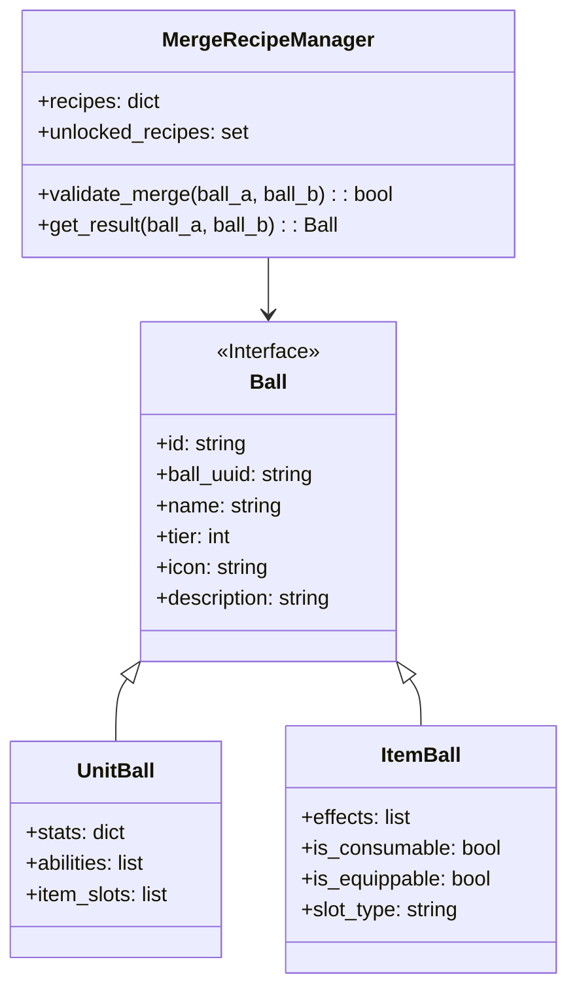

# Flashcard Heroes: Gachamon - Game Design Document

Version: 2.0 (Consolidated Document)
Date: 2025-05-25

## Table of Contents

1. [Game Overview](#1-game-overview)
2. [UI Philosophy & Structure](#2-ui-philosophy--structure)
   - [2.1. Target Aspect Ratio & Interaction Model](#21-target-aspect-ratio--interaction-model)
   - [2.2. Visual States & Responsiveness](#22-visual-states--responsiveness)
   - [2.3. UI Layers](#23-ui-layers)
3. [Core Gameplay Flow & Node Logic](#3-core-gameplay-flow--node-logic)
4. [Resources](#4-resources)
5. [Flashcard System](#5-flashcard-system)
6. [Status Effects](#6-status-effects)
7. [Master Run Pool, Trinkets & Permanence](#7-master-run-pool-trinkets--permanence)
8. [Gacha System](#8-gacha-system)
9. [Battle system](#9-battle-system)
   - [9.1. Battle Phases](#91-battle-phases)
   - [9.2. Combat Resolution](#92-combat-resolution)
10. [Hero & Legendary Units](#10-hero--legendary-units)
11. [Unit, Item & Trinket Definitions](#11-unit-item--trinket-definitions)
    - [11.1. Unit Definitions](#111-unit-definitions)
    - [11.2. Item Definitions](#112-item-definitions)
    - [11.3. Trinket Definitions](#113-trinket-definitions)
12. [Positional & Synergy Systems](#12-positional--synergy-systems)
13. [Scene-Specific UI/UX](#13-scene-specific-uiux)
    - [13.1. Title Screen](#131-title-screen)
    - [13.2. Loadout Scene](#132-loadout-scene)
    - [13.3. Battle Node](#133-battle-node)
    - [13.4. Path Choice Scene](#134-path-choice-scene)
    - [13.5. Shop Scene](#135-shop-scene)
    - [13.6. Event Scene](#136-event-scene)
    - [13.7. Rest Site Node](#137-rest-site-node)
    - [General UI Interaction Patterns](#general-ui-interaction-patterns)
14. [Progression Systems](#14-progression-systems)
    - [14.1. Difficulty Scaling](#141-difficulty-scaling)
    - [14.2. Meta-Progression](#142-meta-progression)
15. [System Architecture & Implementation](#15-system-architecture--implementation)
    - [15.1. Core Systems](#151-core-systems)
    - [15.2. Data Structures](#152-data-structures)
    - [15.3. Save System](#153-save-system)
16. [Detailed Battle System](#16-detailed-battle-system)
    - [16.1. Turn Structure](#161-turn-structure)
    - [16.2. Ability Resolution](#162-ability-resolution)
17. [Event System](#17-event-system)
    - [17.1. Event Types](#171-event-types)
    - [17.2. Event Flow](#172-event-flow)
18. [UI/UX Enhancements](#18-uiux-enhancements)
    - [18.1. Tooltip System](#181-tooltip-system)
    - [18.2. Feedback Systems](#182-feedback-systems)
    - [18.3. Accessibility](#183-accessibility)
19. [Player Interaction & UI Logic](#19-player-interaction--ui-logic)
    - [19.1. Core Interaction Model](#191-core-interaction-model)
    - [19.2. Selection Logic](#192-selection-logic)
    - [19.3. Contextual Actions](#193-contextual-actions)
    - [19.4. Input Handling](#194-input-handling)
    - [19.5. Error Prevention](#195-error-prevention)
20. [Node Resolution & Scene Transitions](#20-node-resolution--scene-transitions)
21. [File Structure & Implementation](#21-file-structure--implementation)
    - [17.3. Save System](#173-save-system)

## 1. Game Overview

Flashcard Heroes: Gachamon is a turn-based, deckbuilder, auto-battler roguelike where players use flashcard mini-games as a resource generator. Players assemble a team led by a chosen Hero Unit, manage their deck of Balls (Units and Items), and engage in strategic battles. Success relies on both tactical decision-making and mastery of the chosen flashcard deck, with each run offering unique opportunities and escalating difficulty as they player gets more familiar with the deck he's using. The Hero Unit's Health Points (HP) persist and is the player's health points for the run; if depleted to zero, the run ends (Game Over). The goal is to defeat the final boss of the run that only appears once they player has unlocked all flashcards in the chosen flashcard deck for the run.

### Core Gameplay Loop

1. **Run Start**: Player selects a Hero Unit and Flashcard Deck
2. **Path Selection**: Choose between 3 RNG generated nodes (Battle (Common, Elite, Mini-Boss, Final Boss), Shop, Event, Rest Site)
3. **Node Resolution**:
   - **Battle**: Engage in combat using Units drawn from Gacha Machines and earn new Balls (Units and Items) or gold as rewards.
   - **Shop**: Spend Gold to acquire new Balls or services
   - **Event**: Make choices with various outcomes
   - **Rest Site**: Heal, train, or gamble for rewards
4. **Progression**: Defeat mini-bosses and the final boss to complete a run
5. **Meta-Progression**: Unlock new content for future runs

### Key Systems

- **Flashcard Mini-Games**: Answer questions to earn Gacha Tokens
- **Gacha System**: Spend Tokens to draw Units and Items during battle
- **Unit Management**: Deploy, merge, and equip Units strategically
- **Master Run Pool**: Persistent collection of Units and Items that grows during a run
- **Trinkets**: Global passive bonuses that modify gameplay
- **Hero Units**: Unique characters with special abilities that persist through the run and represent the player.

## 2. UI Philosophy & Structure

### 2.1. Target Aspect Ratio & Interaction Model

- **Aspect Ratio**: 16:9 landscape, optimized for both PC and mobile
- **Primary Interaction**: Click/tap based (no drag-and-drop in MVP but it will be implemented in the future)
- **Visual Feedback**: Clear visual responses to all interactions
- **Accessibility**: Color-blind friendly, scalable UI elements
- **Consistency**: Uniform interaction patterns across all screens

### 2.2. Visual States & Responsiveness

- **Interactive Elements**:
  - Normal: Default state
  - Hover: Slight scale increase (desktop only)
  - Pressed: Visual feedback on click/tap
  - Disabled: Grayed out, non-interactive
- **Animations**:
  - Smooth transitions between screens
  - Visual feedback for all actions
  - Performance-optimized for target platforms
- **Responsiveness**:
  - Adapts to different screen sizes
  - Maintains aspect ratio and readability
  - Touch targets sized appropriately for mobile

### 2.3. UI Layers

The game interface is organized into logical layers to manage visibility and interaction:

1. **Fixed Top Bar** (Persistent across most screens):
   - Hero portrait & HP
   - Gold counter
   - Day counter
   - Active Trinkets
   - Compendium/Achievements button
   - *Visibility*: Generally visible across most game scenes (exceptions include full-screen introductory sequences, the Title Screen and the loadout screen)
   - *Purpose*: Provides key player information.

2. **Fixed Bottom Bar** (Persistent across most screens like the top bar):
   - Gacha Machines (battle)
   - draw buttons
   - gacha inspection window when the gacha machine is clicked
   - *Visibility*: Generally visible across most game scenes (exceptions include full-screen introductory sequences, the Title Screen and the loadout screen)
   - *Purpose*: Primary interaction area for game actions with the gacha machines, draw buttons and gacha inspection windows.

3. **Dynamic Central Area**:
   - Main content area is contextual (e.g., Battle, Shop, Event)
   - Updates based on current game state
   - Scene-specific UI elements (e.g., Lineups, bench slots,inventory slots, Event Choices, interactions elements, etc)
   - *Position*: Situated between the Top and Bottom Bars
   - *Behavior*: Layout and content change dynamically based on the player's current game Node (e.g., Battle, Shop, Event) or active scene presenting also the interactions elements (e.g., buttons)

4. **Overlays**:
   - Modal windows, pop-up panels, prompts, tooltips and mini-games
   - Appear on top of other UI layers
   - Temporarily take focus
   - Examples include:
     - Flashcard Mini-Game
     - Inspection Windows
     - Tooltips
     - Confirmation prompts
     - Compendium/Achievements views
   - *Behavior*: Typically require user interaction before returning to the underlying content
   - Modal windows
   - Popup dialogs
   - Full-screen mini-games
   - Inspection windows

## 3. Core Gameplay Flow & Node Logic

### Node Types

- **Battle Node**: Combat encounters with enemy teams
  - Common Battle: Standard enemy encounters
  - Elite Battle: Tougher enemies, better rewards
  - Mini-Boss Battle: Challenging fights with unique mechanics
  - Final Boss Battle: Ultimate challenge of the run

- **Shop Node**: Spend Gold to enhance your run
  - Purchase new Balls (Units/Items)
  - Reroll shop inventory
  - Remove unwanted Balls from Master Run Pool
  - Transform Balls into different ones of same tier

- **Event Node**: Narrative choices with various outcomes
  - Resource gains/losses
  - Ball acquisition/loss
  - Trinket acquisition
  - Special battles or challenges

- **Rest Site Node**: Recovery and improvement
  - Rest & Recover: Heal Hero HP
  - Train & Enhance: Upgrade existing Balls stats
  - Gamble: Risk resources for potential rewards

### Path Generation Rules

1. **Procedural Generation**:
   - Each path offers 3 node choices
   - Node types are weighted based on progression
   - No guaranteed shop/rest nodes at set intervals
   - Mini-bosses at flashcard unlock milestones (every 20% unlocked from the main complete deck)
   - Final boss when 100% of the main complete deck is unlocked.

2. **Difficulty Scaling**:
   - Increases with each day/node
   - Additional scaling after mini-bosses
   - Self-adjusts based on player performance due to the flashcard system algorithm for choosing the next flashcard.

## 4. Resources

### Gold
- **Purpose**: Persistent currency for the current run
- **Acquisition**:
  - Battle rewards
  - Event outcomes
  - Rest Site actions (gambles)
- **Uses**:
  - Purchase Balls in shops
  - Pay for shop services
  - Certain event choices
  - Rest Site actions (gambles)

### Hero HP
- **Purpose**: Primary run health resource
- **Maximum**: Determined by Hero selection and upgrades
- **Loss Conditions**:
  - Battle damage
  - Certain event choices
- **Recovery**:
  - Rest Site "Rest" action
  - Certain event outcomes
  - Specific item/ability effects/trinket effects
- **Game Over**: Occurs when Hero HP reaches 0

### Coins (Gacha Tokens)
- **Purpose**: Currency for drawing Balls
- **Acquisition**:
  - Flashcard mini-game performance
  - Unit abilities
  - Trinket effects
  - Passive generation
- **Usage**:
  - Activate Gacha Machines
  - Cost scales with tier (T1=1, T2=2, T3=3)
- **Persistence**:
  - Reset between Nodes
  - Do not carry over between nodes

## 5. Flashcard System

### Flashcard Decks
- **Main Deck**: Selected at run start, contains ~110 cards
- **Active Deck**: Start the run with a subset of 10 cards used in the flashcard mini-game, the active deck is updated at the start of each mini-game with one new card until no more cards are available in the main deck.
- **Card Types**:
  - Japanese characters and words (Hiragana, Katakana, Kanji, Vocabulary words)
- **Progression**:
  - New cards added from Main to Active Deck at the start of each mini-game.
  - Flashcard cycle based on mastery of each flashcard.
  - Spaced repetition algorithm for the draw order of the flashcards.

### Mini-Game Mechanics
- **Trigger**:
  - Start of player turn (battle)
  - Specific abilities (e.g. trinkets)
  - Event choices
  - Rest Site actions
- **Gameplay**:
  1. New card added is shown and explained 
  2. Timer starts counting down
  3. Flashcard is displayed with question
  4. 3x3 grid of answer choices is presented.
  5. Player selects an answer 
  6. The next flashcard from the active deck is shown and this repeats until the time limit is reached
  7. The player tries to asnwers as many Flashcard questions as possible in the time limit.
- **Outcomes**:
  - Correct: 1 coin per correct answer
  - Incorrect: 0 coins

### Master Run Pool (persistent)
- **Definition**: The player's persistent collection of Unit and Item Balls for the current run
- **Acquisition Methods**:
  - Starting set (varies by Hero selection)
  - Battle rewards
  - Shop purchases
  - Event outcomes
  - Merge results
- **Management**:
  - **Capacity**: No maximum limit (unlimited collection)
  - **Organization**: Balls are categorized by type (Unit/Item) and tier (1-3)
  - **Persistence**: Maintained throughout the entire run
  - **Run-Specific**: Reset when starting a new run

### Trinkets
- **Definition**: Global passive bonuses that affect the entire run
- **Acquisition**:
  - Mini-boss rewards
  - Special event outcomes
  - Meta-progression unlocks (acquired as in making it available)
- **Limitations**:
  - Maximum of 5 active Trinkets at once
  - Cannot be sold or removed (but can be replaced)
- **Effects**:
  - Modify game mechanics
  - Provide passive bonuses
  - Unlock special interactions

### Permanence & Run Progression
- **Run-Specific Elements**:
  - Master Run Pool contents
  - Active Trinkets
  - Hero HP and upgrades
  - Day counter
  - Unlocked recipes (specific to run)
- **Permanent Progression**:
  - Meta-currencies
  - Unlocked Heroes
  - Flashcard Decks
  - Starting Ball options 
  - Trinket unlocks
  - New permanent content for future runs (e.g., new recipes, new Balls, new Trinkets, new Hero Units) 

## 7. Master Run Pool, Trinkets & Permanence

### Core Mechanics
- **Gacha Machines**:
  - Three tiers (T1-T3)
  - Each has its own pool of Balls
  - Cost scales with tier (1/2/3 coins)
  - Visual distinction between tiers
- **Draw Mechanics**:
  - Random selection from available Balls
  - Visual/audio feedback on draws

### Battle Instance Pools
- **Temporary Pools**:
  - Created at battle start
  - Based on Master Run Pool contents
  - Separate pools for each tier
  - Discard pile for used Balls
- **Pool Management**:
  - Draws deplete the pool
  - Empty pools reshuffle from discard
  - Visual indicators of pool status via the inspection window

### Merge System
- **Temporary Merges**:
  - Only affect current battle
  - Require matching tiers
  - Follow unlocked recipes
  - Transfer equipped items
- **Permanent Merges**:
  - Consume Balls from Master Run Pool
  - Create new higher-tier Balls that are added to the respective tier machine's pool
  - Require specific combinations recipes

## 8. Gacha System

### Hero Units
- **Selection**:
  - Chosen at run start
  - Unique set of starting balls
  - Special abilities
- **Progression**:
  - Gains stats on rest site
  - Permanent death (run ends if defeated)

### Legendary Units and Items
- **Acquisition**:
  - Battle rewards
  - Shop purchases
  - Event rewards
  - Boss rewards
- **Characteristics**:
  - Powerful abilities
  - Unique mechanics
  - Synergy bonuses
  - Visual distinction

## 9. Battle system

### 9.1. Battle Phases

1. **Start of Turn Phase**
   - Flashcard mini-game triggered
   - Passive Coin generation
   - ON_TURN_START events fire
   - Status effect ticks (start of turn)

2. **Management Phase**
   - Player actions:
     - Draw Balls from Gacha Machines
     - Position Units and units in Lineup/Bench/Inventory
     - Merge Units (temporary for this battle)
     - Equip/merge/use Items
   - When the player clicks the "End Turn" button, move to the autobattle phase.

3. **Combat Phase**
   - Automatic resolution (no player input possible, only inspection of elements, pausing or speeding up the battle)
   - Player team acts first, then the enemy team
   - Within each team, units act from backmost to frontmost position (left to right for player team, right to left for enemy team)
   - Unit actions determined by their abilities
   - When all units have taken their actions, the combat phase ends.

4. **End of Turn Phase**
   - Status effect ticks (end of turn)
   - Check win/lose conditions
   - Award battle rewards if victorious
   - Transition to start of next turn or battle end if the player HP is 0.

### 9.2. Combat Resolution

- **Turn Order**:
  - Player team acts first, then enemy team
  - Within each team, units act from backmost to frontmost position
  - Player team order: left to right (leftmost is front)
  - Enemy team order: right to left (rightmost is front)

## 10. Hero & Legendary Units

### Hero Units
- Selected at the start of a run. One Hero per run.
- Unique: Each Hero has a distinct starting stat profile (HP, PWR) and one or more unique passive abilities or mechanics that define their playstyle.
- Persistent: The Hero Unit remains with the player for the entire run. It automatically starts in the backmost available Lineup slot in every battle.
- Restrictions: Cannot be moved to the Bench or used in Merging.
- Hero HP: The Hero's HP is a persistent resource for the run. It is reduced by battle losses and other effects. If it reaches 0, the run ends (Game Over).

### Legendary Units
- Special, unique Units.
- Acquisition: available through special events or as mini-boss/boss rewards or elite battle rewards or shop purchases.
- Characteristics: Higher base stats, powerful abilities, unique synergies.
- Legendary Units should significantly impact the player's strategy and provide meaningful power spikes when acquired.

## 11. Unit, Item & Trinket Definitions

### Unit Definitions

**Basic Attributes**
- **Name**: Unique identifier
- **Tier**: 1-3 (common to legendary)
- **Type**: Warrior, Mage, Support, etc.
- **HP**: Base health points
- **PWR**: Attack power
- **Abilities**: 1-3 active/passive abilities

**Unit Tiers**
1. **Tier 1 (Common)**
   - Basic abilities
   - Lower stats

2. **Tier 2 (Uncommon)**
   - Enhanced abilities
   - Balanced stats

3. **Tier 3 (Rare)**
   - Powerful abilities
   - Higher stats

### Item Definitions

**Item Types**
1. **equipment**: Increase stats, add passive effects
2. **Trinkets**: Special passive effects
3. **Consumables**: One-time per battle use effects

**Item Rarities**
- **Common**: +X to stat
- **Uncommon**: +X to stat + minor effect
- **Rare**: +X to stats + major effect
- **Legendary**: Unique effects, multiple bonuses

### Trinket Definitions

**Trinket Rarities**
- **Common**: Small bonus
- **Uncommon**: Moderate bonus
- **Rare**: Large bonus + effect
- **Legendary**: Game-changing effect

## 12. Scene-Specific UI/UX

### Title Screen
- **Main Menu**:
  - New Game
  - Continue
  - Options
  - Quit

### Loadout Scene
- **Hero Selection**:
  - Visual carousel preview
  - Stats and abilities
  - Starting bonuses
- **Deck Selection**:
  - Available decks
  - Flashcard Decks carousel preview
  - Description of the deck

### Battle Node
- **Battlefield**:
  - Unit placement lineup (horizontal line of 6 slots, 1x6, for each side)
  - Turn order display
  - Ability bar
- **Unit HUD**:
  - Health bars
  - Status effects
  - Cooldowns

### 8.4. Path Choice Scene
- **Node Preview**:
  - Type icon
  - Difficulty
  - Possible rewards
- **Path Visualization**:
  - Connected nodes
  - Boss indicators
  - Recommended path

### 8.5. Shop Scene
- **Inventory Grid**:
  - Items for sale
  - Prices
  - Rarity colors
- **Preview Pane**:
  - Item details
  - Stats comparison
  - Purchase button

### 8.6. Event Scene
- **Event Display**:
  - Background art
  - Character portraits
  - Text window
- **Choice Buttons**:
  - 2-4 options
  - Success chance
  - Risk/reward indicator

### 8.7. Rest Site Node
- **Rest Options**:
  - Heal amount
  - Upgrade chances
  - Risk levels
- **Visual Feedback**:
  - HP restoration
  - Upgrade results
  - Random events

## General UI Interaction Patterns

### Selection Logic
- **Single Selection**:
  - Click to select
  - Visual highlight
  - Contextual actions

### Inspection Windows
- **Unit Inspection**:
  - Detailed stats
  - Ability descriptions
  - Equipment slots
 **Item Inspection**:
  - Properties
  - Effects description
- **Trinket Inspection**:
  - Effects description

### Prompts & Confirmations
- **Action Confirmation**:
  - Resource spending
  - Action choices

### Tooltips & Feedback
- **Hover Tooltips**:
  - Info
  - Stat breakdowns
- **Action Feedback**:
  - Visual effects
  - Audio cues

## 13. Progression Systems

### 9.1. Difficulty Scaling
- **Enemy Stats**: Increase per day
- **Elite Modifiers**: Special abilities
- **Boss Phases**: Multiple stages
- **Permanent Upgrades**: Reduce scaling

### 9.2. Meta-Progression
- **Unlock Tree**:
  - New heroes
  - Starting items
  - Card packs
  - Cosmetics
- **Achievements**:
  - Milestone rewards
  - Challenge modes
  - Hidden objectives

## 14. System Architecture & Implementation

### 10.1. Core Systems
- **Game Manager**: Orchestrates game flow and scene transitions
- **Battle System**: Handles turn order, ability resolution, and combat outcomes
- **Deck Manager**: Manages flashcard decks and active card sets
- **Save System**: Handles game state persistence and loading
- **Event System**: Manages event triggers, conditions, and effects
- **Gacha System**: Handles unit/item generation and gacha mechanics
- **Audio System**: Manages sound effects and music
- **Localization**: Handles text and asset localization

### 10.2. Data Structures
- **Unit Data**:
  - Base stats (HP, PWR, etc.)
  - Ability definitions
  - Growth curves
  - Visual assets
- **Item Database**:
  - Item properties and effects
  - Rarity definitions
  - Equip restrictions
- **Status Effects**:
  - Effect definitions
  - Stacking rules
  - Duration logic
- **UI State**:
  - Menu navigation state
  - HUD visibility
  - Tooltip data
  - Modal windows
- **Save Data**:
  - Run state
  - Player inventory
  - Unlocks
  - Settings

### 10.3. Save System
- **Run Data**:
  - Current day
  - Hero HP
  - Gold
  - Master Run Pool
  - Equipped items
  - Active trinkets
- **Meta Progress**:
  - Unlocked heroes
  - Available decks
  - Cosmetic unlocks
  - Achievement progress
- **Settings**:
  - Audio levels
  - Display settings
  - Control bindings
  - Accessibility options
- **Cloud Integration**:
  - Cross-device sync
  - Backup system
  - Conflict resolution

## 15. Detailed Battle System

### 11.1. Turn Structure
1. **Start of Turn**
   - Flashcard mini-game
   - Gacha Token generation
   - ON_TURN_START events
   - Status effect ticks

2. **Management Phase**
   - 60-90 second timer
   - Unit placement
   - Item management
   - Merging decisions

3. **Combat Phase**
   - Automatic resolution
   - Turn order by team and position
   - Ability execution
   - Damage calculation

4. **End of Turn**
   - Status effect cleanup
   - Victory/defeat check
   - Reward distribution

### 11.2. Ability Resolution
- **Targeting Rules**:
  - Melee vs Ranged
  - Line of sight
  - Target priorities
- **Damage Calculation**:
  - Base damage
  - Type effectiveness
  - Critical hits
  - Damage reduction
- **Status Effects**:
  - Application rules
  - Stacking logic
  - Duration tracking

## 16. Event System

### 12.1. Event Types
- **Story Events**:
  - Narrative progression
  - Branching paths
  - Character interactions
- **Random Events**:
  - Combat encounters
  - Treasure rooms
  - NPC encounters
- **System Events**:
  - Tutorial popups
  - Achievement unlocks
  - Error notifications

### 12.2. Event Flow
1. **Trigger Detection**
   - Game state changes
   - Player actions
   - Random chance

2. **Condition Checking**
   - Prerequisites
   - Random weights
   - Cooldowns

3. **Execution**
   - Display event UI
   - Present choices
   - Apply outcomes

4. **Cleanup**
   - Update game state
   - Save progress
   - Trigger follow-ups

## 17. UI/UX Enhancements

### 13.1. Localization Support
- **Text Handling**:
  - All text must be externalized to translation files
  - Use Godot's `tr()` function for all user-facing text
  - Support right-to-left (RTL) languages
  - Implement proper text wrapping and container resizing

- **Fonts & Assets**:
  - Include fonts that support extended character sets
  - Ensure proper line heights for different scripts
  - Localize all images containing text

- **Cultural Considerations**:
  - Avoid culturally specific references that don't translate well
  - Use universally recognizable icons and symbols
  - Support different date, time, and number formats

### 13.2. Tooltip System
- **Context-Sensitive**:
  - Unit stats
  - Ability details
  - Status effect info
  - Item properties
- **Progressive Disclosure**:
  - Basic info on hover
  - Detailed info on click
  - Advanced stats toggle

### 13.2. Feedback Systems
- **Visual Feedback**:
  - Damage numbers
  - Status effect icons
  - Ability animations
- **Audio Feedback**:
  - Sound effects
  - Voice lines
  - Environmental audio
- **Haptic Feedback**:
  - Controller rumble
  - Touch feedback
  - Screen shake

### 13.3. Accessibility
- **Visual Options**:
  - Colorblind mode
  - Text size scaling
  - High contrast UI
- **Audio Options**:
  - Separate volume sliders
  - Visual cues
  - Subtitle options
- **Control Options**:
  - Key rebinding
  - Controller support
  - Touch controls

## 18. Player Interaction & UI Logic

### 11.1 Core Interaction Model
- **Single Click/Tap**:
  - Selects interactable elements
  - Opens context menus
  - Confirms actions
- **Double Click/Tap**:
  - Quick equip/use on valid targets
  - Quick merge when applicable
- **Click + Drag**:
  - Reposition units in lineup
  - Move items between slots
  - Reorder cards in hand/deck
- **Right-Click/Long Press**:
  - Open detailed inspection
  - Show advanced options
  - Access context help

### 11.2 Selection Logic

#### Player Entities
1. **First Click on Entity** (Unit/Item):
   - Visual highlight applied
   - Contextual action buttons appear
   - Tooltip displays detailed stats
   - Related UI elements highlight (e.g., valid merge targets)

2. **Subsequent Clicks**:
   - Same entity: Toggle inspection window
   - Different entity: Contextual action based on types
   - Empty space: Deselect current entity

#### Enemy Entities
1. **First Click**:
   - Selects enemy
   - Shows health bar
   - Displays active status effects
   - Highlights attack range/area

2. **Inspection**:
   - Detailed stats view
   - Ability descriptions
   - Weaknesses/resistances
   - Loot preview (if applicable)

### 11.3 Contextual Actions

#### Unit Actions
- **Move**: Reposition in lineup
- **Inspect**: View detailed stats
- **Merge**: Combine with compatible unit
- **Sell/Dismiss**: Remove from team
- **Ability Use**: Activate special skills

#### Item Actions
- **Equip/Use**: Apply to target
- **Inspect**: View properties
- **Upgrade/Enhance**: Improve stats
- **Sell/Discard**: Remove from inventory

### 11.4 Feedback Systems

#### Visual Feedback
- **Selection**: Glow effect + border
- **Valid Targets**: Highlight in green
- **Invalid Actions**: Red highlight + shake
- **Hover States**: Subtle animations
- **Action Confirmation**: Brief flash/particle effect

#### Audio Feedback
- **UI Hover**: Subtle "tick" sound
- **Selection Confirmation**: Soft "click"
- **Success/Failure**: Distinct positive/negative tones
- **Action Sounds**: Thematic audio for different actions

### 11.5 Input Handling

#### Keyboard Controls
- **WASD/Arrow Keys**: Navigate UI
- **Space/Enter**: Confirm selection
- **Escape**: Cancel/back
- **Number Keys**: Quick select units/items
- **Tab**: Cycle through targets

#### Gamepad Controls
- **D-Pad**: Menu navigation
- **Face Buttons**: Primary actions
- **Bumpers/Triggers**: Tab through menus
- **Start/Select**: Pause/options

### 11.6 Error Prevention

#### Confirmation Dialogs
- **Destructive Actions**: "Are you sure?" for major changes
- **Resource Spending**: Confirm before spending premium currency
- **Permanent Choices**: Highlight irreversible decisions

#### Undo Functionality
- **Limited Undo**: Available for certain actions
- **Time-based Revert**: Short window to undo mistakes
- **Action Log**: History of recent actions

### 11.7 Tooltip System

#### Contextual Help
- **Basic Info**: Appears on hover
- **Detailed View**: On click/long press
- **Tutorial Tips**: Context-sensitive guidance
- **Keyword Glossary**: Hover over terms for definitions

### 11.8 Menu Navigation

#### Hierarchy
1. **Main Menu**: Game modes and settings
2. **Pause Menu**: In-game options
3. **Character/Inventory**: Equipment and stats
4. **Ability/Deck**: Skills and loadouts
5. **Quest/Map**: Progression tracking

#### Shortcuts
- **Quick Menu**: Radial/pie menu for common actions
- **Hotkeys**: Customizable keybinds
- **Favorites**: Pin frequently used items
*   **Content**: Displays detailed stats, abilities, equipped items or effects.
*   **Modal Behavior**: Foremost UI element but doesn't prevent interaction with game board.

## 15. Detailed Battle System

### 9.1. Battle Phases & Event Flow

#### Battle Start
- **BATTLE_SETUP_PHASE**:
  - Enemy Lineup is populated.
  - Player's Hero Unit is placed in their Lineup.
  - Temporary Battle Draw Pools and Discard Piles are initialized based on Master Run Pool.
  - Player's Lineup, Bench for units and Inventory bench are empty (except Hero).
  - Trinket effects relevant at battle start are applied.
  - Any ON_BATTLE_START abilities trigger.

#### Player Turn Cycle
1. **START_OF_TURN_PHASE**:
   - A Flashcard mini-game is automatically initiated for the player.
   - Player passively generates a base amount of Gacha Tokens if any passive effects dictate this.
   - Abilities with the ON_TURN_START trigger activate.
   - Status effects with duration: remaining duration decreases by 1.

2. **BATTLE_MANAGEMENT_PHASE**:
   - Player can spend Gacha Tokens at the Gacha Machines.
   - Player can arrange their Lineup and Bench (move Units between slots).
   - Player can merge compatible Units (temporary for this battle).
   - Player can equip/use Items.
   - Phase ends when player clicks the "End Phase" button.

3. **COMBAT_PHASE**:
   - Both Player's and Enemy's Units automatically attack each other.
   - Order determined by team (player goes first) and unit position (back to front).
   - Abilities trigger according to their parameters.
   - Phase ends when all Units have taken their actions.

4. **END_OF_TURN_PHASE**:
   - End-of-turn ability triggers and effects resolve.
   - Battle victory/defeat conditions are checked:
     - Victory: All enemy Units are defeated.
     - Defeat: All player Units (including Hero) are defeated.
   - If neither condition is met, the game proceeds to the next turn, returning to START_OF_TURN_PHASE.

### 9.2 Item Equipping & Usage Logic

#### Core Concepts
- **ItemBall**: Represents equippable items with properties:
  - `is_consumable`: Boolean for one-time use items
  - `is_equippable`: Boolean for equipment items
  - `slot_type`: Type of equipment slot (weapon, armor, etc.)
  - `effects`: List of effects applied when equipped/used

#### Equipping Flow
1. **Player Action**: 
   - Clicks on InventoryItem (selection)
   - Clicks on TargetUnit (action)

2. **Item Type Check**:
   - **Non-Targeted Consumable**:
     - Effect triggers immediately
     - Item is consumed from inventory
     - `ItemConsumedEvent` is published
   
   - **Equippable/Targeted Consumable**:
     - System checks target unit's item slots sequentially
     - If empty compatible slot found:
       - Item is equipped in the slot
       - Removed from inventory
       - If targeted consumable, effect triggers immediately
       - `ItemEquippedEvent` is published
     
     - If no empty slots, attempts merge-on-equip:
       - Checks merge compatibility with each equipped item
       - If valid merge recipe found:
         - Both items are consumed
         - New merged item is created
         - `MergeSuccessfulEvent` is published
       - If no merge possible, action fails

#### Event Flow
1. `PlayerAttemptEquipIntent` generated
2. `EquipEventHandler` processes the intent
3. `EquipService` validates and executes the action
4. Game state updates and events are published
5. UI updates based on result events

#### Key Methods
- `EquipService.equip_item(item_id, unit_id, slot_index)`
- `MergeService.check_merge_possibility(item_a, item_b)`
- `GameStateManager.update_item_state(item_id, new_state)`

### 9.3 Unit Merging System

#### Core Concepts
- **UnitBall**: Represents mergeable units with properties:
  - `stats`: Base attributes (HP, PWR)
  - `abilities`: List of unit abilities
  - `item_slots`: Equipped items
  - `tier`: Current merge tier

#### Merging Flow
1. **Player Action**:
   - Selects Unit A (first click)
   - Selects Unit B (second click, same tier)
   - System validates merge via `MergeRecipeManager`

2. **Validation Check**:
   - Both units must be of the same tier
   - Must have a valid merge recipe
   - Must be in valid locations (bench or lineup)

3. **Merge Execution**:
   - Units A and B are consumed
   - New merged unit is created in Unit B's position
   - Unit inherits:
     - Higher base stats + 10% bonus
     - Combined ability list (unique abilities only)
     - Combined item slots (up to maximum)

4. **Item Handling**:
   - Items from both units are collected
   - System attempts to equip items in this order:
     1. Empty slots on the new unit
     2. Merge with existing equipped items if possible
     3. Place in battle inventory if space available
     4. Discard if no other options

#### Event Flow
1. `PlayerAttemptMergeIntent` generated
2. `MergeEventHandler` processes the intent
3. `MergeService` validates and executes the merge
4. `MergeSuccessfulEvent` published with details
5. UI updates to reflect the new unit and item states

#### Key Methods
- `MergeService.execute_merge(unit_a_id, unit_b_id, target_location)`
- `MergeRecipeManager.validate_merge(unit_a_type, unit_b_type)`
- `GameStateManager.transfer_items(source_unit, target_unit)`

#### Merge Rules
- Only same-tier units can merge
- Resulting unit is one tier higher
- Stats increase by 10% over the higher base
- Duplicate abilities are not stacked
- Item capacity increases with unit tier

## 16. Event System

### 10.1. Events (Triggers) - Full List

Events represent moments when abilities can activate. Key events include:

- **ON_BATTLE_START**: Triggered when a battle begins, before the first turn.
- **ON_TURN_START**: Triggered at the beginning of each turn.
- **ON_TURN_END**: Triggered at the end of each turn.
- **ON_ATTACK**: Triggered when a Unit initiates an attack.
- **ON_HURT**: Triggered when a Unit takes damage (formerly UNIT_TOOK_DAMAGE).
- **ON_DEATH**: Triggered when a Unit dies (formerly UNIT_DIED).
- **STATUS_EFFECT_APPLIED**: Triggered when a status effect is applied to a Unit (formerly UNIT_STATUS_APPLIED).
- **MERGE_SUCCESSFUL_EVENT**: Triggered when Units are successfully merged (formerly ENTITIES_MERGED).
- **VISUAL_EFFECT_TRIGGER**: Triggered for visual effects in the game.
- **ON_FLASHCARD_CORRECT**: Triggered when a flashcard is answered correctly.
- **ON_FLASHCARD_INCORRECT**: Triggered when a flashcard is answered incorrectly.

### 10.2. Conditions - Full List & Definitions

Conditions determine if an ability can activate when its trigger event occurs. Examples include:

- **HEALTH_BELOW_X_PERCENT**: Checks if a Unit's HP is below a specified percentage.
- **HAS_STATUS_EFFECT_X**: Checks if a Unit has a specific status effect.
- **ATTACKER_HAS_TAG_X**: Checks if an attacking Unit has a specific tag.
- **IS_FIRST_ATTACK_OF_TURN**: Checks if this is the Unit's first attack of the turn.
- **RANDOM_CHANCE_X**: Activates with a specified probability.
- **WARRIOR_SYNERGY_TIER_X_ACTIVE**: Checks if a specific Warrior synergy tier is active.

### 10.3. Effects (Keywords) - Full List & Definitions

Effects are the outcomes when an ability activates. Examples include:

- **DEAL_DAMAGE**: Deals damage to the target(s).
- **HEAL**: Restores HP to the target(s).
- **APPLY_STATUS_EFFECT**: Applies a status effect to the target(s).
- **MODIFY_STAT_TEMPORARY**: Temporarily changes a stat of the target(s).
- **MODIFY_STAT_PERMANENT**: Permanently changes a stat of the target(s).
- **GAIN_GACHA_TOKENS**: Player gains Gacha Tokens.
- **DRAW_BALL_FROM_TIER_X**: Draws a Ball from a specified Tier.

### 10.4. Targeting Rules - Full List & Definitions

Targeting rules determine which entities are affected by an ability. Examples include:

- **SELF**: The Unit with the ability.
- **ATTACKER**: The Unit that attacked.
- **DEFENDER**: The Unit that was attacked.
- **RANDOM_ENEMY**: A random enemy Unit.
- **RANDOM_ALLY**: A random allied Unit.
- **ALL_ENEMIES**: All enemy Units.
- **ALL_ALLIES**: All allied Units.
- **ALL_ALLIES_WITH_TAG_X**: All allied Units with a specific tag.
- **ADJACENT_ALLIES**: Allied Units in adjacent positions.

## 6. Status Effects

Status Effects are temporary conditions applied to Units that modify their behavior or stats. Each effect has a name, description, visual indicator, duration, and effect logic.

Key Status Effects include:

- **Burn**: Unit takes X damage at the start of each turn. Duration: Y turns.
- **Stun**: Unit cannot act during the next combat phase. Duration: 1 turn.
- **Shield**: Unit is protected from up to X damage. Duration: Until broken or Y turns.
- **Strength**: Unit deals +X% damage with attacks. Duration: Y turns.
- **Weakness**: Unit deals -X% damage with attacks. Duration: Y turns.
- **Dodge**: Unit has X% chance to avoid attacks. Duration: Y turns.
- **Regeneration**: Unit heals X HP at the start of each turn. Duration: Y turns.

## 10. Unit, Item & Trinket Definitions

This section outlines the structure and provides examples of the logic for Units, Items, and Trinkets. The comprehensive list of all specific game content, including detailed stats, full ability/effect descriptions, and names for all entities, is maintained in the `Flashcard Heroes (Game Content).md` document. The focus here is on the *types* of entities and the *behavioral logic* they entail.

### 12.1 Unit Definitions

Units are defined by Type ID, Name, Tier, BaseStats: HP, PWR, Abilities, Tags (for synergies), and Visual Assets. This GDD describes the *kinds* of abilities and their logic, while the specific abilities for each unit are detailed in the content document.

Example Unit Types by Tier (illustrative of complexity and roles):
- **Tier 1**: Basic units with simple abilities (e.g., Warrior, Archer, Mage).
- **Tier 2**: Advanced units with more complex abilities (e.g., Knight, Ranger, Wizard).
- **Tier 3**: Powerful units with strong abilities (e.g., Paladin, Sniper, Archmage).

### 12.2 Item Definitions

Items are defined by Type ID, Name, Tier, Effect Description, and Visual Assets. This GDD describes the *types* of effects and their logic, while specific item effects are detailed in the content document. They are categorized as:
- **Equippable**: Provides passive bonuses when equipped to a Unit.
- **Consumable**: Provides a one-time effect when used, then disappears.

Example Item Types:
- **Weapons**: Increase PWR (e.g., Sword, Bow, Staff).
- **Armor**: Increase HP or provide defensive effects (e.g., Shield, Helmet).
- **Accessories**: Provide utility effects (e.g., Ring, Amulet).
- **Potions**: Consumable items with instant effects (e.g., Healing Potion, Strength Potion).

### 12.3 Trinket Definitions

Trinkets provide global passive bonuses affecting various game systems. This GDD provides *examples* of the *logic* these trinkets might employ. Specific trinket effects and values are detailed in the content document. Example Trinkets:
- **Flashcard Proficiency**: Earn +1 Gacha Token per correct answer.
- **Lucky Draw**: +10% chance to draw higher-rarity Units/Items.
- **Token Generator**: Generate +1 Gacha Token at the start of each turn.
- **Expert Merging**: +5% stats on all merged Units.
- **Gold Finder**: +10% Gold from battle rewards.

## 11. Positional & Synergy Systems

### 13.1 Positional Logic in Combat

- **Lineup Positions**: 6 positions arranged in 2 rows of 3.
- **Front Row (positions 0-2)**: Takes damage first. Units here can attack any enemy.
- **Back Row (positions 3-5)**: Protected by Front Row. Units here can only attack enemy Back Row if the corresponding Front Row position is empty.
- **Position-Based Abilities**: Some abilities reference positions (e.g., "Adjacent allies gain +1 PWR").
- **Position Swapping**: Players can arrange Units during the Battle Management Phase.

### 13.2 Synergy System Logic

- **Unit Tags**: Each Unit has one or more tags (e.g., Warrior, Mage, Beast).
- **Synergy Tiers**: The game checks the count of unique Units sharing specific tags in the Lineup.
- **Threshold Examples**:
  - Warrior Tier 1: 2 Warrior Units → All Warriors gain +10% PWR.
  - Warrior Tier 2: 4 Warrior Units → All Warriors gain +25% PWR.
- **Bonus Effects**: Defined using the Event-Driven Effects System.
- **Activation**: Synergy bonuses are evaluated whenever the player's Lineup composition changes.

## 19. Node Resolution & Scene Transitions

### 14.1 Node Resolution Summary

Each Node type has a defined flow leading to its resolution and a transition to the next scene:

- **Battle Node**: Ends on Win (→ Battle Reward Scene → Path Choice Scene) or Loss (→ Game Over Screen → Title Screen).
- **Shop Node**: Player interacts until they choose to leave → Path Choice Scene.
- **Event Node**: Player makes choices, outcomes resolve → Path Choice Scene (after "Back to the Road" button).
- **Rest Site Node**: Resolves with the chosen action's outcome (e.g., Rest & Recover heals Hero HP, Train & Enhance improves Hero stats, Gamble yields a random reward or penalty) → Path Choice Scene.

### 14.2 Path Choice Scene Logic

- Presents the player with 3 Node choices.
- Node types and their content are generated based on current Day, player progression, and procedural rules.
- Mini-Bosses appear at set Day intervals.
- The player can access their Master Run Pool (their "deck" of Balls) for Permanent Merges or inspection.

### 14.3 Shop Scene Logic

**Offerings**:
- 5 Balls (Units and/or Items, Tiers 1-3) offered for Gold. Stock is random. Cost by Tier/rarity.

**Services**:
- Reroll Stock: Costs Gold. Replaces offered Balls.
- Remove Ball: Costs Gold. Removes one Ball from Master Run Pool.
- Transform Ball: Costs Gold. Replaces one Ball with a random Ball of the same Tier.

### 14.4 Event Scene Logic

- Presents a narrative scenario with choices.
- Outcomes may include: Gold/Hero HP changes, Ball acquisition/loss, Trinket acquisition, Battles, Flashcard mini-games.
- Resolves outcomes, then transitions to Path Choice Scene.

### 14.5 Rest Site Node Logic

**Offers one action choice per visit**:
- Rest & Recover: Heals Hero HP. Flashcard mini-game → Gacha Tokens for Healing Gacha Machine → Healing Balls determine HP recovered.
- Train & Enhance: Improves Hero stat. Flashcard mini-game → Gacha Tokens for Training Gacha Machine → Training Balls grant stat ups.
- Gamble: Costs Gold. Flashcard mini-game → Gacha Tokens for Gambling Gacha Machine → Gambling Balls yield various rewards/setbacks.

## 13. Progression Systems

### 15.1 Run Progression

Difficulty in Flashcard Heroes primarily scales with the **'Day' counter**, which increments with each Node progression. This scaling is implemented through several interconnected mechanisms affecting enemy encounters:

1.  **Encounter Budget System**:
    *   Each 'Day' (or range of Days) is associated with an **Encounter Budget**. This budget increases significantly as the Day counter rises.
    *   A primary use of this budget is to **increase the base stats (HP, PWR) of enemy units**, making them inherently tougher. The budget also funds the "purchase" of enemy units for an encounter, their equipped items, passive bonuses (including Enemy Team Trinkets), and the number/power of Enemy Leaders.

2.  **Enemy Team Composition & Templates**:
    *   Enemy teams are constructed based on **Enemy Team Templates**. These templates define potential unit combinations, synergies, and strategic roles.
    *   Templates can be hand-designed for specific encounters or procedurally selected/generated for common battles based on the current Day and Encounter Budget.
    *   The complexity and power level of available templates increase in later Days.

3.  **Unit Pool, Enemy Leaders, & Enemy Team Trinkets**:
    *   Enemy units are primarily drawn from the same pool of `UnitBalls` available to the player.
    *   **Enemy Leader Units**: All battles will feature at least one Enemy Leader Unit; some challenging encounters or later Day battles may feature multiple Leaders. These are special, enemy-only units with:
        *   Potentially higher base stats or unique stat distributions.
        *   Powerful, distinct abilities not available to player units. These abilities often aim to disrupt core player mechanics and might include global buffs for their team, significant debuffs for the player's team, direct interference with player systems (e.g., adding 'Dud Balls' to Gacha Machines, causing damage on Ball draw), or unique on-death effects.
    *   **Enemy Team Trinkets**: Some enemy teams will benefit from passive effects similar to player Trinkets. These can be:
        *   *Enemy-Specific Trinkets*: Granting bonuses or special abilities only to the enemy team (e.g., "Enemy units start with +X Shield").
        *   *Global Effect Trinkets*: Affecting both the player and the enemy team (e.g., "All Units deal +Y% damage," or "Gacha Token costs are increased for both players").
        *   These trinket effects will be clearly communicated to the player, potentially through UI elements, to allow for strategic adaptation.
    *   The frequency, power, and complexity of Enemy Leader Units and Enemy Team Trinkets increase with the Day counter and Encounter Budget.

4.  **Other Scaling Factors**:
    *   **Itemization**: Enemies in later Days may have more or higher-tier items equipped.
    *   **Event & Shop Difficulty**: Non-combat challenges may also scale (e.g., increased Gold costs, harder Event checks).
    *   **Flashcard Mini-Game**: Requirements or timers for flashcard mini-games could subtly increase in difficulty.

- Mini-Bosses at set Day intervals. Defeating them gates further progression and rewards.
- Final Boss at run end.

### 15.2 Player Power Progression (Within a Run)

- Improving Master Run Pool (the player's "deck" of Balls by acquiring higher Tier Balls, Items).
- Permanent Merges.
- Acquiring Trinkets.
- Managing Hero HP/Gold.
- Flashcard mini-game skill for Gacha Tokens.

### 15.3 Meta-Progression System

Permanent unlocks persisting between runs:
- Unlockable Content: New Heroes, Flashcard Decks, new potential Balls and Trinkets, new Merge Recipes.
- Unlock Mechanism: Achievement system. Completing achievements grants unlocks.
- "Unlocks" screen shows available unlocks and requirements.

## 14. System Architecture & Implementation

### 14.1 Core Components

#### Ball System
- **`Ball` (Interface)**: Base interface with common properties:
  - `id`: Type identifier (e.g., "sword_t1")
  - `ball_uuid`: Unique instance identifier
  - `name`: Display name
  - `tier`: Rarity/power level
  - `icon`: Visual representation
  - `description`: Flavor text and effect description

- **UnitBall**: Extends `Ball` with:
  - `stats`: Base attributes (HP, PWR)
  - `abilities`: List of unit abilities
  - `item_slots`: Equipped items
  - `tier`: Current merge tier

- **ItemBall**: Extends `Ball` with:
  - `effects`: List of effects when used/equipped
  - `is_consumable`: Boolean for one-time use items
  - `is_equippable`: Boolean for equipment items
  - `slot_type`: Type of equipment slot (weapon, armor, etc.)

### 14.2 Core Services

#### Merge System
- **MergeRecipeManager**:
  - Stores all valid merge combinations (e.g., 2x `sword_t1` → `sword_t2`)
  - Tracks unlocked recipes per player
  - Validates potential merges
  - Key Methods:
    - `validate_merge(ball_a, ball_b)`: bool
    - `get_recipe(ball_a_type, ball_b_type)`: Recipe
    - `unlock_recipe(recipe_id)`: void

- **MergeService**:
  - Central coordinator for all merge operations
  - Handles both unit and item merges
  - Manages item transfers during merges
  - Key Methods:
    - `execute_merge(ball_a_id, ball_b_id, target_location)`: void
    - `check_merge_possibility(item_a, item_b)`: bool
    - `transfer_items(source_unit, target_unit)`: void

#### Equipment System
- **EquipService**:
  - Manages item equipping logic
  - Handles consumable item usage
  - Coordinates with MergeService for merge-on-equip
  - Key Methods:
    - `equip_item(item_id, unit_id, slot_index)`: void
    - `use_consumable(item_id, target_id)`: void
    - `can_equip(item, unit)`: bool

- **GameStateManager**:
  - Central repository for all Ball instances
  - Tracks Ball locations (battlefield, bench, inventories)
  - Maintains game state consistency
  - Key Methods:
    - `get_ball(ball_id)`: Ball
    - `update_item_state(item_id, new_state)`: void
    - `get_unit_items(unit_id)`: List[ItemBall]

### 14.3 Event System

The architecture follows an event-driven design where components communicate through events:

1. **Player Input Events**:
   - `PlayerAttemptEquipIntent`
   - `PlayerAttemptMergeIntent`
   - `PlayerUseItemIntent`

2. **Game State Events**:
   - `ItemEquippedEvent`
   - `ItemConsumedEvent`
   - `MergeSuccessfulEvent`
   - `UnitMergedEvent`

3. **UI Update Events**:
   - `InventoryUpdateEvent`
   - `UnitStatsUpdateEvent`
   - `AbilityUnlockedEvent`

### 14.4 Data Flow

1. **Player Action** → InputHandler → EventBus
2. **EventBus** → Appropriate EventHandler
3. **EventHandler** → Service Layer
4. **Service Layer** → Game State Update
5. **Game State** → UI Update Events
6. **UI** → Visual Feedback

#### A. Merging Two Items in Battle Inventory
1. Player clicks Item A (selects it)
2. Player clicks Item B (target for merge)
3. System validates merge via MergeRecipeManager
4. If valid:
   - Items A and B are consumed
   - New merged item is created in Item B's slot
   - `MergeSuccessfulEvent` is published
5. If invalid, action is cancelled

#### B. Equipping an Item onto a Unit
1. Player clicks InventoryItem (selects it)
2. Player clicks TargetUnit
3. System checks item type:
   - **Non-Targeted Consumable**: Effect triggers immediately, item is consumed
   - **Equippable/Targeted Consumable**:
     1. Tries to equip in empty slot
     2. If no empty slot, attempts merge with equipped item
     3. If merge not possible, action fails

#### C. Merging Two Units
1. Player selects Unit A, then Unit B
2. System validates merge via MergeRecipeManager
3. If valid:
   - Units A and B are consumed
   - New merged unit is created in Unit B's slot
   - Items from both units are transferred to new unit
   - `MergeSuccessfulEvent` is published

#### D. Item State After Equipping
- Equipped items cannot be manually unequipped
- Items can only be replaced through merging
- Consumable items are automatically used when equipped

### 20.3 Event Flow

1. **UI Interaction**:
   - Player performs action (select, merge, equip)
   - InputHandler captures input and context
   - Appropriate intent is generated (e.g., `PlayerAttemptMergeIntent`)

2. **Event Handling**:
   - Intent is published to EventBus
   - Corresponding handler processes the intent
   - Service layer is called to execute the action

3. **Service Execution**:
   - Service validates the action
   - Game state is updated
   - Result events are published

4. **UI Update**:
   - UI components listen for result events
   - Visual feedback is provided
   - Game state changes are reflected

### 20.4 Implementation Details

#### Class Relationships

#### Key Methods
- `MergeService.execute_merge(ball_a_id, ball_b_id, target_location)`
- `EquipService.equip_item(item_id, unit_id, slot_index)`
- `GameStateManager.get_ball(ball_id)`
- `MergeRecipeManager.get_recipe(ball_a_type, ball_b_type)`

### 16.2 Event-Driven Architecture

- **`EventBus`**: Central message broker for game events.
- **Event Handlers**: Subscribe to specific events and trigger appropriate actions.
- Key Events:
  - **`PlayerAttemptMergeIntent`**: Player intends to merge two Balls.
  - **`MergeSuccessfulEvent`**: Two Balls were successfully merged.
  - **`PlayerAttemptEquipIntent`**: Player intends to equip an item to a unit.
  - **`ItemEquippedEvent`**: An item was successfully equipped to a unit.

### 16.3 File Structure

Key source files:
- `core_types.py`: Core game entity definitions and enums.
- `recipe_manager.py`: Manages merge recipes and their unlock status.
- `game_state_manager.py`: Manages game state and Ball instances.
- `merge_service.py`: Implements merge logic.
- `equip_service.py`: Implements equip/consume logic.
- `event_handlers.py`: Handlers for various game events.
- `input_handler.py`: Processes player input and generates intents.
- `ui_manager.py`: Manages UI elements and their states.
- `event_bus.py`: Implements the event messaging system.