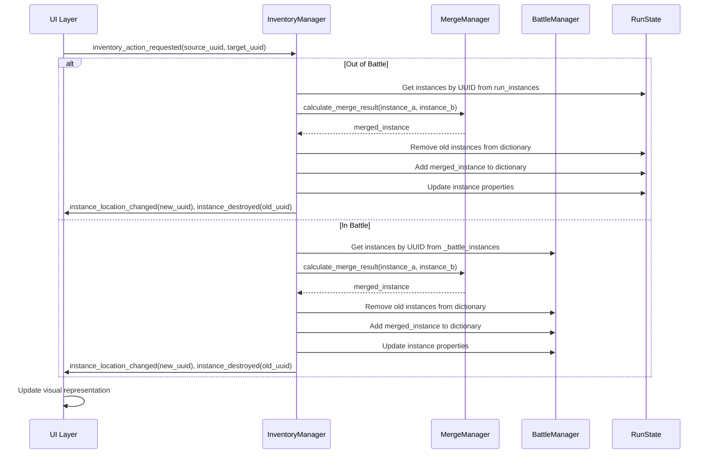
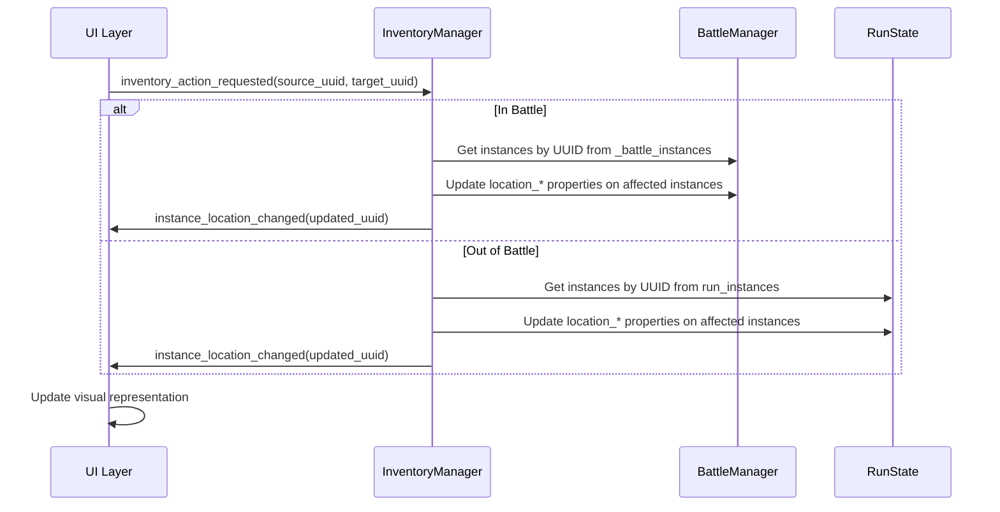

Flashcard Heroes - Core Mechanics MVP TDD (Definitive Edition)
Part 1: Project Blueprint
1.1 Architectural Principles
Data is the Source of Truth: Game state is stored in data structures (Arrays, Dictionaries). The UI is a disposable reflection of this data.
The Intent-Action Model: User input is translated into a clear "intent" signal before being processed by logic controllers.
Hierarchical Input Handling: User input is processed in a strict order of priority. An input event is "consumed" at the first level that can handle it, preventing it from propagating further. The order is: 1) Window Blockers, 2) Individual UI Components (Buttons, Views), 3) Inspection Window Panels, 4) The Global _unhandled_input handler in WindowManager as a final fallback for "background" clicks.
Visually Consistent Components: UI components representing similar data (e.g., inventory slots, whether full or empty) should maintain a consistent size within their container to ensure a clean, grid-like appearance.
Centralized, Context-Aware Managers: Singleton managers (e.g., InventoryManager) are the sole authorities for their specific logic domains. InteractionManager is a state machine for UI selection, not a direct input handler.
Reactive UI: The UI redraws itself in response to global "state changed" signals, ensuring it is always synchronized with the data.
1.2 Directory Structure
Generated code
res://
├── assets/
│   ├── sprites/
│   │   ├── units/
│   │   └── items/
├── resources/
│   ├── units/
│   ├── items/
│   ├── abilities/
│   ├── recipes/
│   └── decks/
├── scenes/
└── scripts/
├── localization.csv
Use code with caution.
Part 2: Data Schemas & Structures
2.1 Data Resource Schemas

**RunState.gd**: Resource, class_name RunState. The persistent state for an entire run.
Properties: - `gold: int` - `run_instances: Dictionary[String, GachaBallInstance]` (The master list of all permanent instances for the run. Their location is defined by their internal properties.)

**EffectRequest.gd**: Resource, class_name EffectRequest.
- Properties:
  - `@export var source_uuid: String`: The UUID of the unit initiating the effect.
  - `@export var ability_id: StringName`: The ID of the ability to execute.
  - `@export var trigger_context: Dictionary`: Stores contextual information about the event that triggered this request. For a basic attack, it could be empty. For a retaliation, it might contain the original attacker's UUID.

GachaBallDefinition.gd: Resource, class_name GachaBallDefinition. The template for a GachaBall. Properties: @export var id: StringName, @export var display_name_key: String, @export var description_key: String, @export var icon: Texture2D, @export var tags: Array[StringName], @export var item_slot_count: int, @export var base_hp: int = 0, @export var base_pwr: int = 0, @export var bonus_hp: int = 0, @export var bonus_pwr: int = 0, @export var ability_definitions: Array[AbilityDefinition]
GachaBallInstance.gd: Resource, class_name GachaBallInstance. A unique instance of a GachaBall. Its state is defined by its properties and tags. Properties: - `definition_id: StringName` - `ball_uuid: String` - `origin_uuid: String` - `static_tags: Array[StringName]` (Read-only tags from the definition, e.g., "UNIT", "TIER_1") - `dynamic_tags: Array[StringName]` (Tags added/removed during gameplay, e.g., "POISONED", "HONEY_ARMOR") - `current_hp: int` - `current_pwr: int` - `location_container_tag: StringName` (e.g., "BATTLE_PLAYER_LINEUP", "RUN_INVENTORY_T1") - `location_slot_index: int` (The slot index within the container) - `equipped_on_uuid: String` (If equipped, this holds the host's UUID. `location_container_tag` must be null) - `equipped_slot_index: int` (The item slot this occupies on the host) Methods: - `initialize(def: GachaBallDefinition)`: Sets `definition_id`, generates `ball_uuid`, copies `def.tags` into `static_tags`. - `add_tag(tag: StringName)`: Adds a non-unique tag to `dynamic_tags`. - `remove_tag(tag: StringName)`: Removes a non-unique tag from `dynamic_tags`. - `has_tag(tag: StringName) -> bool`: Checks if a tag exists in either `static_tags` or `dynamic_tags`. - `recalculate_stats(all_instances_db: Dictionary)`: Calculates stats based on its own definition and any equipped items (found by querying the database for items where `equipped_on_uuid` matches this instance's `ball_uuid`). - `create_battle_copy() -> GachaBallInstance`: Creates a deep copy, assigning a new `ball_uuid`, setting `origin_uuid`, and returning the copy to be placed into the battle.
MergeRecipe.gd: Resource, class_name MergeRecipe. Defines a valid merge.
Properties: @export var id: StringName, @export var ingredient_a_id: StringName, @export var ingredient_b_id: StringName, @export var result_id: StringName, @export var is_self_merge: bool, @export var merge_type: StringName
ConditionDefinition.gd: Resource, class_name ConditionDefinition. Defines ability conditions. For MVP, its evaluate() method is a placeholder that always returns true.
FlashcardDeckDefinition.gd: Resource, class_name FlashcardDeckDefinition.
Properties: @export var id: StringName, @export var display_name_key: String, @export var card_list: Array[Dictionary]
AbilityDefinition.gd: Resource, class_name AbilityDefinition. Defines an ability.
Properties: @export var id: StringName, @export var name_key: String, @export var description_key: String, @export var effect: EffectDefinition.
EffectDefinition.gd: Resource, class_name EffectDefinition. A base class for all ability effects.
Method: execute(source: GachaBallInstance, targets: Array[GachaBallInstance], battle_manager: BattleManager).
2.2 Inventory Data Structures
2.3 MVP Data File Manifest
The following .tres files must be created in their respective res://resources/ subdirectories.
Units & Hero (res://resources/units/)
| Filename | id | tags | item_slot_count | base_hp | base_pwr | icon (Path) |
| :--- | :--- | :--- | :--- | :--- | :--- | :--- |
| Hero.tres | hero | `["UNIT", "HERO", "TIER_0"]` | 5 | 10 | 2 | res://assets/sprites/units/Hero.png |
| EnemyHero.tres | enemy_hero | `["UNIT", "HERO", "TIER_0"]` | 5 | 10 | 2 | res://assets/sprites/units/Hero.png |
| UnitTier1A.tres | unit_t1_a | `["UNIT", "TIER_1"]` | 1 | 1 | 2 | res://assets/sprites/units/UnitTier1A.png|
| UnitTier1B.tres | unit_t1_b | `["UNIT", "TIER_1"]` | 1 | 2 | 1 | res://assets/sprites/units/UnitTier1B.png|
| UnitTier2C.tres | unit_t2_c | `["UNIT", "TIER_2"]` | 2 | 3 | 3 | res://assets/sprites/units/UnitTier2C.png|
| UnitTier3D.tres | unit_t3_d | `["UNIT", "TIER_3"]` | 4 | 6 | 6 | res://assets/sprites/units/UnitTier3D.png|

**Items (res://resources/items/)**

| Filename | id | tags | bonus_hp | bonus_pwr | icon (Path) |
| :--- | :--- | :--- | :--- | :--- | :--- |
| ItemTier1A.tres | item_t1_a | `["ITEM", "TIER_1"]` | 1 | 0 | res://assets/sprites/items/ItemTier1A.png|
| ItemTier1B.tres | item_t1_b | `["ITEM", "TIER_1"]` | 0 | 1 | res://assets/sprites/items/ItemTier1B.png|
| ItemTier2C.tres | item_t2_c | `["ITEM", "TIER_2"]` | 1 | 1 | res://assets/sprites/items/ItemTier2C.png|
| ItemTier3D.tres | item_t3_d | `["ITEM", "TIER_3"]` | 2 | 2 | res://assets/sprites/items/ItemTier3D.png|

**Recipes (res://resources/recipes/)**
*(No changes to this section)*

**Abilities (res://resources/abilities/)**

| Filename | id | name_key | description_key | effect (Resource) |
| :--- | :--- | :--- | :--- | :--- |
| BasicAttack.tres | basic_attack | "ability.basic_attack.name" | "ability.basic_attack.desc" | An instance of `BasicAttackEffect.gd`. |

*Note on Enemy Equipping: For the initial battle setup, the enemy lineup will be populated with one of each unit type, including an `EnemyHero`. All available item slots on these enemy units will be filled with a diverse set of appropriate items.*

## Part 3: Logic Layer & Managers

### 3.5: The Definitive Hybrid Architecture: Tags and Queries
Generated code
This section is the authoritative source for how game state is managed and logic is executed. It supersedes all previous descriptions of data management. The architecture is a hybrid system that uses two core concepts: the Tag System and Relational Queries.

    ### A. The Tag System: The Source of Truth for State

    The state of any `GachaBallInstance` is defined by the properties and tags on the instance itself, not by its inclusion in a manager's container.

    *   **Static Tags:** From the `GachaBallDefinition` (e.g., "UNIT", "TIER_1"). These do not change.
    *   **Dynamic Tags:** For status effects (e.g., "POISONED"). Added and removed via `add_tag()` and `remove_tag()`.
    *   **Location Properties:** A set of properties on the instance (`location_container_tag`, `location_slot_index`, `equipped_on_uuid`, `equipped_slot_index`) unambiguously define its single, current location.
    *   **Systemic Integrity:** This design makes it impossible for an instance to be in two places at once. An action like "Move" does not move a UUID between arrays; it changes the `location_*` properties on the instance itself. The UI listens for `instance_location_changed` signals to redraw views.

    ### B. Relational Queries: The Source of Truth for Context

    The `BattleManager` (and future helper managers like `TargetingManager`) is responsible for understanding the rules of the game and the relationships between instances. It provides helper functions that perform complex, relational queries.

    *   **The Principle:** An ability's effect logic should be "dumb." It should not contain complex positional or comparative logic. Instead, it asks the `BattleManager` for a list of valid targets.
    *   **Example Query Functions:**
        *   `get_friend_behind(source_instance)`
        *   `get_enemies_in_front(source_instance)`
        *   `get_strongest_enemy()`
        *   `get_adjacent_friends(source_instance)`
    *   **Implementation:** These functions take the full `_battle_instances` dictionary as input. They loop through the instances, applying game rules (positioning, stats, etc.) to determine which instances match the query, and return an `Array` of the resulting `GachaBallInstance`s.

    ### C. The Flow: How They Work Together

    1.  **Trigger:** An event occurs (e.g., start of battle, unit faints, player ends turn).
    2.  **Ability Activation:** An ability on a source unit is set to activate.
    3.  **Query for Targets:** The ability's effect script calls the appropriate query function on the `BattleManager` (e.g., `get_friend_behind(self.source_instance)`).
    4.  **Receive Targets:** The `BattleManager` performs its relational logic and returns an array of target instances.
    5.  **Apply Effect:** The effect script iterates through the returned array and applies its logic (damage, buffs, adding a "POISONED" tag, etc.) to each target instance. Any change to an instance's data (HP, PWR, dynamic tags) must be followed by an `instance_data_changed` signal.

    This hybrid system provides a clean separation of concerns. **Tags define WHAT a thing is. Queries define WHO it relates to.** This creates a robust, scalable, and easy-to-understand foundation for all game mechanics.

**State Change Signals:** `instance_data_changed(uuid: String), instance_location_changed(uuid: String), instance_created(uuid: String), instance_destroyed(uuid: String), battle_state_changed(is_in_battle: bool), battle_phase_changed(phase_name: StringName), gacha_tokens_changed(new_amount: int)`

*   **Run/Scene Signals:** `start_run_requested, loadout_scene_requested, main_scene_requested, battle_start_requested`
*   **Window/Modal Signals:** `inspect_inventory_requested, display_discard_pile_requested, close_modal_requested`
*   **Action Signals:** `draw_gacha_requested(tier: int), inventory_action_requested(source_uuid: String, target_uuid: String), choice_made(choice_id: String), inspection_requested(source_view: Control)`
*   **Selection Signals:** `view_selected(view: Control, location: LocationIdentifier), view_deselected(view: Control), invalid_action_triggered(view: Control), selection_changed(new_location: LocationIdentifier)`

### 3.2 Singleton Managers

*   **`GameManager.gd`**: Holds the master `run_state: RunState` resource for the current run and the global `is_in_battle: bool` flag. It is the central access point for all persistent run data.
*   **`InventoryManager.gd`**: A stateless logic controller. It listens for `inventory_action_requested` and uses `GameManager.is_in_battle` to determine the correct data owner (`RunState` or `BattleManager`). It then calls the appropriate methods on that owner to modify the properties of the involved `GachaBallInstance`s. After a successful action, it is responsible for ensuring the correct state change signals (e.g., `instance_location_changed`) are emitted.
*   **`InteractionManager.gd`**: A state machine that holds the `source_uuid` of the currently selected `GachaBallInstance`. Manages drag-and-drop state and selection state for the UI.
*   **`MergeManager.gd`**: A stateless helper used by `InventoryManager` for merge calculations.
*   **`Database.gd`**: Loads all `.tres` resources on startup for fast access.
*   **`SceneManager.gd`**: Handles scene transitions.
*   **`AbilityResolver.gd`**: Manages ability queue and resolution. For the MVP, it will directly execute the `BasicAttackEffect`.
*   **`UUIDUtils.gd`**: Provides a `generate_uuid()` utility function.
*   **`WindowManager.gd`**: The sole authority for the lifecycle of all modal and inspection windows.
*   **`BattleManager.gd`**: The sole authority for the state of a single battle.
    * **State Properties**:
        * `_battle_instances: Dictionary[String, GachaBallInstance]` (The master registry for ALL temporary battle copies.)
        * `_gacha_tokens: int`
        * `_current_battle_phase: StringName`
    * **Responsibility**: Manages the battle lifecycle and provides relational query functions (e.g., `get_friend_behind()`, `get_strongest_enemy()`) for the ability system. It modifies `GachaBallInstance` properties in its `_battle_instances` registry and emits the appropriate state change signals.
    * **Battle State Machine**: Operates with phases: `START_OF_TURN`, `MANAGEMENT`, `COMBAT`, `END_OF_TURN`. The `COMBAT` phase uses relational queries to determine targets for abilities.

## Part 4: Presentation Layer (UI)

### 4.1 UI Component Blueprints

*   **`GachaBallView.tscn`**:
    *   Metadata Requirement: Each instance must have the `ball_uuid: String` of the `GachaBallInstance` it represents stored in its metadata. This is essential for all interactions.
*   **`SlotView.tscn`**:
    *   Metadata Requirement: Each instance must have the `ball_uuid: String` of the `GachaBallInstance` it represents stored in its metadata. This is essential for all interactions.
    *   The `RichTextLabel` for the prompt must have `mouse_filter = MOUSE_FILTER_PASS`.
*   **`Battle.tscn` UI Elements**:
    *   An `%EndTurnButton` `Button` will be added.
    *   A `%GachaTokenLabel` `Label` will be added to display the player's current tokens.
    *   **Implementation Note**: The `BattleView.gd` script must be attached to the root node of `Battle.tscn` for the UI to update correctly.
    *   **Implementation Note**: When `BattleView.gd` is attached to the root node, the `BattleManager` node can be referenced directly as `$"BattleManager"`.

## Part 5: Game Flows

### 5.1 Battle Setup Flow
1. `BattleManager` is instantiated.
2. It accesses `GameManager.run_state.run_instances`.
3. For each permanent instance, it calls `create_battle_copy()` and adds the copy to its own `_battle_instances`.
4. It sets the initial battle location properties on each new copy (e.g., `location_container_tag = "BATTLE_DRAW_POOL_T1"`).
5. For each newly created instance, it emits `instance_created(new_uuid)`.

### 5.2 Gacha Draw Flow
1. Receives `draw_gacha_requested(tier)`.
2. Checks for sufficient `_gacha_tokens`.
3. Queries `_battle_instances` to find all instances with `location_container_tag == "BATTLE_DRAW_POOL_T[tier]"`.
4. If the pool is empty, it performs the reshuffle logic by finding instances with `location_container_tag == "BATTLE_DISCARD_PILE"` and the correct static tier tag, then changing their location properties.
5. Picks a random instance from the draw pool.
6. Changes its `location_container_tag` and `location_slot_index` to an available slot in `BATTLE_PLAYER_BENCH` or `BATTLE_ITEM_INVENTORY` (or `BATTLE_DISCARD_PILE` if full).
7. Emits `instance_location_changed(drawn_uuid)`.

### 5.3 Battle Turn Flow
1. `BattleManager` transitions to `START_OF_TURN`.
2. Sets `_gacha_tokens` to 5 and emits `gacha_tokens_changed(new_amount)`.
3. Transitions to `MANAGEMENT` phase. Player may deploy units, equip items, and arrange lineup by changing properties on instances.
4. On End Turn, transitions to `COMBAT` phase. For each unit, uses relational queries (e.g., `get_frontmost_enemy()`) to determine targets and applies ability effects by changing properties (e.g., `current_hp`). Emits `instance_data_changed` and/or `instance_location_changed` as needed.
5. If a unit is defeated, updates its `location_container_tag` to `BATTLE_DISCARD_PILE` and emits `instance_location_changed` and `instance_destroyed`.
6. Checks for victory/defeat and transitions accordingly.

### 5.4 Equip & Stat Recalculation Flow
1. Player initiates an equip action. UI emits `inventory_action_requested(source_uuid, target_uuid)`.
2. `InventoryManager` determines context and modifies the item's `equipped_on_uuid` and `equipped_slot_index` properties.
3. Updates the item's `location_container_tag` to `EQUIPPED` and `location_slot_index` to the slot index.
4. Emits `instance_data_changed(item_uuid)` and `instance_location_changed(item_uuid)`.
5. Calls `recalculate_stats` on the target unit and emits `instance_data_changed(unit_uuid)`.

### 5.5 Permanent Merge Flow (Out of Battle)
1. Player merges two instances from `RunState.run_instances`.
2. `InventoryManager` calls `MergeManager.calculate_merge_result(instance_a, instance_b)`.
3. Removes the old instances from `run_instances` and adds the merged instance.
4. Sets the merged instance's properties and emits `instance_created(new_uuid)` and `instance_destroyed(old_uuid)` for each removed instance.
5. Emits `instance_location_changed(new_uuid)`.
*All locations and board state are defined by the `location_*` properties on each instance. There are no containers or arrays for board state. The UI queries `_battle_instances` for all instances with a given `location_container_tag` and ordered by `location_slot_index`.*

### 5.2 Gacha Draw Flow (`BattleManager.gd`)
1. Receives `draw_gacha_requested(tier)`.
2. Checks if `_gacha_tokens` is sufficient (`cost = tier`).
3. If the draw pool for the tier is empty, automatically reshuffles by finding all instances in `_battle_instances` with `dynamic_tags` including "DISCARDED" and the matching tier tag, and resets their location to the draw pool.
4. Picks a random instance from the draw pool (querying `_battle_instances` for `location_container_tag == "DRAW_POOL"` and matching tier).
5. Sets its `location_container_tag` and `location_slot_index` to the target (e.g., "PLAYER_BENCH", next available slot) or, if full, sets `location_container_tag` to "DISCARD".
6. Emits `battle_inventory_changed`.

*All movement is performed by updating the `location_*` properties on the instance. The UI redraws by querying for all instances with a given location tag.*

### 5.3 Reshuffle Flow
*   The manual `_on_reshuffle_requested` flow is **REMOVED**. Reshuffling is now an automatic process triggered by an attempt to draw from an empty pool.

### 5.3 Battle Turn Flow
This describes the flow for a single turn, managed by the `BattleManager`'s state machine.
1.  **Transition to `START_OF_TURN`**:
    *   `BattleManager` sets `_gacha_tokens` to 5.
    *   Emits `gacha_tokens_changed`.
2.  **Transition to `MANAGEMENT`**:
    *   Enables the `%EndTurnButton`.
    *   Player may spend tokens, deploy units, equip items, and arrange their lineup by changing the `location_*` and `equipped_on_uuid` properties on instances.
3.  **Player Action: End Turn**:
    *   Player clicks `%EndTurnButton`.
    *   Button is disabled.
4.  **Transition to `COMBAT`**:
    *   `BattleManager` queries all instances with `location_container_tag == "PLAYER_LINEUP"` and `location_container_tag == "ENEMY_LINEUP"`, ordered by `location_slot_index`.
    *   Each unit acts in order (player then enemy, back-to-front), using relational queries (e.g., `get_frontmost_enemy()`).
    *   Each unit performs its ability (e.g., basic attack), applying changes to target instances (e.g., updating `current_hp`).
    *   If a unit is defeated, its `location_container_tag` is set to "DISCARD" or it is removed from `_battle_instances`.
    *   Emits `battle_inventory_changed` after any change affecting the board.
5.  **Transition to `END_OF_TURN`**:
    *   `BattleManager` checks for victory (all enemies defeated) or defeat (player hero HP <= 0).
    *   If the battle is not over, loop back to Step 1 for the next turn.

*All board state and effects are managed by property/tag changes and queries on `_battle_instances`.*

### 5.4 Equip & Stat Recalculation Flow (Reactive)
This flow describes how equipping an item correctly triggers a reactive stat update.

1.  **Intent**: Player initiates an Equip action during a battle.
2.  **UI Layer**: Emits `inventory_action_requested` with the `LocationIdentifier` for the source item and target unit.
3.  **`InventoryManager`**:
    *   Receives the signal. Confirms `GameManager.is_in_battle` is true.
    *   Uses `BattleManager`'s API to get the unit and item instances from `_battle_instances`.
    *   Sets the item's `equipped_on_uuid` and `equipped_slot_index` properties to reference the unit and slot.
    *   Updates the item's `location_container_tag` to "EQUIPPED" and `location_slot_index` to the slot index.
    *   Emits `unit_inventory_changed(target_unit.ball_uuid)`.
4.  **`BattleManager`**:
    *   Receives `unit_inventory_changed`.
    *   Calls `get_instance(unit_uuid).recalculate_stats(_battle_instances)`.
    *   Emits `unit_stats_changed(unit_uuid)`.
5.  **UI Layer**: The `GachaBallView` for the unit receives `unit_stats_changed` and updates its HP/PWR labels.

*All equipment and stat changes are managed by property/tag changes on the relevant instances, with no arrays or containers involved.*

### 5.5 Permanent Merge Flow (Out of Battle)
This flow describes how merging instances outside of battle correctly modifies the persistent `RunState`.

1.  **Context**: Player is in a non-battle scene (e.g., Shop). `GameManager.is_in_battle` is `false`.
2.  **Intent**: Player merges two instances from their Run Inventory.
3.  **UI Layer**: Emits `inventory_action_requested` with `LocationIdentifier`s for both instances.
4.  **`InventoryManager`**:
    *   Receives the signal. Confirms `is_in_battle` is `false`.
    *   Uses `RunState.run_instances` to get the instances by UUID.
    *   Calls `MergeManager.calculate_merge_result(instance_a, instance_b)` to get the merged instance.
    *   Updates the merged instance's properties and tags as needed.
    *   Sets the merged instance's `location_container_tag` and `location_slot_index` to the correct location.
    *   Removes the old instances from `run_instances`.
    *   Emits `run_state_changed`.
5.  **UI Layer**: The Run Inventory window (or relevant UI) listens for `run_state_changed` and redraws itself.

*All merges and inventory changes are performed by updating properties and tags on instances in `run_instances`. There are no container arrays or direct array manipulation.*
4.  **`InventoryManager`**:
    *   Receives the signal. Confirms `is_in_battle` is `false`.
    *   Communicates with `GameManager.run_state` to perform data operations.
    *   Calls `MergeManager.calculate_merge_result` to get the `merged_instance`.
    *   Reads the `tier` from the `merged_instance`'s definition.
    *   Dynamically determines the target container name (e.g., `StringName("RunInventoryT%d" % result_tier)`).
    *   Removes the ingredient UUIDs from their source `DataContainer`s in `RunState`.
    *   Places the merged instance in the first available slot of the appropriate tier container.
    *   Ensures drag state is properly cleaned up with `InteractionManager.end_drag(true)` on success.
    *   Adds the new instance to `RunState.run_instances` and its UUID to the correct target `DataContainer` in `RunState`.
    *   Emits `run_state_changed`.
5.  **UI Layer**: The Run Inventory window (or relevant UI) listens for `run_state_changed` and redraws itself.

## Part 6: Sequence Diagrams for Key Operations

### 6.1 Merge Operation Flow

### 6.2 Move/Swap Operation Flow

{{ ... }}
For any inventory action, the following validation steps occur in order:

1. **Basic Validation**
   - Check if source and target locations are valid
   - Verify instances exist at specified locations
   - Ensure instances are not null and properly initialized

2. **Context Validation**
   - Verify action is allowed in current game state (battle/run)
   - Check if containers involved in the action are accessible

3. **Container Compatibility**
   - Check if source container type matches expected types
   - Verify target container can accept the source instance type
   - For swaps, ensure both containers can accept each other's content

4. **Tier Validation**
   - Verify source instance tier matches target container tier
   - For battle inventory, enforce strict tier-container matching
   - For run inventory, allow moving to any container of equal or higher tier

5. **Action-Specific Validation**
   - For merges: Check if merge recipe exists
   - For equips: Verify unit has available item slots
   - For moves: Ensure target slot is empty or can be swapped
