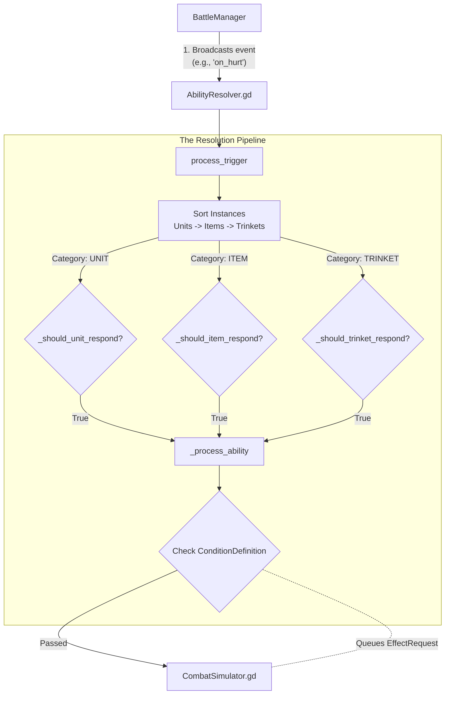

# Module 4: The Trigger & Ability System

## The Unified Broadcast Pipeline
Instead of units manually observing one another and cluttering the game state with hundreds of active signal connections, Flashcard Heroes uses a **Unified Broadcast Pattern** managed by `AbilityResolver.gd`. 

Whenever a gameplay event happens (a unit dies, a token is spent, someone attacks), the `BattleManager` blasts a single generic broadcast. The `AbilityResolver` catches this broadcast, categorizes every instance on the board, passes them through a strict filter, and enqueues abilities into the `CombatSimulator`.



---

## Line-by-Line Mastery: The Context Dictionary and Unified Filters

When an event is broadcast, it comes with a `context` Dictionary. This semantic context contains the "Who, What, and Where" of the event.

### 1. The Unit Filter
*File: `scripts/AbilityResolver.gd`*

Notice how the unified filter prevents every unit on the board from responding to an `on_hurt` event. Only the unit whose UUID matches the `victim_uuid` inside the context dictionary is allowed to proceed.

```gdscript
func _should_unit_respond(trigger: StringName, unit_uuid: String, unit: GachaBallInstance,
						  context: Dictionary, battle_manager: Node) -> bool:
	match trigger:
		&"on_ally_death":
			# Unit must be: same team as fainting, alive, not the fainting unit
			var fainting_uuid = context.get("fainting_ally_uuid", "")
			var fainting_team = context.get("fainting_ally_team", "")
			var unit_team = _get_instance_team(unit, battle_manager)
			return unit_team == fainting_team and unit_uuid != fainting_uuid and unit.current_hp > 0
		
		&"on_hurt":
			# Only the unit that received damage responds
			return unit_uuid == context.get("victim_uuid", "")
		
		&"on_death":
			# Only the dying unit responds
			return unit_uuid == context.get("dying_uuid", "")
```

**Syntax Breakdown:**
- `match trigger:`: This is Godot's optimized switch statement matching against the trigger's `StringName`.
- `&"on_hurt"`: The `&` prefix designates a `StringName`. In Godot 4, `StringName` is a highly optimized, unique string stored in a central table. Comparing `StringName`s is as fast as comparing two integers, whereas comparing regular strings requires checking every character.
- `context.get("victim_uuid", "")`: Accessing the semantic dictionary safely. If the event didn't provide a `victim_uuid`, it defaults to an empty string instead of crashing the game.

> ### Godot 4 Refactoring Guide: Dictionary Keys
> While the code correctly uses the modern `StringName` (`&"on_hurt"`) for the `match` blocks, it uses regular Strings (`"victim_uuid"`) for Dictionary keys. Since these keys are accessed hundreds of times per second during combat resolution, converting them to `StringName`s provides a free performance boost.
> 
> **Refactored Code:**
> ```gdscript
> 		&"on_hurt":
> 			# Use StringName for the dictionary key lookup
> 			return unit_uuid == context.get(&"victim_uuid", "")
> ```

---

## 2. Dynamic Component Composition

Once an instance passes the unified filter, `AbilityResolver` extracts its active abilities. 

```gdscript
		# Process all abilities from the component system (definition + injected + persistent)
		for entry in instance.get_active_ability_entries(all_instances):
			if entry.get("source_type") == &"EQUIPMENT":
				continue
			var ability: AbilityDefinition = entry.get("ability_def")
			if not is_instance_valid(ability):
				continue
			if ability.trigger == trigger:
				_process_ability(ability, entry.get("source_instance_uuid", instance_uuid), battle_manager, context)
```

Because Flashcard Heroes allows items to inject new abilities into units dynamically, we cannot just read the base `GachaBallDefinition`. We iterate over `get_active_ability_entries`, ensuring temporary buffs and injected equipment abilities are caught during the broadcast.

---

## 3. The Condition Gatekeeper

Before an ability's effects are finally packaged into an `EffectRequest` and sent to the `CombatSimulator`, it must pass its `ConditionDefinition`.

### The Data Structure
*File: `scripts/ConditionDefinition.gd`*

```gdscript
## A reusable, self-contained check that determines if an ability is allowed to proceed.

## Unique identifier for the condition (e.g., "cond_team_size_less_than_enemy").
@export var id: StringName
## The specific type of check to perform. This is interpreted by BattleManager. See TDD for canonical list.
@export var condition_type: StringName
## A flexible dictionary containing any values needed for the check. For example, a RELATIVE_HP check might use `{"comparison": "greater_than"}`.
@export var parameters: Dictionary
## If true, the result of the condition check is inverted. (e.g., "if NOT front slot is empty").
@export var invert_result: bool = false 
```

### The Validation
*File: `scripts/AbilityResolver.gd`*

Inside `_process_ability`, the condition acts as the final gatekeeper:

```gdscript
	# Check condition if present
	if is_instance_valid(ability.condition):
		var condition_result = battle_manager.check_condition(ability.condition, source_uuid, context)
		if not condition_result:
			return # Condition failed, skip this ability
```

If the condition passes, the ability packages its payload and is enqueued into the priority sort we examined in Module 3.
