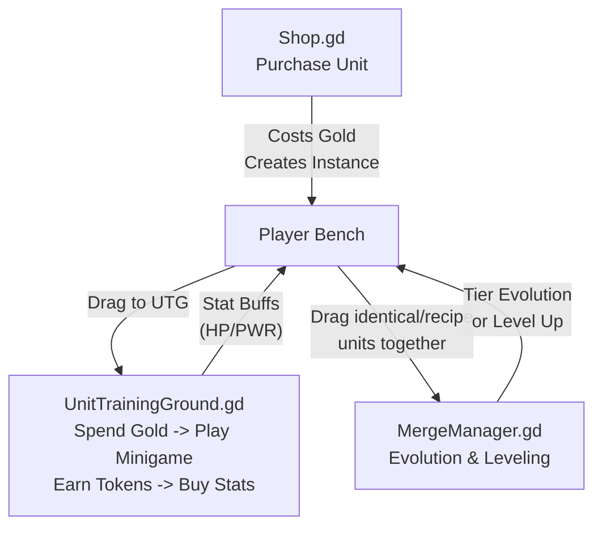

# Module 5: Unit Lifecycle & Economy

## The Core Gameplay Loop
The life of a unit in Flashcard Heroes revolves around purchasing it from the shop, training it to increase its stats, and eventually merging it to evolve it to the next tier or level.



---

## 1. Purchasing Units
*File: `scripts/Shop.gd`*

Units are primarily introduced into the player's run via the Shop. The Shop visually represents the purchasing cost and handles the transaction before injecting the unit into the `RunState`.

```gdscript
			# PRE-VALIDATION: Check if player has enough gold BEFORE animating
			var current_gold: int = 0
			if is_instance_valid(GameManager.run_state):
				current_gold = GameManager.run_state.gold
			
			if current_gold < _selected_cost:
				# Insufficient gold - play rejection feedback
				var main_node = GameManager._active_main_node
				var gold_group = main_node.get_node_or_null("%GoldGroup") if is_instance_valid(main_node) else null
				# Play rejection on the drop zone overlay instead of the old buy button
				var drop_zone = main_node.get_node_or_null("%ConfirmDropZone") if is_instance_valid(main_node) else null
				var rejection_target = drop_zone if is_instance_valid(drop_zone) else reroll_button
				RejectionFeedbackScript.play_rejection_with_counter(rejection_target, gold_group, get_tree())
				return
```

Once the transaction is validated, the `_animate_gold_spend` function deducts the gold, emits the `shop_purchase_requested` signal (handled by GameManager to call `RunState.add_instance()`), and visually arcs the new unit to the Gacha Machine.

---

## 2. Training Units
*File: `scripts/UnitTrainingGround.gd`*

To increase a unit's base HP or Power without merging, the player uses the Unit Training Ground.

```gdscript
func _spend_tokens_and_train(cost: int) -> void:
	if _tokens < cost: return
	_tokens -= cost
	SignalBus.emit_signal("gacha_tokens_changed", _tokens)
	_update_popup_buttons()

	# Roll: cost+1 possible outcomes (0..cost), uniform distribution
	var roll = randi() % (cost + 1)

	# ... (Visual setup abbreviated) ...
		
		# DEFERRED: Apply stat buff to backend AFTER impact so visual tween has correct start/end
		if roll > 0:
			var hp_delta = roll if _training_stat == "hp" else 0
			var pwr_delta = roll if _training_stat == "pwr" else 0
			GameManager.run_state.modify_unit_base_stats(unit_uuid, hp_delta, pwr_delta)
```

**Key Mechanic:** Players spend Gold to enter the training minigame, earn Flashcard Tokens by answering correctly, and then spend those tokens to roll for permanent base stat increases. Because `modify_unit_base_stats` is used, these buffs persist across battles and survive merging.

---

## 3. Merging: Level Up vs. Tier Evolution
*File: `scripts/MergeManager.gd`*

The `MergeManager` acts as a stateless calculator. When two units are dragged together, it determines whether they are leveling up (combining two identical units) or evolving to a new tier (combining two different units via a recipe).

### The Math of Merging
When two units merge, the game adds their current stats together. However, it specifically *subtracts* the stats granted by equipped items to prevent "double-dipping" (since the items will be re-equipped to the new unit).

```gdscript
	# Initial combined stats (excluding items, handled below)
	var total_hp: int = instance_a.current_hp + instance_b.current_hp
	var total_pwr: int = instance_a.current_pwr + instance_b.current_pwr
	
	# Subtract bonuses from all parent items to avoid double-dipping.
	# We want the inherent stats (Base + Inherent Extra), and then items will be re-applied.
	var source_items: Array[GachaBallInstance] = _get_equipped_item_instances(instance_a, all_instances_db)
	var target_items: Array[GachaBallInstance] = _get_equipped_item_instances(instance_b, all_instances_db)
	var all_parent_items: Array[GachaBallInstance] = []
	all_parent_items.append_array(source_items)
	all_parent_items.append_array(target_items)

	for item in all_parent_items:
		var item_def = item.get_definition()
		if is_instance_valid(item_def):
			total_hp -= item_def.bonus_hp
			total_pwr -= item_def.bonus_pwr
```

### Applying the Result
The final calculation changes drastically depending on the merge type.

```gdscript
	if is_level_up:
		merged_instance.level = instance_a.level + 1
		# LEVELING LOGIC: Keeps base stats + Sum(Extra Stats) + 1
		var base_a = instance_a.get_definition_base_hp()
		var level_bonus_a = int(instance_a.get_attribute(&"level")) - 1
		
		# Formula: Result = Result_Base + (Extras_A + Extras_B) + (Result_Level - 1)
		# Which simplifies to: total_hp - Parent_Base - Parent_LevelBonus + 1
		final_hp = total_hp - base_a - level_bonus_a + 1
		
		var pwr_base_a = instance_a.get_definition_base_pwr()
		final_pwr = total_pwr - pwr_base_a - level_bonus_a + 1
	else:
		merged_instance.level = 1
		# TIER EVOLUTION LOGIC: Additive (A + B)
		final_hp = total_hp
		final_pwr = total_pwr
```

> ### Godot 4 Refactoring Guide: Enum Usage
> In `UnitTrainingGround.gd`, strings are frequently used to denote state: `_training_stat = "hp"`. In Godot 4, strongly-typed Enums are much safer, as they prevent typos and allow for better autocompletion.
> 
> **Refactored Code:**
> ```gdscript
> enum StatType { HP, PWR }
> var _training_stat: StatType
> 
> # Usage:
> if roll > 0:
>     var hp_delta = roll if _training_stat == StatType.HP else 0
>     var pwr_delta = roll if _training_stat == StatType.PWR else 0
> ```

---

## Conclusion of Curriculum
This module concludes the core system documentation for Flashcard Heroes: Gachamon. You now have a complete map of the Global Architecture, Combat Initialization, The VCR Simulator, The Unified Trigger Pipeline, and the Unit Economy. You are fully equipped to audit the codebase and balance the game!
