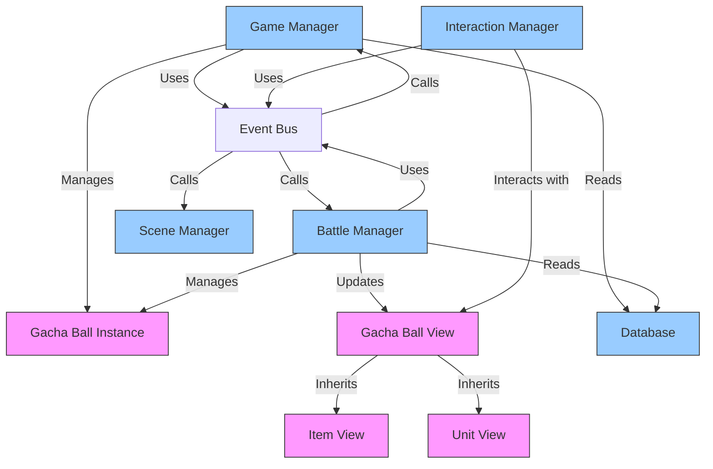

# Class Relationships Flowchart

This diagram shows the relationships between classes in the game's architecture.

## Class Methods

### Manager Classes (Blue)
- **Game Manager**: handle_start_run(), handle_battle_start(), handle_merge()
- **Battle Manager**: handle_draw_gacha(), handle_reshuffle(), handle_interaction()
- **Interaction Manager**: handle_view_interaction(), clear_selection()
- **Scene Manager**: change_scene(), load_scene()
- **Event Bus**: emit_signal(), connect()

### Data/View Classes (Pink)
- **Gacha Ball Instance**: create_battle_copy(), initialize()
- **Gacha Ball View**: display(), handle_gui_input()
- **Unit View**: update_equipped_items()
- **Database**: get_gachaball_def(), get_merge_recipe()
